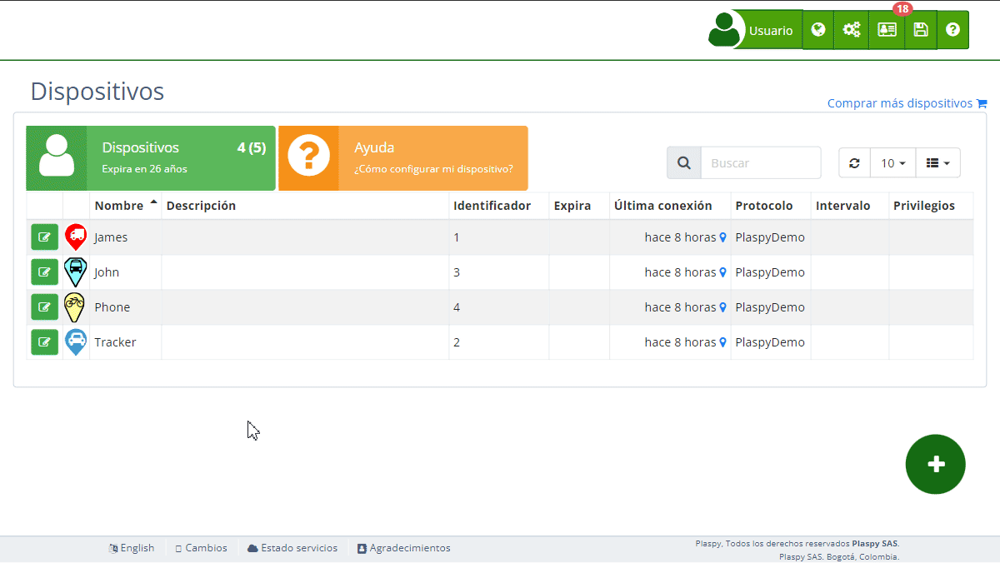

# Reasignar sensores digitales
La función de reasignar sensores digitales permite cambiar la asignación de las entradas digitales del rastreador a diferentes funciones o propósitos. Esto es útil para ajustar la configuración de los [dispositivos](https://app.plaspy.com/Devices) según las necesidades específicas de monitoreo y control.

## Descripción de Campos

- **Entrada digital 1 \(ACC\)**: Permite reasignar la entrada digital número 1 del rastreador, que típicamente monitorea el estado de encendido \(ACC\), a otra función.
- **Entrada digital 2**: Permite reasignar la entrada digital número 2 del rastreador a otra función.
- **Entrada digital 3**: Permite reasignar la entrada digital número 3 del rastreador a otra función.
- **Entrada digital 4**: Permite reasignar la entrada digital número 4 del rastreador a otra función.

## Acceder a la Sección de Reasignar Sensores Digitales

1. Navega a la sección "[*fa-cogs* Dispositivos](https://app.plaspy.com/Device)" desde el panel superior derecho en el icono de "*fa-cogs*".
2. Selecciona el dispositivo para el cual deseas reasignar los sensores digitales.
3. Haz clic en la opción "*fa-exchange* Reasignar Sensores Digitales" para expandir esta sección y ver los detalles relevantes.

## Instrucciones Paso a Paso

### Reasignar una Entrada Digital

1. Selecciona el dispositivo de la lista de [dispositivos](https://app.plaspy.com/Devices).
2. En la sección "*fa-exchange* Reasignar Sensores Digitales", localiza la entrada digital que deseas reasignar.
3. Haz clic en el menú desplegable junto al campo de la entrada digital.
4. Selecciona la nueva función a la que deseas reasignar la entrada digital.
5. Haz clic en "Aceptar" para actualizar la reasignación.

### Ejemplo: Reasignar la Entrada Digital 1 \(ACC\)

1. Selecciona el dispositivo de la lista de dispositivos.
2. En la sección "*fa-exchange* Reasignar Sensores Digitales", localiza el campo "Entrada digital 1 \(ACC\)".
3. Haz clic en el menú desplegable y selecciona la nueva función, por ejemplo, "Entrada digital 2".
4. Haz clic en "Aceptar" para actualizar la reasignación.

## Preguntas Frecuentes

- **¿Por qué debería reasignar una entrada digital?**
    - Reasignar una entrada digital te permite adaptar la configuración del dispositivo a tus necesidades específicas de monitoreo y control. Por ejemplo, puedes cambiar la función de una entrada digital para monitorear un sensor diferente o activar una función específica.
- **¿Cómo puedo saber qué función seleccionar para una entrada digital?**
    - La función a seleccionar depende de las necesidades específicas de tu monitoreo. Si no estás seguro, consulta la documentación del dispositivo o contacta al soporte técnico para obtener recomendaciones.
- **¿Qué sucede si reasigno una entrada digital incorrectamente?**
    - Si reasignas una entrada digital incorrectamente, el dispositivo podría no funcionar según lo esperado. Puedes volver a la sección de reasignar sensores digitales y seleccionar la función correcta para corregir la configuración.
