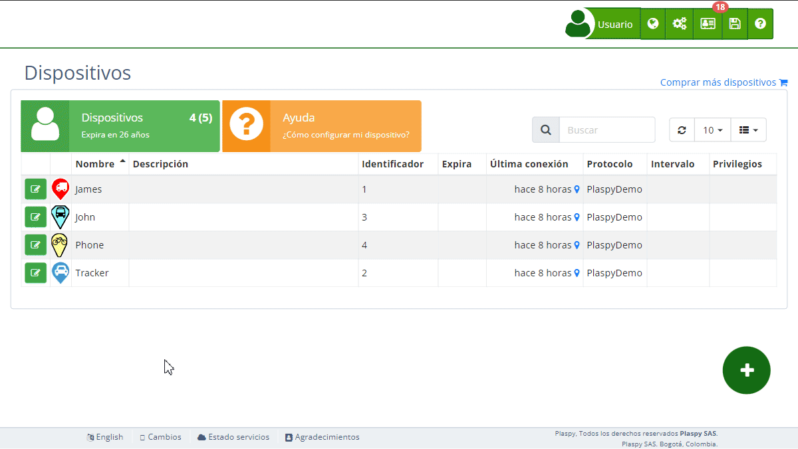

# Recordatorios
La sección de Recordatorios permite a los usuarios programar alertas para eventos importantes relacionados con sus [dispositivos](https://app.plaspy.com/Devices) de rastreo. Estas alertas pueden basarse en fechas específicas o en el kilometraje del vehículo, y se envían por correo electrónico para asegurar que no se olviden tareas críticas como el mantenimiento del vehículo.

## Descripción de Campos

- **Nombre del Recordatorio**: Este campo permite asignar un nombre descriptivo al recordatorio, como "Mantenimiento del Vehículo" o "Renovación del Seguro".
- **Email**: Dirección de correo electrónico donde se enviará el recordatorio. Puedes añadir una o varias direcciones separadas por comas.
- **Fecha**: Fecha en la que deseas que se envíe el recordatorio. Utiliza el selector de fecha para escoger la fecha correcta.
- **Kilometraje**: Kilometraje en el cual deseas que se envíe el recordatorio. Ingresa el valor en kilómetros.

## Acceder a la Sección de Recordatorios

1. Navega a la sección "[*fa-cogs* Dispositivos](https://app.plaspy.com/Device)" desde el panel principal superior derecho en el icono "*fa-cogs*".
2. Selecciona el dispositivo para el cual deseas configurar un recordatorio.
3. Haz clic en la opción "*fa-bell* Recordatorios" para expandir esta sección y ver los detalles relevantes.

## Instrucciones Paso a Paso

### Crear un Nuevo Recordatorio

1. Selecciona el dispositivo de la lista de [dispositivos](https://app.plaspy.com/Devices).
2. En la sección "*fa-bell* Recordatorios", haz clic en "Agregar nuevo recordatorio".
3. Completa los campos requeridos:
    - **Nombre del Recordatorio**: Introduce un nombre descriptivo para el recordatorio.
    - **Email**: Ingresa la dirección de correo electrónico donde deseas recibir el recordatorio.
    - **Fecha**: Selecciona la fecha en la que deseas que se envíe el recordatorio.
    - **Kilometraje**: Ingresa el kilometraje en el que deseas que se envíe el recordatorio.
4. Haz clic en "Aceptar" para crear el recordatorio.

### Editar un Recordatorio Existente

1. Selecciona el dispositivo de la lista de dispositivos.
2. En la sección "*fa-bell* Recordatorios", localiza el recordatorio que deseas editar.
3. Realiza los cambios necesarios en los campos disponibles.
4. Haz clic en "Aceptar" para actualizar el recordatorio.

### Eliminar un Recordatorio

1. Selecciona el dispositivo de la lista de dispositivos.
2. En la sección "*fa-bell* Recordatorios", localiza el recordatorio que deseas eliminar.
3. Haz clic en el ícono de la papelera \(*fa-trash*\) al lado del recordatorio.
4. Confirma la eliminación del recordatorio.

## Preguntas Frecuentes

- **¿Qué tipo de eventos puedo programar con los recordatorios?**
    - Puedes programar recordatorios para cualquier evento importante relacionado con tus dispositivos de rastreo, como el mantenimiento del vehículo, la renovación del seguro, o cualquier otra tarea crítica.
- **¿Puedo añadir varios correos electrónicos para recibir el recordatorio?**
    - Sí, puedes añadir varias direcciones de correo electrónico separadas por comas para que varias personas reciban el recordatorio.
- **¿Cómo funciona el recordatorio basado en kilometraje?**
    - El recordatorio basado en kilometraje se enviará cuando el vehículo alcance el kilometraje especificado. Esto es útil para programar mantenimientos basados en el uso del vehículo.
- **¿Puedo editar o eliminar un recordatorio después de crearlo?**
    - Sí, puedes editar o eliminar un recordatorio en cualquier momento desde la sección de Recordatorios del dispositivo.
