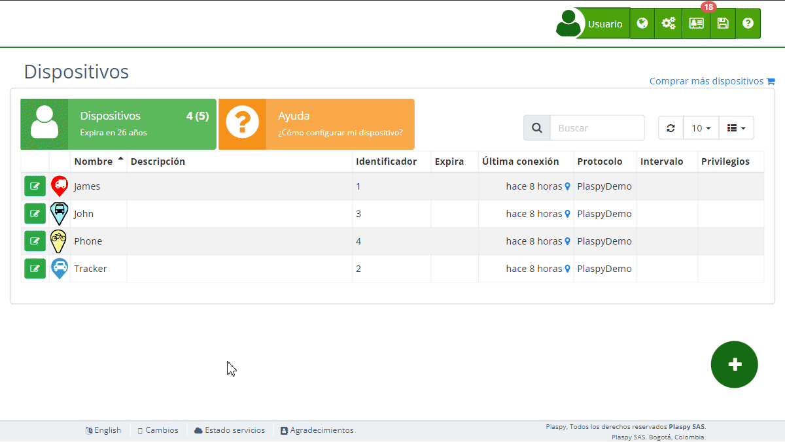

# Sensores
La sección de Sensores te permite configurar y monitorear diversos sensores asociados a tus [dispositivos](https://app.plaspy.com/Devices) de seguimiento. Esta funcionalidad es crucial para obtener datos detallados y precisos sobre tus activos, como el kilometraje, el consumo de combustible y la capacidad del tanque. Los sensores también pueden incluir entradas y salidas digitales para un control y monitoreo más específicos.

## Descripción de Campos

- **Kilometraje**: Este campo establece el [kilometraje actual calculado](../map/mileage_calculation) del vehículo. Ingresa el kilometraje del vehículo para llevar un control preciso de su uso.
- **Consumo de combustible**: Este campo estima el consumo aproximado de combustible para calcular una tasa de consumo estimada cuando el dispositivo no tiene un sensor de combustible. Este valor se utiliza para realizar cálculos de [resumen de recorridos](../activity_summary), basados en la distancia recorrida para estimar el consumo de combustible.
- **Capacidad del tanque**: Especifica la capacidad del tanque de combustible del vehículo para realizar los cálculos de combustible. Ingresa la capacidad del tanque en galones.
- **Entrada digital 1 \(ACC\)**: Nombre de la entrada digital número 1 del rastreador. Esta entrada típicamente monitorea el estado de encendido \(ACC\). El tiempo acumulado del sensor se muestra junto a su título.
- **Entrada digital 2**: Nombre de la entrada digital número 2 del rastreador. El tiempo acumulado del sensor se muestra junto a su título.
- **Entrada digital 3**: Nombre de la entrada digital número 3 del rastreador. El tiempo acumulado del sensor se muestra junto a su título.
- **Entrada digital 4**: Nombre de la entrada digital número 4 del rastreador. El tiempo acumulado del sensor se muestra junto a su título.
- **Salida digital 1**: Nombre de la salida digital número 1 del rastreador.
- **Salida digital 2**: Nombre de la salida digital número 2 del rastreador.
- **Salida digital 3**: Nombre de la salida digital número 3 del rastreador.
- **Salida digital 4**: Nombre de la salida digital número 4 del rastreador.

## Accediendo a la Sección de Sensores

1. Navega a la sección "[*fa-cogs* Dispositivos](https://app.plaspy.com/Device)" desde el panel superior derecho pinchando en "*fa-cogs*".
2. Selecciona el dispositivo para el cual deseas configurar o monitorear los sensores.
3. Haz clic en la opción "*fa-cog* Sensores" para expandir esta sección y ver los detalles relevantes de los sensores.

## Instrucciones Paso a Paso

### Establecer el Kilometraje

1. Selecciona el dispositivo de la lista de [dispositivos](https://app.plaspy.com/Devices).
2. En la sección "*fa-cog* Sensores", localiza el campo "Kilometraje".
3. Ingresa el kilometraje actual del vehículo.
4. Haz clic en "Aceptar" para actualizar el kilometraje.

### Configurar el Consumo de Combustible

1. Selecciona el dispositivo de la lista de dispositivos.
2. En la sección "*fa-cog* Sensores", localiza el campo "Consumo de combustible".
3. Ingresa el valor aproximado de consumo de combustible.
4. Haz clic en "Aceptar" para actualizar la tasa de consumo de combustible.

### Establecer la Capacidad del Tanque

1. Selecciona el dispositivo de la lista de dispositivos.
2. En la sección "*fa-cog* Sensores", localiza el campo "Capacidad del tanque".
3. Ingresa la capacidad del tanque en litros o galones.
4. Haz clic en "Aceptar" para actualizar la capacidad del tanque.

### Configurar Entradas y Salidas Digitales

1. Selecciona el dispositivo de la lista de dispositivos.
2. En la sección "*fa-cog* Sensores", localiza la entrada o salida digital que deseas configurar.
3. Ingresa el nombre para la entrada o salida digital. Puedes renombrar las entradas y salidas digitales para identificar fácilmente los sensores, por ejemplo, puertas, aire acondicionado, encendido, etc.
4. Haz clic en "Aceptar" para actualizar la configuración de la entrada o salida digital.
5. Para restaurar el estado de un sensor, haz clic en el ícono de actualización junto al sensor respectivo. Esto pondrá a cero el tiempo acumulado del sensor y lo desactivará hasta que el rastreador envíe información nuevamente a.

## Preguntas Frecuentes

- **¿Por qué es importante establecer el kilometraje?**
 - Establecer el kilometraje de manera precisa ayuda a llevar un control del uso del vehículo, programar mantenimientos y calcular el consumo de combustible.
- **¿Qué debo hacer si cambia el consumo de combustible de mi vehículo?**
 - Actualiza el campo "Consumo de combustible" con el nuevo valor estimado para asegurar cálculos precisos de consumo de combustible.
- **¿Cómo afecta la capacidad del tanque los cálculos de combustible?**
 - La capacidad del tanque se utiliza para calcular los niveles de combustible y el consumo de manera más precisa. Asegúrate de que este valor sea correcto para evitar cálculos erróneos.
- **¿Para qué se utilizan las entradas y salidas digitales?**
 - Las entradas y salidas digitales se utilizan para monitorear y controlar funciones específicas del dispositivo, como el estado de encendido o la activación/desactivación de ciertos componentes. Puedes renombrarlas para una identificación más fácil.
- **¿Qué sucede cuando restauro el estado de un sensor?**
 - Restaurar el estado de un sensor pondrá su tiempo acumulado a cero y desactivará el sensor hasta que el rastreador envíe información nuevamente a.
