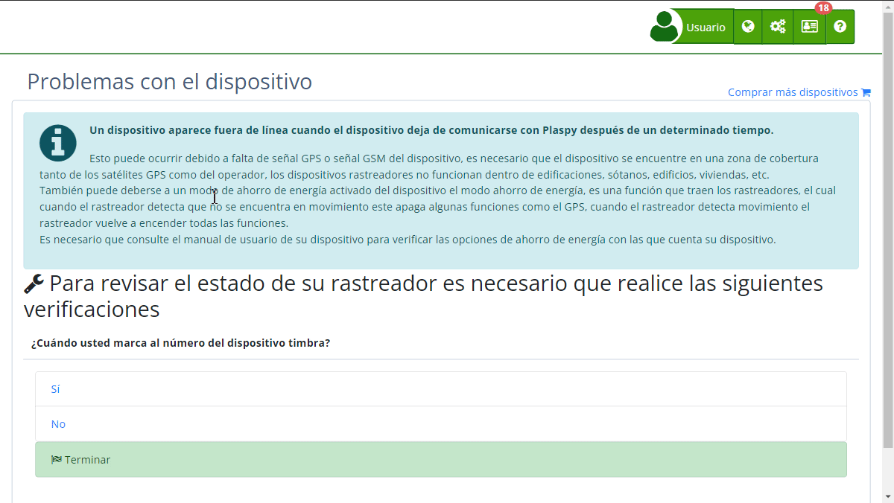

# Problemas con el Dispositivo
En Plaspy, es posible que encuentres algunos [problemas comunes con tus dispositivos](https://app.plaspy.com/TroubleShooting) de seguimiento. Esta guía te proporcionará una descripción general de estos problemas y sus posibles soluciones para ayudarte a resolverlos de manera eficiente.

A veces, un dispositivo de seguimiento puede aparecer fuera de línea, dejar de comunicar datos, o no funcionar correctamente debido a diversas razones. Los problemas más comunes suelen estar relacionados con la señal GPS, la conectividad GSM, el estado de la batería, o la configuración del dispositivo.

## Problemas Comunes y Soluciones

### Problema: Dispositivo Aparece Fuera de Línea

**Causa Posible: Señal GPS o GSM Insuficiente**

- **Solución**: Asegúrate de que el dispositivo esté en una zona con buena cobertura GPS y GSM. Los rastreadores no funcionan bien dentro de edificaciones, sótanos o áreas con muchas obstrucciones. Mueve el dispositivo a un área abierta.

**Causa Posible: Modo de Ahorro de Energía Activado**

- **Solución**: Consulta el manual del usuario del dispositivo para verificar las opciones de ahorro de energía. Algunos rastreadores desactivan ciertas funciones cuando no detectan movimiento. Desactiva el modo de ahorro de energía si es necesario.

### Problema: El Dispositivo No Responde a las Llamadas

**Causa Posible: Falta de Energía o Batería Baja**

- **Solución**: Verifica que el dispositivo esté correctamente conectado a una fuente de energía y que la batería esté cargada. Si es necesario, carga el dispositivo completamente antes de volver a intentar.

**Causa Posible: Dispositivo Apagado**

- **Solución**: Asegúrate de que el dispositivo esté encendido. Consulta el manual para localizar y usar el botón de encendido si es necesario.

**Causa Posible: Problemas con la Tarjeta SIM**

- **Solución**: Verifica que la tarjeta SIM esté correctamente insertada y activada. Asegúrate de que tenga saldo suficiente y un plan activo que permita la navegación y el envío de mensajes de texto.

### Problema: Ubicación Incorrecta o Fecha Errada

**Causa Posible: Señal GPS Debil**

- **Solución**: Coloca el dispositivo en un área abierta donde pueda recibir una señal GPS fuerte. Evita usarlo en interiores o cerca de estructuras grandes que puedan bloquear la señal.

**Causa Posible: Zona Horaria Incorrecta**

- **Solución**: Asegúrate de que el dispositivo esté configurado para usar la zona horaria correcta \(GMT o UTC-0\). Verifica la conexión a Internet del dispositivo para que pueda sincronizar la fecha y hora correctas.

### Problema: El Dispositivo No Envía Datos

**Causa Posible: Conexión de Datos Inactiva**

- **Solución**: Verifica que el plan de datos del operador esté activo y que permita la navegación. Contacta a tu proveedor de servicios móviles para más información.

**Causa Posible: Configuración Incorrecta**

- **Solución**: Consulta el manual del dispositivo o contacta al proveedor del dispositivo para asegurarte de que esté configurado correctamente para enviar datos. Algunos dispositivos pueden requerir comandos específicos para configurarse.

## Recomendaciones Adicionales

- **Reiniciar el Dispositivo**: Algunos dispositivos pueden bloquearse temporalmente. Intentar un reinicio físico puede resolver el problema.
- **Consultar el Manual del Usuario**: Siempre es útil revisar el manual del dispositivo para encontrar soluciones específicas y opciones de configuración.
- **Soporte Técnico**: Si los problemas persisten, contacta al soporte técnico de Plaspy para obtener asistencia adicional.

Siguiendo estos consejos y soluciones, podrás resolver la mayoría de los problemas comunes con tus dispositivos de seguimiento en Plaspy, asegurando un funcionamiento continuo y eficiente.
