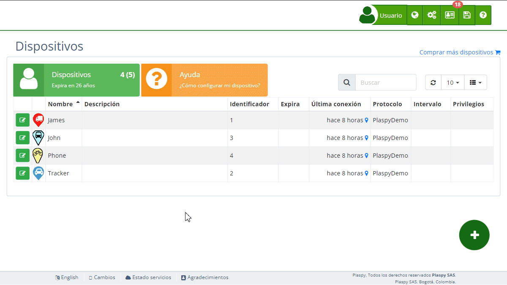

# Configuración de un Nuevo Rastreador
Para comenzar a utilizar un nuevo rastreador en Plaspy, es necesario seguir algunos pasos de [configuración](https://app.plaspy.com/Start?w=1). A continuación, se describen las instrucciones para configurar tu rastreador, ya sea mediante comandos SMS o utilizando el software proporcionado por el fabricante del rastreador.

### Paso 1: Acceder a la Configuración del Rastreador

1. **Inicio de Configuración**: Ingresa a tu cuenta de Plaspy y ve a la sección [***fa-cogs* Dispositivos**](https://app.plaspy.com/Devices) en el panel superior derecho \(*fa-cogs*\) y haz clic en [¿Cómo configurar mi dispositivo?](https://app.plaspy.com/Start?w=1).
2. **Seleccionar Tipo de Dispositivo**: Elige el tipo de dispositivo que deseas configurar \(rastreador o dispositivo móvil\).
3. **Agregar Detalles del Dispositivo**:
    - **Nombre**: Ingresa un nombre para tu rastreador.
    - **IMEI o ID**: Ingresa el número IMEI o el identificador del rastreador. Este número suele ser el IMEI de 15 dígitos, pero algunos rastreadores utilizan los últimos 11 dígitos del IMEI o un serial único. Consulta el manual del usuario para más detalles.

### Paso 2: Configuración del APN

1. **Configurar APN**: Selecciona el país y el operador de la tarjeta SIM insertada en el rastreador. Plaspy proporcionará automáticamente la configuración del APN correcta dependiendo del operador seleccionado.

### Paso 3: Configuración del Rastreador

Selecciona la marca de tu rastreador, los rastreadores pueden configurarse mediante comandos SMS o utilizando el software proporcionado por el fabricante. No todos los rastreadores tienen ambas opciones, y el usuario puede elegir el método que prefiera.

1. **Comandos SMS**: Si tu rastreador requiere configuración mediante comandos SMS, Plaspy mostrará los comandos específicos necesarios para tu dispositivo. Es importante enviar los comandos exactamente como se muestran, respetando signos, espacios, mayúsculas, minúsculas, etc.
2. **Software del Fabricante**: Algunos rastreadores pueden ser configurados mediante el software proporcionado por el fabricante. Consulta el manual del usuario para descargar e instalar el software correspondiente y seguir las instrucciones de configuración.

### Paso 4: Verificación y Finalización

1. **Agregar Dispositivo a la Cuenta**: Una vez configurado el rastreador, agrégalo a tu cuenta en Plaspy ingresando el IMEI o el identificador único del dispositivo en la sección de **Dispositivos**.
2. **Verificar Funcionamiento**: Asegúrate de que el dispositivo esté enviando datos correctamente y que aparezca en el mapa de Plaspy.

### Datos del Servidor de Plaspy

Para conectar tu rastreador a Plaspy, utiliza los siguientes datos del servidor:

- **Servidor**: `d.plaspy.com` o `54.85.159.138`
- **Puerto**: `8888`

Plaspy detectará automáticamente el protocolo del dispositivo.

### Solución de Problemas

- **Revisar Manual del Usuario**: Consulta el manual del usuario del rastreador para obtener información específica sobre la configuración y resolución de problemas.
- **Verificar Conexión**: Asegúrate de que la tarjeta SIM esté activada y tenga saldo suficiente para enviar datos.
- **Reiniciar Dispositivo**: Si el rastreador no responde, intenta reiniciarlo.

### Asistencia Adicional

Si encuentras problemas durante la configuración, contacta al soporte técnico de Plaspy para recibir ayuda adicional. Ellos pueden proporcionarte orientación específica y solucionar cualquier inconveniente que puedas tener.

Siguiendo estos pasos, podrás configurar tu nuevo rastreador en Plaspy y comenzar a utilizar sus servicios de seguimiento satelital de manera eficiente y efectiva.
