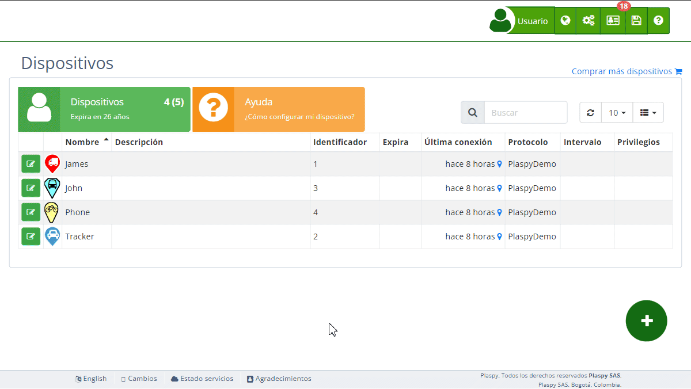

# Solución para identificador ya en uso en otra cuenta
Si al intentar agregar su dispositivo a su cuenta de Plaspy recibe un mensaje indicando que el identificador o serial ya está siendo utilizado por otra cuenta, puede seguir estos pasos para resolver el problema.

### Reconfiguración del Rastreador

Para reconfigurar su rastreador y conectarlo directamente al servidor de Plaspy, utilice la siguiente información de configuración:

- **Servidor**: `54.85.159.138`
- **Puerto**: `9000` \(Nota: el puerto estándar de Plaspy es `8888`, pero en su caso debe usar `9000`\)

#### Paso a Paso para Reconfigurar y Agregar el Dispositivo

1. **Configurar el Rastreador**:

    - Acceda a la [configuración de su rastreador](.). Esto puede requerir el uso de comandos SMS o el software del fabricante, según el modelo de su dispositivo.
    - Introduzca los detalles del servidor y puerto proporcionados:
        - **Servidor**: `54.85.159.138`
        - **Puerto**: `9000`
2. **Agregar Dispositivo en Plaspy**:

    - Inicie sesión en su cuenta de Plaspy.
    - Vaya a la sección **[Dispositivos](https://app.plaspy.com/Devices)**.
    - Agregue su dispositivo utilizando el identificador seguido por `:0`. Por ejemplo, si el identificador del dispositivo es `1234567890`, deberá ingresarlo como `1234567890:0`.
3. **Verificar Funcionamiento**:

    - Asegúrese de que el dispositivo esté enviando datos correctamente y que aparezca en el mapa de Plaspy.

### Ejemplo de Configuración

Si su dispositivo tiene el identificador `1234567890`:

- **Identificador Original**: `1234567890`
- **Identificador en Plaspy**: `1234567890:0`

Al agregar el dispositivo en Plaspy, use `1234567890:0` para asegurarse de que se asocie correctamente a su cuenta.

### Asistencia Adicional

Si encuentra algún problema durante el proceso de reconfiguración o al agregar el dispositivo a su cuenta, no dude en ponerse en contacto con el soporte técnico de Plaspy. Estamos aquí para ayudarle a recuperar el control de sus dispositivos y resolver cualquier inconveniente.
