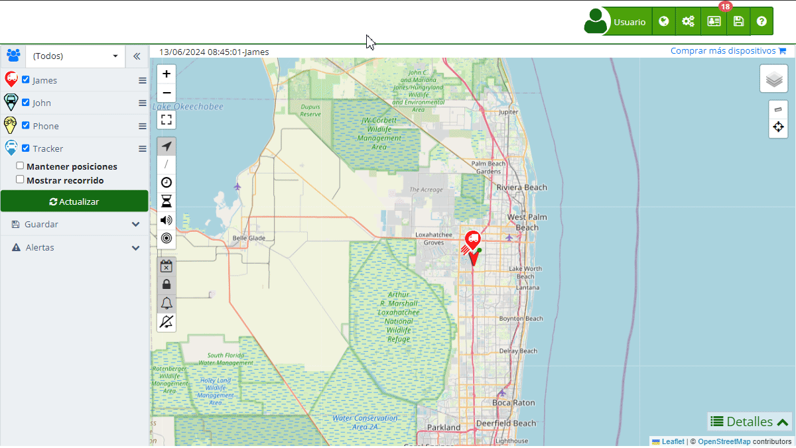

# Grupos
La sección de "[*fa-users* Grupos](https://app.plaspy.com/Groups)" permite a los usuarios organizar sus dispositivos de manera eficiente al agruparlos según diferentes criterios. Esto facilita la gestión, el monitoreo y la asignación de permisos de acceso a los dispositivos. Los grupos son una herramienta fundamental para mantener una estructura organizada y controlada de los activos rastreados.

Para acceder a la sección de grupos, dirígete al menú superior y selecciona el ícono de "Configuración" \(*fa-cogs*\), luego elige "[*fa-users* Grupos](https://app.plaspy.com/Groups)". Aquí podrás crear nuevos grupos, editar los existentes y asignar dispositivos a cada grupo.

### Descripción de Campos

- **Nombre**: Campo para ingresar el nombre del grupo, que debe ser descriptivo y fácil de identificar.
- **Descripción**: Campo para agregar una descripción detallada del grupo, proporcionando información adicional sobre su propósito o contenido.
- **API ID**: Identificador único del grupo, utilizado para integraciones y consultas a través de la API.
- **Insertar en mi página web**: Código HTML proporcionado para insertar el mapa del grupo en una página web externa.
- **Miembros**: Lista de dispositivos que pertenecen al grupo.
- **Dispositivo**: Campo de búsqueda para agregar dispositivos al grupo.

### Funcionalidades de los Grupos

Los grupos permiten realizar las siguientes acciones:

- **Filtrar en el Mapa**: Ver únicamente los dispositivos que pertenecen a un grupo específico en el [mapa](map), facilitando la visualización y el monitoreo.
- **Control de Acceso**: Limitar el acceso de los [usuarios](users) y dispositivos móviles a ciertos grupos, mejorando la seguridad y la gestión de permisos.
- **Organización**: Mantener los dispositivos organizados según su ubicación, función, o cualquier otro criterio relevante, mejorando la eficiencia en la gestión.

### Instrucciones Paso a Paso

#### Crear un Nuevo Grupo

1. **Acceder a la Sección de Grupos**:

 - Haz clic en "*fa-cogs* Configuración" en la parte superior derecha y selecciona "[*fa-users* Grupos](https://app.plaspy.com/Groups)".
2. **Iniciar la Creación de un Grupo**:

 - Haz clic en el ícono "*fa-plus*" en la esquina inferior derecha para abrir el formulario de creación de grupo.
3. **Completar los Detalles del Grupo**:

 - **Nombre**: Introduce el nombre del grupo.
 - **Descripción**: Añade una descripción detallada del grupo.
 - **Dispositivos**: Usa el campo de búsqueda para añadir dispositivos al grupo.
4. **Guardar el Grupo**:

 - Haz clic en "Aceptar" para guardar el nuevo grupo.
 - Si deseas cancelar, haz clic en "Cancelar".

#### Editar un Grupo Existente

1. **Seleccionar el Grupo a Editar**:

 - En la lista de [*fa-users* grupos](https://app.plaspy.com/Groups), haz clic en el ícono de editar \(*fa-pencil-square*\) junto al grupo que deseas modificar.
2. **Modificar los Detalles del Grupo**:

 - Realiza los cambios necesarios en el nombre, descripción o dispositivos del grupo.
3. **Guardar los Cambios**:

 - Haz clic en "Aceptar" para guardar los cambios realizados.

### Validaciones y Restricciones

- **Nombre del grupo**: Asegúrate de ingresar un nombre de grupo único y descriptivo.
- **Dispositivos**: Debes añadir al menos un dispositivo al grupo para que sea válido.

### Preguntas Frecuentes

- **¿Cómo puedo agregar dispositivos a un grupo?**
 - Utiliza el campo de búsqueda en el formulario de edición de grupos para encontrar y agregar dispositivos al grupo.
- **¿Puedo asignar un dispositivo a varios grupos?**
 - Sí, un dispositivo puede pertenecer a múltiples grupos, lo que te permite organizarlo según diferentes criterios.
- **¿Qué hago si quiero eliminar un grupo?**
 - Haz clic en el ícono de eliminar \(*fa-trash*\) en la parte inferior izquierda del formulario de edición. Confirma la eliminación cuando se te solicite.
- **¿Cómo puedo ver solo los dispositivos de un grupo en el mapa?**
 - Selecciona el grupo deseado en el filtro del mapa para visualizar únicamente los dispositivos que pertenecen a ese grupo.
- **¿Es posible compartir un grupo con otros usuarios?** 

 - Sí, puedes configurar permisos de acceso para compartir el grupo con otros usuarios, permitiéndoles ver y gestionar los dispositivos del grupo.
