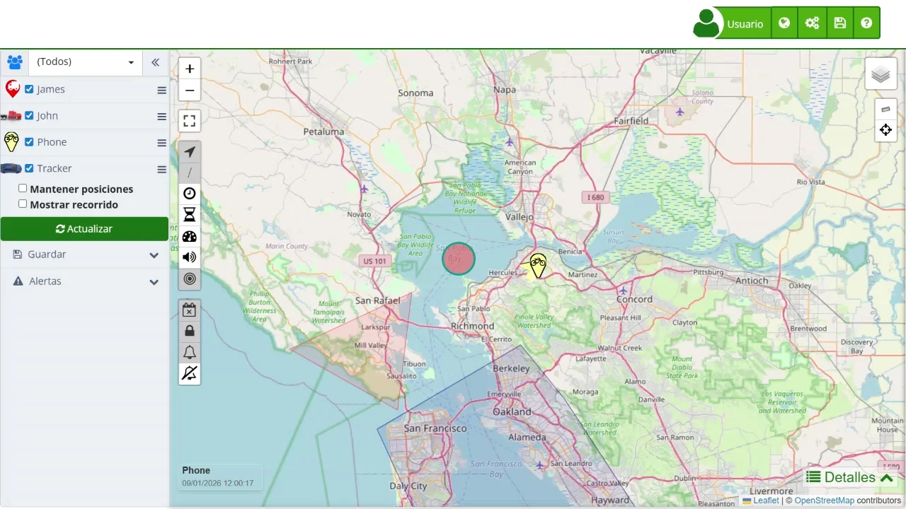

# Atributos
En Plaspy, cada ubicación reportada puede tener diversos atributos que proporcionan información detallada sobre el estado y los datos del dispositivo en ese momento específico. Estos atributos no son configurables por los usuarios, pero es importante entenderlos para interpretar correctamente la información suministrada por los dispositivos de rastreo. Es fundamental destacar que los atributos disponibles dependen de cada dispositivo y son adicionales a los atributos estándar de cada ubicación. No todos los dispositivos cuentan con atributos adicionales y, por lo tanto, todos los atributos listados a continuación pueden o no estar presentes en cada reporte de ubicación.

Es importante tener en cuenta que los atributos adicionales dependen del dispositivo utilizado y pueden variar entre reportes de ubicación. No todos los dispositivos cuentan con los mismos atributos, y algunos reportes pueden no incluir atributos adicionales. Comprender estos atributos es esencial para interpretar correctamente los datos suministrados y maximizar el uso de la plataforma Plaspy. Aunque estos atributos no son configurables por los usuarios, conocerlos ayuda a una mejor gestión y análisis de la información recolectada por los dispositivos de rastreo.

| **Atributo** | **Descripción** |
| --- | --- |
| Evento | Evento generado del dispositivo |
| Status | Status del dispositivo |
| Comando | Comando generado del dispositivo |
| Altitud | Altitud del dispositivo |
| Kilometraje | Kilometraje reportado por el dispositivo |
| RFID | Código RFID |
| Usuario | Usuario registrado en el dispositivo |
| Combustible2 | Sensor de combustible 2 |
| Temperatura2 | Sensor de temperatura 2 |
| Voltaje | Voltaje en el dispositivo |
| ADC1 | Sensor 1 Análogo |
| ADC2 | Sensor 2 Análogo |
| ADC3 | Sensor 3 Análogo |
| ADC4 | Sensor 4 Análogo |
| ADC5 | Sensor 5 Análogo |
| ADC6 | Sensor 6 Análogo |
| ADC7 | Sensor 7 Análogo |
| ADC8 | Sensor 8 Análogo |
| ADC9 | Sensor 9 Análogo |
| ADC10 | Sensor 10 Análogo |
| ADC11 | Sensor 11 Análogo |
| ADC12 | Sensor 12 Análogo |
| ADC13 | Sensor 13 Análogo |
| ADC14 | Sensor 14 Análogo |
| ADC15 | Sensor 15 Análogo |
| ADC16 | Sensor 16 Análogo |
| Entrada | Estado de la entrada |
| IO1 | Estado de la entrada y salida 1 |
| IO2 | Estado de la entrada y salida 2 |
| IO3 | Estado de la entrada y salida 3 |
| IO4 | Estado de la entrada y salida 4 |
| Salida | Estado de la salida |
| Contador | Contador del dispositivo |
| Contador1 | Contador del dispositivo 1 |
| Contador2 | Contador del dispositivo 2 |
| Contador3 | Contador del dispositivo 3 |
| Contador4 | Contador del dispositivo 4 |
| HDOP | Incertidumbre de la precisión horizontal [https://en.wikipedia.org/wiki/Dilution_of_precision_\(navigation\)](https://en.wikipedia.org/wiki/Dilution_of_precision_%28navigation%29) |
| PDOP | Incertidumbre de la precisión posición [https://en.wikipedia.org/wiki/Dilution_of_precision_\(navigation\)](https://en.wikipedia.org/wiki/Dilution_of_precision_%28navigation%29) |
| VDOP | Incertidumbre de la precisión vertical  [https://en.wikipedia.org/wiki/Dilution_of_precision_\(navigation\)](https://en.wikipedia.org/wiki/Dilution_of_precision_%28navigation%29) |
| Satélites | Numero de satélites conectados |
| GSM | GMS señal |
| GPS | GPS señal |
| Señal | Señal del dispositivo |
| MCC | Código del país red móvil  [https://en.wikipedia.org/wiki/Mobile_country_code](https://en.wikipedia.org/wiki/Mobile_country_code) |
| MNC | Código de red móvil [https://en.wikipedia.org/wiki/Mobile_country_code](https://en.wikipedia.org/wiki/Mobile_country_code) |
| LAC | Código móvil de área local [https://en.wikipedia.org/wiki/Location_area_identity](https://en.wikipedia.org/wiki/Location_area_identity) |
| CID | Identificador de la celda móvil |
| Celda | Identificador de la celda móvil |
| Carga | Voltaje de carga |
| API | Numero de API del dispositivo |
| Tipo | Tipo de evento |
| Índice | Índice del reporte |
| Serial | Serial del reporte |
| Energía | Voltaje del suministro de energía |
| Batería | Voltaje de la batería |
| Alarma | Alarma generada |
| Archivo | Reporte archivado |
| Código | Código del evento |
| Flags | Flags del evento |
| Válido | Validad de la ubicación |
| Pasos | Numero de pasos recorridos |
| ADC0 | Sensor 0 Análogo |
| FechaO | Fecha original reportada por el dispositivo |
