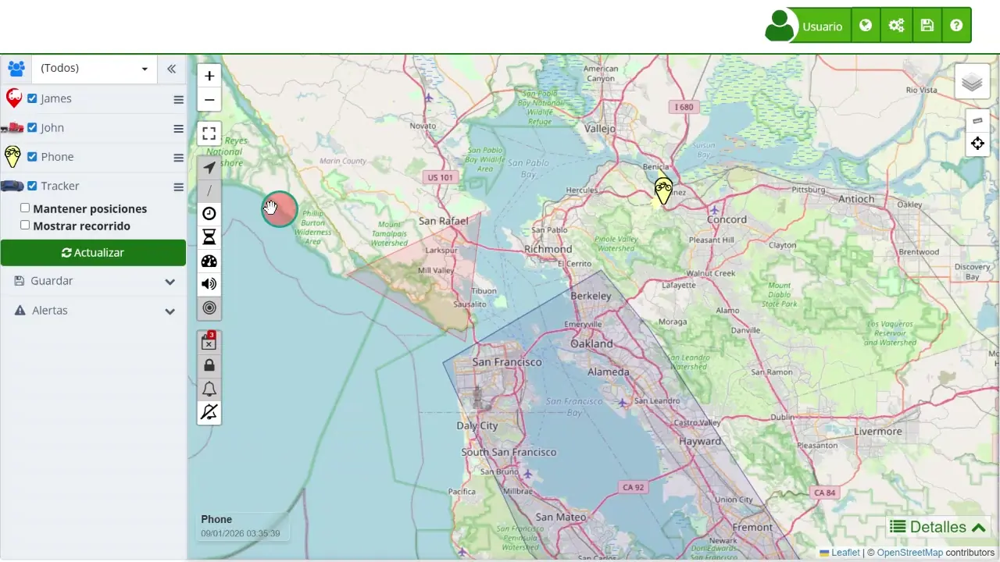

# Edición Masiva de Alertas
La función de edición masiva de alertas en el [mapa](https://app.plaspy.com/Map) de Plaspy permite a los usuarios configurar y gestionar alertas para múltiples dispositivos simultáneamente. Esta herramienta es especialmente útil para realizar ajustes en lote, lo que ahorra tiempo y asegura la coherencia en la configuración de alertas a través de varios dispositivos. Sin embargo, debido a su capacidad para modificar múltiples dispositivos a la vez, es importante utilizar esta función con precaución para evitar errores que puedan afectar la operación de los dispositivos.

## Descripción General

La opción para editar alertas se encuentra en la parte inferior del panel de control del mapa, bajo la sección " Alertas". Al seleccionar varios dispositivos, puede acceder a la ventana de edición de alertas, donde se le permite agregar nuevas alertas o reemplazar las alertas existentes en todos los dispositivos seleccionados.

### Cómo Acceder y Usar la Función de Edición de Alertas

1. **Acceso a la Edición de Alertas**:

    - Inicie sesión en su cuenta de Plaspy.
    - Navegue al [mapa](https://app.plaspy.com/Map) principal donde se muestran todos sus dispositivos.
    - En el [panel izquierdo](device_control_panel), bajo la sección " Alertas", haga clic en " Editar alertas".
2. **Seleccionar Dispositivos**:

    - En el panel de control, seleccione los dispositivos para los que desea configurar o editar alertas. Los dispositivos seleccionados se mostrarán en la parte superior de la ventana de edición de alertas.
3. **Agregar o Reemplazar Alertas**:

    - **Agregar**: Esta opción permite agregar nuevas [alertas](../devices/alerts) a los dispositivos seleccionados sin eliminar las alertas existentes. Útil cuando desea añadir alertas adicionales manteniendo las configuraciones actuales.
    - **Reemplazar**: Esta opción elimina todas las alertas actuales en los dispositivos seleccionados y añade las nuevas alertas configuradas. Es importante tener cuidado al usar esta opción, ya que se perderán todas las alertas existentes.

### Pasos Detallados para Configurar Alertas

1. **Agregar Nuevas Alertas**:

    - Haga clic en el botón "+" para agregar una nueva [alerta](../devices/alerts).
    - Configure los parámetros de la alerta según sus necesidades \(por ejemplo, geocerca, velocidad, tiempo de inactividad, etc.\).
    - Una vez configurada la alerta, haga clic en "Agregar". La nueva alerta se añadirá a todos los dispositivos seleccionados.
2. **Reemplazar Alertas Existentes**:

    - Haga clic en el botón "" para agregar la nueva [alerta](../devices/alerts).
    - Configure los parámetros de la alerta según sus necesidades.
    - Seleccione "Reemplazar" para eliminar todas las alertas actuales y añadir las nuevas alertas a los dispositivos seleccionados.

### Precauciones y Recomendaciones

- **Precaución en la Reemplazo de Alertas**:
    - La opción de reemplazo es potente pero peligrosa, ya que eliminará todas las alertas existentes en los dispositivos seleccionados. Asegúrese de revisar cuidadosamente las nuevas alertas antes de aplicarlas.
- **Revisión de Configuraciones**:
    - Siempre revise las configuraciones de las alertas nuevas o editadas para asegurar que se alineen con los requisitos operativos de sus dispositivos.
- **Confirmación de Dispositivos Seleccionados**:
    - Verifique que los dispositivos seleccionados para la edición de alertas sean los correctos, evitando así modificaciones no deseadas en dispositivos no intencionados.

## Ejemplo de Uso

Supongamos que un administrador de flota necesita establecer una nueva alerta de geocerca para todos los vehículos que operan en una zona específica. En lugar de configurar esta alerta en cada dispositivo individualmente, el administrador puede seleccionar todos los vehículos relevantes, acceder a la opción de " Editar alertas", configurar la nueva geocerca y aplicar la alerta a todos los dispositivos seleccionados de una vez. Si las alertas existentes también necesitan actualizarse, el administrador puede utilizar la opción "Reemplazar" para asegurar que solo las alertas más recientes y relevantes estén activas en los dispositivos.

Esta función de edición en lote es una herramienta poderosa para la gestión eficiente de alertas en múltiples dispositivos, permitiendo a los usuarios ahorrar tiempo y garantizar la coherencia en las configuraciones de sus sistemas de rastreo.
