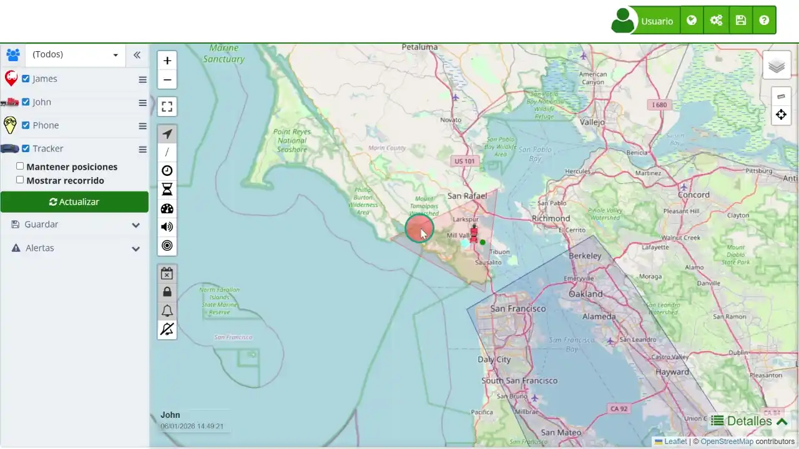

# Información Detallada del Dispositivo
Cuando se hace clic sobre un marcador en el [mapa](https://app.plaspy.com/Map) de Plaspy, se muestra un cuadro de información detallada sobre la ubicación y el estado del dispositivo. Esta menú emergente proporciona datos críticos que ayudan a los usuarios a monitorear y gestionar eficientemente cada dispositivo. La información mostrada puede variar según las capacidades del rastreador. A continuación se describe cada sección de la información proporcionada en el marcador.

### Información General

- **Nombre del Dispositivo:** Muestra el nombre del dispositivo en la parte superior del cuadro, por ejemplo, "403". Esto permite una identificación rápida y clara del dispositivo seleccionado.
- **Ubicación Actual:** Se presenta la dirección aproximada donde se encuentra el dispositivo, como "Carrera 16 UPZ Los Alcázares". Esta información es útil para conocer la posición exacta del dispositivo en términos de direcciones comprensibles.

### Datos de Monitoreo

- **Fecha y Hora:** Muestra la fecha y hora de la última actualización recibida del dispositivo, por ejemplo, "31/05/2024 06:02:51". Esto ayuda a verificar la actualidad de la información.
- **Velocidad:** La velocidad actual del dispositivo se muestra junto a la fecha y hora, por ejemplo, "0 Km/h". Es crucial para entender si el dispositivo está en movimiento o detenido.
- **Nivel de Batería:** Un indicador de batería muestra el nivel de carga del dispositivo, como "100%". Esto es esencial para asegurar que el dispositivo tiene suficiente energía para continuar operando.
- **Kilometraje:** La distancia total recorrida por el dispositivo, por ejemplo, "0 Km", ayuda a monitorear el uso y el rendimiento del dispositivo.
- **Estado de Movimiento:** El tiempo que el dispositivo ha estado detenido, por ejemplo, "Detenido 13:11:54", permite identificar períodos de inactividad prolongada.

### Opciones Interactivas

- **Entradas Digitales:** Permite expandir para ver detalles sobre las entradas digitales del dispositivo, como sensores activados. Esto es útil para obtener información adicional sobre el estado y funcionamiento del dispositivo.
- **Compartir Ubicación:** Proporciona opciones para compartir la ubicación del dispositivo a través de diferentes plataformas como Google Maps, Waze y WhatsApp. Esta funcionalidad es ideal para coordinar acciones y compartir información de ubicación con otros.
- **[Atributos](atributes):** Muestra detalles técnicos adicionales como la latitud y longitud del dispositivo, que pueden ser clicados para abrir en Google Maps. Estos datos geoespaciales precisos son útiles para análisis más detallados y acciones específicas.
- **Vista de la Calle Aproximada:** Un enlace para abrir la vista de calle aproximada mediante Google Street View, proporcionando una perspectiva visual del entorno del dispositivo.
- **Enviar Comando:** Permite enviar comandos al dispositivo directamente desde la ventana emergente, facilitando acciones remotas inmediatas como reiniciar el dispositivo o enviar alertas específicas.

### Información Adicional del Dispositivo

- **Nivel de Combustible:** Si está disponible, muestra el nivel de combustible del dispositivo. Por ejemplo, "93%". Esto es útil para la gestión de flotas y la planificación de reabastecimiento.
- **Temperatura:** Si el dispositivo tiene sensores de temperatura, muestra la lectura actual, útil para monitorear condiciones ambientales en vehículos refrigerados.
- **RPM y Voltaje de la Batería:** Para dispositivos avanzados, puede mostrar datos de RPM del motor y voltaje de la batería, esenciales para el mantenimiento y monitoreo del rendimiento del vehículo.
- **Señal GSM:** Muestra la calidad de la señal GSM en porcentaje, asegurando que el dispositivo tiene una buena conexión para transmitir datos.

### Ejemplo de Uso

Supongamos que un gerente de flota necesita verificar la ubicación y el estado de un vehículo específico en tiempo real. Al hacer clic en el marcador del vehículo en el mapa, el gerente puede ver inmediatamente detalles como la última ubicación conocida, la velocidad actual, el nivel de batería, y otros datos importantes. Si el vehículo está detenido por un período prolongado, el gerente puede decidir enviar un comando para investigar más a fondo o tomar medidas correctivas. Además, el gerente puede compartir la ubicación del vehículo con un equipo de asistencia en carretera usando la opción de compartir ubicación, asegurando una respuesta rápida y eficiente.

Este cuadro de información detallada es una herramienta poderosa para la gestión eficiente de dispositivos, proporcionando datos cruciales y opciones interactivas que facilitan la toma de decisiones y la acción inmediata.
