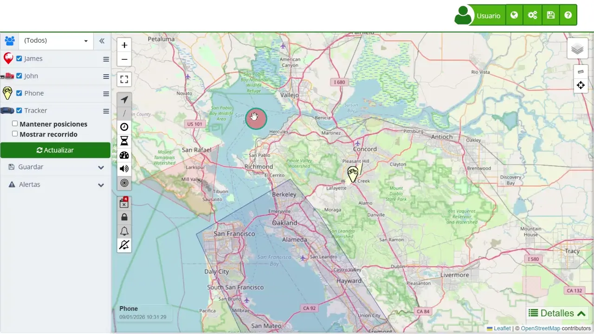

# Menú de Dispositivos
Cada dispositivo listado en el Panel de Control de Dispositivos en el lado izquierdo de la interfaz del [mapa](https://app.plaspy.com/Map) de Plaspy tiene un menú que proporciona acceso a varias opciones. Estas opciones permiten a los usuarios realizar una variedad de acciones y configuraciones en cada dispositivo. A continuación, se presenta una descripción detallada de todas las opciones del menú, sus propósitos y casos de uso específicos para que queden más claras.

### Recorrido

- **Última hora:** Permite a los usuarios ver la ruta que ha recorrido el dispositivo en la última hora. Es útil para monitorear movimientos recientes de un vehículo o persona, asegurándose de que estén siguiendo la ruta esperada.
- **Últimas 3 horas:** Permite ver la ruta que ha recorrido el dispositivo en las últimas tres horas. Ideal para revisar el recorrido de un turno de trabajo reciente.
- **Últimas 6 horas:** Permite ver la ruta que ha recorrido el dispositivo en las últimas seis horas. Útil para analizar un medio turno de trabajo o actividades en una mañana o tarde completa.
- **Hoy:** Permite ver la ruta que ha recorrido el dispositivo hoy. Ideal para revisar todas las actividades del día, útil para informes diarios de actividades.
- **Ayer:** Permite ver la ruta que ha recorrido el dispositivo ayer. Útil para generar informes de actividad del día anterior y analizar comportamientos recientes.
- **Anteayer:** Permite ver la ruta que ha recorrido el dispositivo anteayer. Útil para ver y analizar actividades de hace dos días, ideal para comparaciones y análisis a corto plazo.

### Última ubicación

- **Solo este dispositivo:** Muestra la última ubicación de solo este dispositivo. Útil para localizar rápidamente un dispositivo específico en caso de emergencia o necesidad de información puntual.
- **Todos los dispositivos:** Muestra la última ubicación de todos los dispositivos. Permite obtener una vista general de la ubicación de todos los dispositivos, ideal para supervisar múltiples activos al mismo tiempo.

### Compartir Ubicación

- **Ubicación Actual:**
    - Permite enviar la posición más reciente del dispositivo usando aplicaciones como Google Maps, Waze, WhatsApp u otras opciones disponibles. De esta forma, cualquier persona autorizada puede ver exactamente dónde se encuentra en ese momento.
- **Ubicación en vivo**:
    - Ofrece la posibilidad de compartir la ubicación del dispositivo en tiempo real durante un periodo específico: 1 hora, 4 horas, 8 horas, 1 día o un tiempo personalizado. Una vez elegido el intervalo, el acceso puede enviarse por correo electrónico, WhatsApp o mediante un enlace directo. Así, quien reciba el acceso podrá seguir el movimiento del dispositivo mientras dure el tiempo configurado.

### Enviar comando

- **Enviar comando:** Permite a los usuarios enviar un comando al dispositivo, aunque esta opción puede estar oculta dependiendo de las capacidades del dispositivo y los permisos del usuario. Es utilizado para realizar acciones remotas como apagar el motor de un vehículo, reiniciar un dispositivo, o enviar alertas personalizadas, siendo crucial para la gestión proactiva y la respuesta rápida ante situaciones críticas.

### Configuración

- **Nombre:** Permite cambiar el nombre del dispositivo. Útil para renombrar dispositivos según su función, ubicación o asignación específica, facilitando la identificación y gestión.
- **Ícono:** Permite cambiar el ícono que representa al dispositivo en el mapa. Personaliza la visualización y utiliza diferentes íconos para distintos tipos de dispositivos o estados, mejorando la claridad y la organización visual.
- **Alertas**
    - **Recordatorios:** Configura recordatorios para eventos importantes relacionados con el dispositivo. Útil para mantenimiento, inspecciones o eventos específicos.
    - **Editar:** Permite editar las alertas existentes para adaptarse a nuevas condiciones o requisitos. Asegura que las notificaciones sean relevantes y precisas.
    - **Copiar a...:** Copia la configuración de alertas a otro dispositivo. Facilita la configuración de múltiples dispositivos con alertas similares, asegurando consistencia en las configuraciones.
- **Geo cercas**
    - **Editar:** Permite editar las geocercas asociadas con el dispositivo para reflejar cambios en las áreas de operación o ajustar los límites según sea necesario.
    - **Nueva zona permitida:** Crea una nueva zona permitida. Define áreas donde el dispositivo puede operar libremente, útil para la gestión de rutas y áreas de trabajo autorizadas.
    - **Nueva zona prohibida:** Crea una nueva zona prohibida. Establece zonas donde el dispositivo no debe entrar, crucial para la seguridad y prevención de accesos no autorizados.
    - **Nueva zona de control:** Crea una nueva zona de control. Define áreas de vigilancia especial donde se debe prestar atención adicional a las actividades del dispositivo.
    - **Nuevo punto de control:** Crea un nuevo punto de control. Establece puntos específicos que el dispositivo debe visitar o por donde debe pasar, útil para la verificación de rutas y cumplimiento de itinerarios.
- **Más configuraciones:** Permite acceder a ajustes avanzados y personalizaciones detalladas. Adapta la configuración del dispositivo a necesidades específicas y optimiza su rendimiento.

Estas opciones del menú proporcionan un conjunto completo de herramientas para la gestión y configuración de cada dispositivo, asegurando que los usuarios puedan personalizar su experiencia de rastreo para satisfacer sus necesidades específicas.
