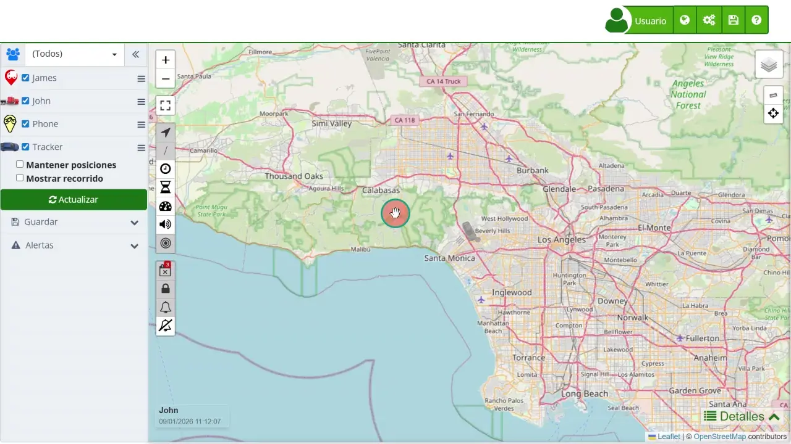

# Geocercas
Las geocercas son herramientas fundamentales para el monitoreo y control de ubicaciones específicas dentro del sistema de seguimiento satelital Plaspy. Estas permiten establecer zonas virtuales en el [mapa](https://app.plaspy.com/Map) que pueden generar alertas cuando un dispositivo entra o sale de dichas áreas. Las geocercas pueden configurarse de varias formas, incluyendo zonas permitidas, prohibidas, de control, puntos de control y rutas, adaptándose a diferentes necesidades de monitoreo.

Para crear y gestionar geocercas, los usuarios pueden utilizar las herramientas disponibles en el [panel de control del mapa](device_control_panel). Desde aquí, se pueden dibujar directamente sobre el mapa utilizando las opciones de cursor, zona permitida, zona prohibida, zona de control, punto de control y ruta. Además, es posible editar y renombrar las geocercas existentes, así como eliminar aquellas que ya no son necesarias. Estas funciones son cruciales para la gestión efectiva de flotas y activos, permitiendo alertas automatizadas que mejoran la eficiencia y seguridad operativa.

### Tipos de Geocercas y Casos de Uso

- **Cursor**: Esta opción permite seleccionar y manipular elementos existentes en el mapa, facilitando la edición de geocercas previamente creadas.
- **Zona permitida**: Útil para definir áreas donde se permite que los dispositivos operen libremente. Por ejemplo, una empresa de logística puede establecer una zona permitida en su centro de distribución, permitiendo que los vehículos se muevan sin generar alertas.
- **Zona prohibida**: Ideal para establecer áreas donde el acceso está restringido. Un ejemplo sería crear una geocerca alrededor de un área sensible donde no se permite la entrada de vehículos de la flota.
- **Zona de control**: Se utiliza para monitorear entradas y salidas en áreas específicas, como en las fronteras de una ciudad o instalaciones de alto valor. Un caso de uso podría ser el control de acceso a un área industrial, asegurando que solo los vehículos autorizados entren o salgan.
- **Punto de control**: Permite establecer puntos específicos que los dispositivos deben alcanzar. Esto es útil en rutas de entrega donde cada punto representa una parada obligatoria para el vehículo.
- **Ruta**: Define caminos específicos que los dispositivos deben seguir. Un caso de uso típico sería una ruta de transporte público donde se requiere que los vehículos sigan un trayecto fijo.

Estas funcionalidades aseguran que los usuarios puedan personalizar el monitoreo según sus necesidades específicas, proporcionando una herramienta poderosa para la gestión de activos y flotas.

### Acceso y Uso de Geocercas

Para acceder a las opciones de geocercas en Plaspy, siga estos pasos:

1. **Acceso**: Inicie sesión en su cuenta de Plaspy y diríjase al mapa principal.
2. **Menú de Geocercas:** En el panel lateral izquierdo encontrará la sección “ Alertas”. Selecciónela para mostrar las opciones disponibles.
3. **Opciones de Geocercas**: Dentro del menú, abra el apartado **“** Geo Cercas**”** para visualizar todas las herramientas relacionadas.
4. **Dibujo de Geocercas**: Seleccione el tipo de geocerca que desea crear \(Cursor, Zona permitida, Zona prohibida, etc.\) y dibuje directamente sobre el mapa.
5. **Gestión de Geocercas**: Una vez creadas, puede editar, renombrar o eliminar las geocercas según sea necesario.

Con estas herramientas, podrá gestionar de manera efectiva las áreas de operación de sus dispositivos, optimizando la seguridad y eficiencia de sus operaciones diarias.
