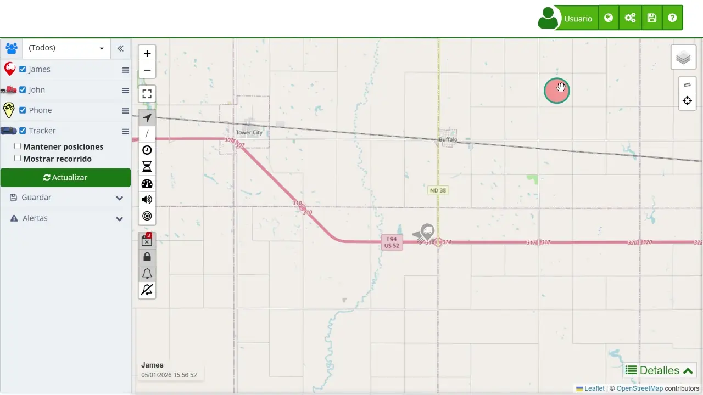

# Mapa
El [mapa](https://app.plaspy.com/Map) de Plaspy es una herramienta de monitoreo avanzada diseñada para proporcionar una visualización interactiva y en tiempo real de la ubicación de diversos dispositivos rastreadores. Este mapa está organizado en varias secciones clave, cada una con funcionalidades específicas que permiten a los usuarios gestionar y analizar la información de seguimiento de manera eficiente. A continuación, se detallan las diferentes partes del mapa y sus capacidades, ofreciendo una guía completa para comprender y utilizar todas las funciones disponibles.

Para acceder al mapa, navega a través del menú principal de la aplicación web y selecciona la opción "[Mapa](https://app.plaspy.com/Map)". Una vez allí, se te presentará una vista general de todos los dispositivos rastreados, junto con diversas opciones para personalizar la visualización y obtener información precisa sobre cada uno de ellos.

## Mapa Principal

El mapa principal es el componente más crucial de la herramienta de monitoreo de Plaspy. Aquí es donde se visualizan todos los dispositivos rastreados y sus rutas en una interfaz central y accesible. La actualización en tiempo real de la ubicación de los dispositivos proporciona datos precisos y actuales, esenciales para el monitoreo continuo. Además, la interfaz interactiva permite a los usuarios interactuar directamente con los marcadores y controles, mejorando la experiencia del usuario y permitiendo un seguimiento más eficiente. Las diferentes capas del mapa, como vistas satelitales y de calle, ofrecen opciones de visualización adaptadas a diversas necesidades, facilitando un análisis detallado y la toma de decisiones informadas.

Esta área central del mapa también permite la visualización de rutas y recorridos históricos de los dispositivos dentro de un rango de fechas seleccionado. Esta funcionalidad es especialmente útil para el análisis de patrones de movimiento y la planificación de rutas futuras. La capacidad de cambiar entre diferentes vistas del mapa y utilizar herramientas de zoom para obtener vistas más detalladas o más amplias del área, aumenta significativamente la eficacia del monitoreo y la gestión de dispositivos.

## Botones sobre el mapa

Los [iconos sobre el mapa](buttons_on_the_map) representan los marcadores de dispositivos y son una parte esencial de la interfaz visual. Cada marcador en el mapa indica la ubicación actual de un dispositivo y puede tener diferentes colores y formas según su estado, facilitando una identificación rápida y visual. Estos iconos no solo muestran la ubicación, sino que también permiten una interacción directa. Al hacer clic en un marcador, se despliega una ventana emergente con información detallada del dispositivo, como su última actualización y otros datos relevantes.

Estos iconos mejoran la experiencia del usuario al permitir acciones como centrar el mapa en un dispositivo específico y cambiar entre diferentes vistas del mapa. Esta capacidad interactiva no solo facilita el monitoreo en tiempo real, sino que también permite a los usuarios personalizar su vista del mapa según sus necesidades específicas, mejorando así la capacidad de seguimiento y análisis.

-animated.webp")

## Panel de dispositivos izquierdo

La [parte izquierda del mapa](device_control_panel) está dedicada a la gestión y visualización de dispositivos rastreados. Aquí, los usuarios encontrarán una lista completa de todos los dispositivos asociados a su cuenta. Esta lista permite seleccionar y deseleccionar dispositivos, facilitando la visualización u ocultación de su ubicación en el mapa. Los dispositivos pueden ser buscados rápidamente utilizando el campo de búsqueda, lo que es especialmente útil cuando se gestionan grandes cantidades de dispositivos. Además, los dispositivos pueden agruparse en categorías personalizables, lo que simplifica la gestión y organización.

En esta sección también se encuentran opciones de visualización avanzadas. La opción "Mantener Posiciones" permite conservar los puntos actuales de los dispositivos en el mapa al realizar nuevas consultas, asegurando que la información no se pierda. La opción "Mostrar Recorrido" permite visualizar la ruta histórica de un dispositivo en un rango de fechas específico, proporcionando una visión detallada de sus movimientos. El botón "Actualizar" permite refrescar manualmente la información del mapa, asegurando que los datos mostrados estén siempre actualizados y reflejen la situación en tiempo real.

-animated.webp")

## Panel inferior de detalles

En la [parte inferior del mapa](details) se encuentran los detalles específicos del dispositivo seleccionado. Esta sección proporciona una visión detallada de la información del dispositivo, incluyendo su última ubicación conocida, velocidad actual y estado de la batería. Estos datos son esenciales para el monitoreo preciso y en tiempo real de cada dispositivo, permitiendo a los usuarios tomar decisiones informadas basadas en datos actualizados.

Además, esta área incluye un historial de actividad que registra los últimos movimientos y eventos del dispositivo. Este historial es invaluable para analizar patrones de comportamiento y detectar cualquier actividad inusual. Las alertas y notificaciones también se gestionan desde esta sección, permitiendo a los usuarios configurar y visualizar alertas basadas en la entrada y salida de geocercas, así como otros eventos críticos. Esta funcionalidad es fundamental para la seguridad y el seguimiento eficiente de los dispositivos.

El mapa de Plaspy está diseñado para ofrecer una experiencia de usuario completa y eficiente, facilitando el monitoreo y gestión de múltiples dispositivos. Cada componente del mapa tiene una función específica que contribuye a proporcionar una visualización detallada y personalizable de la información de seguimiento satelital. Al familiarizarse con estos componentes, los usuarios pueden maximizar el uso de la herramienta y mejorar su capacidad para tomar decisiones informadas basadas en datos en tiempo real.

-animated.webp")

## Preguntas Frecuentes

- **¿Cómo puedo ver la ruta completa de un dispositivo?**
    - Activa la opción "[Mostrar recorrido](viewing_a_devices_route_history)" en el panel lateral y selecciona el rango de fechas deseado para visualizar la ruta completa en el mapa.
- **¿Puedo configurar alertas para zonas específicas?**
    - Sí, utiliza el panel de alertas para crear [geocercas](geofences) y configurar alertas basadas en la entrada o salida de estas zonas.
- **¿Cómo exporto los datos del mapa a Excel?**
    - En el menú de guardado, selecciona la opción " MS Excel" para exportar los datos actuales del mapa en formato Excel.

Este manual cubre las funcionalidades básicas del mapa en Plaspy, proporcionando una guía clara y detallada para maximizar el uso de esta herramienta de seguimiento satelital.
