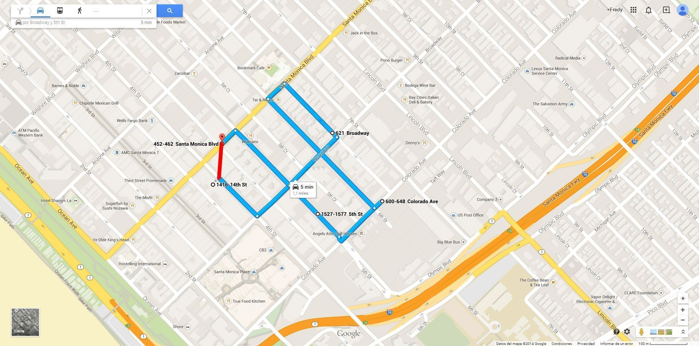

# Cálculo de kilometraje
En Plaspy, el cálculo del kilometraje de un vehículo se basa en las posiciones enviadas por el rastreador para determinar la ubicación. Es fundamental comprender que este cálculo es un aproximado y no siempre refleja con precisión la distancia recorrida debido a las limitaciones en la transmisión de datos y las características del terreno.

El sistema de Plaspy calcula la distancia utilizando las posiciones reportadas por el dispositivo de rastreo, conectando estos puntos de forma recta. Esto significa que las curvas y otros detalles del trayecto real pueden no ser considerados en el cálculo, lo que puede resultar en diferencias entre la distancia real y la distancia reportada.

## Cómo se Calcula el Kilometraje

- **Método de Cálculo:** El kilometraje se calcula basándose en las posiciones transmitidas por el dispositivo de rastreo. El sistema conecta estos puntos con líneas rectas, lo que puede omitir curvas y otros detalles del trayecto real.
- **Limitaciones del Cálculo:** Si un vehículo recorre un círculo cerrado y vuelve a la posición original, el sistema lo considerará como una distancia de 0 km. Esto se debe a que el cálculo se realiza únicamente entre puntos de transmisión y no considera el camino real tomado por el vehículo.
- **Visualización de Rutas:** En las gráficas de Plaspy, el recorrido real del vehículo se muestra en azul, mientras que la ruta calculada basada en los puntos de transmisión se muestra en rojo. Esto permite a los usuarios comparar la distancia real con la calculada.

## Optimización del Cálculo

Para mejorar la precisión del cálculo de kilometraje, es recomendable reducir el intervalo de transmisión de datos del dispositivo de rastreo. Sin embargo, es necesario equilibrar la frecuencia de transmisión con el consumo de datos, la duración de la batería y la capacidad del procesador del dispositivo.

- **Frecuencia de Transmisión:** Transmitir datos más frecuentemente mejorará la precisión del cálculo de kilometraje, pero también aumentará el consumo de datos y batería, y requerirá un mayor uso del procesador del dispositivo.
- **Recomendaciones:** Se sugiere ajustar el intervalo de transmisión al menor tiempo posible que mantenga un equilibrio aceptable entre precisión, consumo de datos y duración de la batería.

## Ejemplos

Para ilustrar cómo se calcula el kilometraje y las posibles diferencias con la distancia real recorrida, se pueden consultar los siguientes ejemplos gráficos:

Azul el recorrido real del vehículo  
Rojo el recorrido reportado a **Plaspy**

Ejemplo 1

Ejemplo 2

## Consideraciones Finales

Es importante tener en cuenta que el cálculo del kilometraje en Plaspy es una estimación y puede no reflejar con precisión la distancia real recorrida debido a las limitaciones del método de cálculo y las características del terreno. Los usuarios deben ser conscientes de estas limitaciones y ajustar sus expectativas en consecuencia.

Al comprender el proceso y las limitaciones del cálculo de kilometraje en Plaspy, los usuarios pueden optimizar el uso de sus dispositivos de rastreo y obtener una mejor aproximación de las distancias recorridas por sus vehículos.
