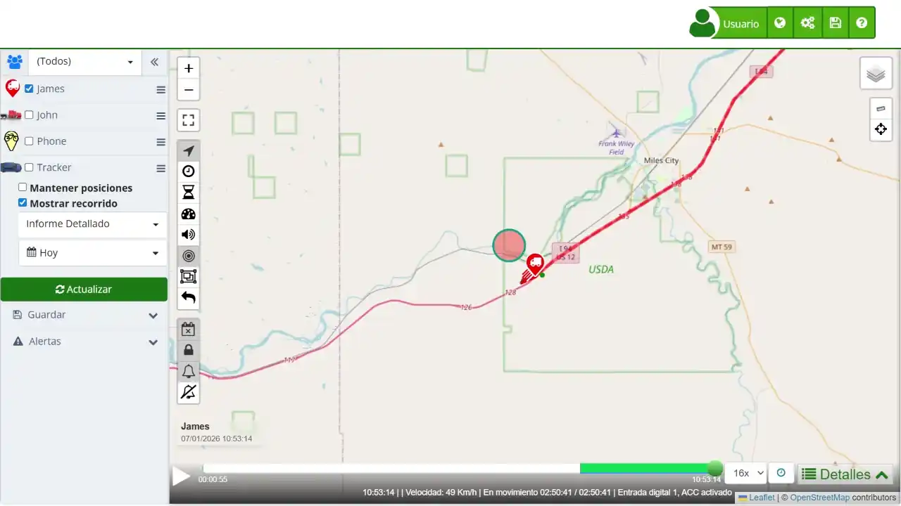

# Cronología
El [panel de cronología](https://app.plaspy.com/Map)*fa-external-link* en Plaspy proporciona un resumen detallado del desempeño del dispositivo durante un recorrido específico. A continuación, se detallan los botones y  que se presentan en esta sección:

### Botones de filtrado

- **Movimiento \(\):** Filtra la cronología para ver únicamente los tramos en los que el dispositivo estuvo en movimiento. Útil para revisar velocidades, trayectos y tiempos activos.
- **Estacionado \(\):**Muestra los eventos donde el dispositivo estuvo detenido y estacionado. Ideal para verificar cuánto tiempo permaneció parado y en qué lugares.
- **Ralentí \(\):**Muestra los períodos en los que el dispositivo estuvo encendido pero sin avanzar. Ayuda a identificar tiempos improductivos y posibles desperdicios de combustible.
- **Alertas \(\):**Muestra detalles de alertas enviadas por el dispositivo, como exceso de velocidad, desconexiones o entrada/salida de geocercas. Sirve para detectar situaciones que necesitan atención.
- **Alertas críticas \(\):** Muestra alertas más importantes o de mayor riesgo. Estas alertas requieren atención inmediata para evitar problemas o incidentes.

### Campos del Resumen:

- **Velocidad máxima:** Permite identificar los picos más altos de velocidad y detectar posibles excesos o eventos puntuales durante la conducción.
- **Velocidad promedio:** Ofrece una referencia general del ritmo del trayecto y facilita la comparación entre recorridos similares.
- **Kilómetros recorridos:** Ayuda a llevar control del uso del vehículo, planificar mantenimientos por kilometraje y validar distancias recorridas.
- **Número de paradas:** Muestra cuántas detenciones se realizaron y permite identificar paradas excesivas o no previstas.
- **Tiempo en movimiento:** Indica el tiempo real de desplazamiento y ayuda a estimar la duración de trayectos, operaciones o entregas.
- **Tiempo detenido:** Refleja los periodos de espera o estacionamiento, útil para detectar tiempos prolongados o improductivos.
- **Sensores activos \(Opcional\):** Registra los momentos en los que se activaron sensores instalados \(como ignición, puerta o carga\) y la duración de cada activación.
- **Porcentaje de combustible \(%\) \(Opcional\):** Muestra el nivel de combustible al finalizar el recorrido y facilita el control del consumo y las recargas.
- **Km por tanque \(Opcional\):** Estima la autonomía aproximada del vehículo con el tanque lleno y ayuda a planificar rutas según su alcance.

### Instrucciones para Consultar la Cronología de Recorridos

1. **Abrir la sección de recorridos**: En el panel lateral izquierdo, selecciona el dispositivo del cual deseas ver el recorrido.
2. **[Seleccionar un recorrido](viewing_a_devices_route_history)**: Utiliza el selector de fecha para definir el período del recorrido que deseas visualizar.
3. **Mostrar recorrido**: Marca la opción "[Mostrar recorrido](viewing_a_devices_route_history)" y haz clic en el botón "Actualizar" para visualizar la ruta en el mapa.
4. **Abrir apartado de Cronología \(*fa-clock-o*\)**: En la parte [inferior derecha del mapa](details), haz clic en el icono *fa-clock-o* antes del botón de "*fa-list* Detalles".

### Validaciones y Restricciones

- **Intervalo de Fechas**: Asegúrate de que las fechas seleccionadas para el recorrido estén dentro del rango de datos disponible para el dispositivo.
- **Precisión de Sensores**: Algunos sensores pueden no estar disponibles para todos los dispositivos, dependiendo de sus capacidades.

### Preguntas Frecuentes

**¿Por qué no veo datos de todos los sensores?**

- Asegúrate de que el dispositivo tiene los sensores correspondientes y que están habilitados y funcionando correctamente durante el recorrido.

**¿Qué significan las diferentes métricas de combustible?**

- "Combustible \(%\)" indica el porcentaje de combustible restante. "Distancia por tanque" y "Distancia por unidad de combustible" muestran la eficiencia del combustible.
