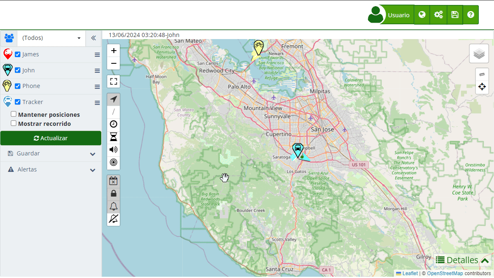

# Estadísticas de Recorridos
El [panel de estadísticas](https://app.plaspy.com/Map) en Plaspy proporciona un resumen detallado del desempeño del dispositivo durante un recorrido específico. A continuación, se detallan los campos y métricas que se presentan en esta sección:

### Campos y Descripciones

- **Desde**: La fecha y hora de inicio del recorrido.
- **Hasta**: La fecha y hora de finalización del recorrido.
- **Máx. Velocidad**: La velocidad máxima alcanzada durante el recorrido, medida en las unidades configuradas \(Km/h o Mi/h\).
- **Velocidad promedio**: La velocidad promedio durante el recorrido, medida en las unidades configuradas \(Km/h o Mi/h\).
- **Distancia recorrida**: La distancia total recorrida, medida en las unidades configuradas \(Km o Mi\).
- **Paradas**: El número total de paradas realizadas durante el recorrido.
- **Tiempo en movimiento**: La cantidad total de tiempo que el dispositivo estuvo en movimiento.
- **Tiempo estático**: La cantidad total de tiempo que el dispositivo estuvo detenido.
- **Tiempo en ralentí**: \(Opcional\) El tiempo total que el dispositivo estuvo en ralentí.
- **Sensor 1**: \(Opcional\) Tiempo que el Sensor 1 estuvo activo.
- **Sensor 2**: \(Opcional\) Tiempo que el Sensor 2 estuvo activo.
- **Combustible \(%\)**: El porcentaje de combustible restante en el tanque al final del recorrido.
- **Distancia por tanque**: Los kilómetros o millas recorridos por tanque de combustible.
- **Combustible**: La cantidad de combustible utilizada, medida en litros o galones.
- **Distancia por unidad de combustible**: Los kilómetros o millas recorridos por litro o galón de combustible.
- **Combustible 2 \(%\)**: \(Opcional\) El porcentaje de combustible restante en un segundo tanque al final del recorrido.
- **Distancia por tanque 2**: \(Opcional\) Los kilómetros o millas recorridos por el segundo tanque de combustible.
- **Combustible 2**: \(Opcional\) La cantidad de combustible utilizada en el segundo tanque, medida en litros o galones.
- **Distancia por unidad de combustible 2**: \(Opcional\) Los kilómetros o millas recorridos por litro o galón de combustible del segundo tanque.
- **Temperatura mínima**: La temperatura mínima registrada durante el recorrido, medida en las unidades configuradas \(Celsius o Fahrenheit\).
- **Temperatura máxima**: La temperatura máxima registrada durante el recorrido, medida en las unidades configuradas \(Celsius o Fahrenheit\).

### Instrucciones para Consultar Estadísticas de Recorridos

1. **Abrir la sección de recorridos**: En el panel lateral izquierdo, selecciona el dispositivo del cual deseas ver el recorrido.
2. **[Seleccionar un recorrido](viewing_a_devices_route_history)**: Utiliza el selector de fecha para definir el período del recorrido que deseas visualizar.
3. **Mostrar recorrido**: Marca la opción "[Mostrar recorrido](viewing_a_devices_route_history)" y haz clic en el botón "Actualizar" para visualizar la ruta en el mapa.
4. **Abrir detalles de estadísticas**: En la parte [inferior del mapa](details), haz clic en la pestaña "Estadísticas" dentro del panel de detalles.

### Validaciones y Restricciones

- **Intervalo de Fechas**: Asegúrate de que las fechas seleccionadas para el recorrido estén dentro del rango de datos disponible para el dispositivo.
- **Precisión de Sensores**: Algunos sensores pueden no estar disponibles para todos los dispositivos, dependiendo de sus capacidades.

### Preguntas Frecuentes

**¿Por qué no veo datos de todos los sensores?**

- Asegúrate de que el dispositivo tiene los sensores correspondientes y que están habilitados y funcionando correctamente durante el recorrido.

**¿Qué significan las diferentes métricas de combustible?**

- "Combustible \(%\)" indica el porcentaje de combustible restante. "Distancia por tanque" y "Distancia por unidad de combustible" muestran la eficiencia del combustible.
