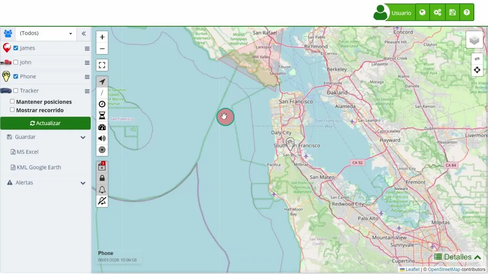
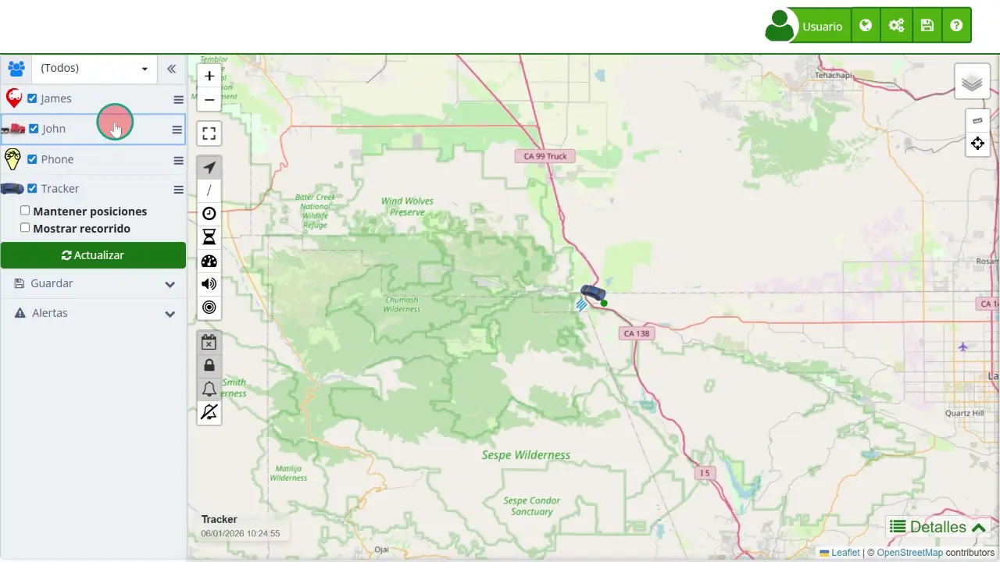
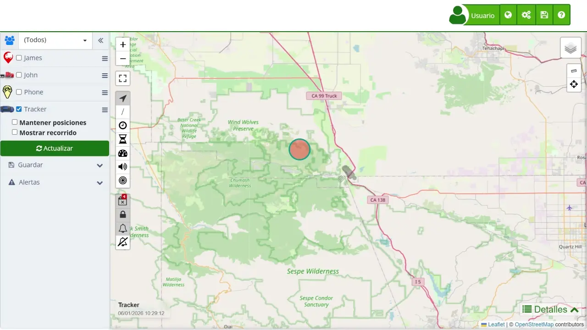
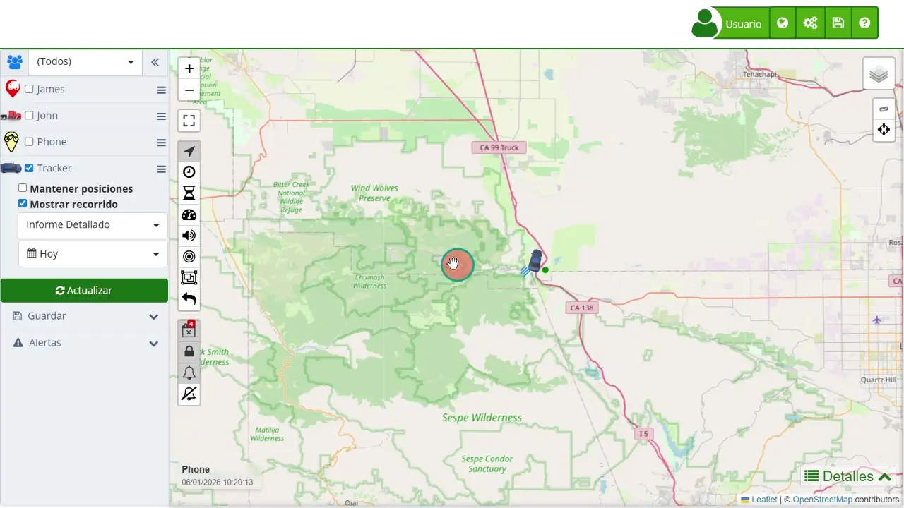
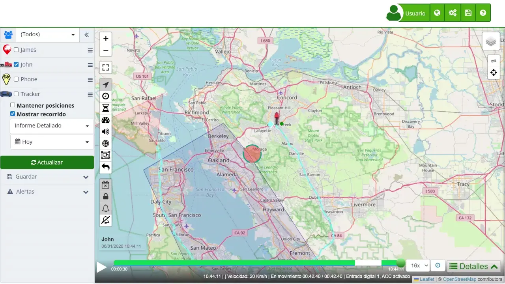
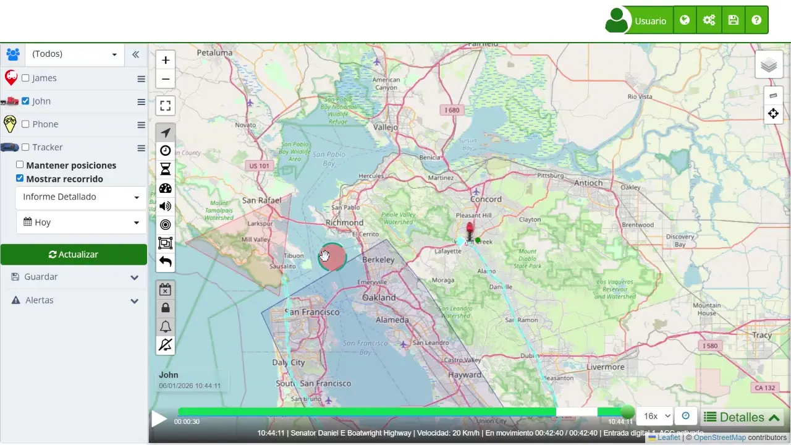

# Consultar el Historial de Recorridos de un Dispositivo
Plaspy permite a los usuarios visualizar el historial completo de recorridos de sus dispositivos en el [mapa](https://app.plaspy.com/Map). Esta funcionalidad es útil para rastrear los movimientos y actividades de sus dispositivos durante un período seleccionado. Siga estos pasos para ver el historial de recorridos de un dispositivo y entienda los controles de reproducción disponibles:

#### Pasos para Ver un Recorrido:

- **Seleccionar Dispositivos**: En el panel izquierdo, seleccione el dispositivo o los dispositivos cuyos recorridos desea ver. Puede elegir un dispositivo específico o varios dispositivos simultáneamente. Use las casillas de verificación junto a cada dispositivo para hacer su selección.

- **Activar Mostrar Recorrido**: Marque la opción "Mostrar recorrido". Esto habilitará la función de mostrar recorridos y mostrará configuraciones adicionales para personalizar la visualización del recorrido.

- **Elegir Rango de Fechas**: Seleccione el rango de fechas para el recorrido que desea ver. Puede elegir entre opciones predefinidas como "Hoy" o establecer un rango personalizado. Esta flexibilidad le permite ver recorridos de la última hora, fechas específicas o cualquier período deseado.

- **Actualizar Mapa**: Haga clic en el botón " Actualizar". Esto cargará los recorridos seleccionados en el mapa. El sistema mostrará el recorrido, mostrando todas las ubicaciones reportadas por el dispositivo durante el período seleccionado.

#### Controles de Reproducción:

Una vez que el recorrido se muestra en el mapa, varios controles de reproducción en la parte inferior del mapa estarán disponibles para mejorar la experiencia de visualización:

- **Botón de Reproducir/Pausar**: Presione el botón de "Reproducir" para iniciar la reproducción del recorrido o "Pausar" para detener la animación. Al presionar "Reproducir", se animará el movimiento del dispositivo a lo largo del recorrido mostrado. "Pausar" detendrá la animación en el punto actual.
- **Deslizador de Tiempo**: Use el deslizador de tiempo en la parte inferior de la pantalla para navegar manualmente por el recorrido. Arrastrar el deslizador hacia la izquierda o derecha moverá la reproducción a diferentes momentos dentro del rango de fechas seleccionado, permitiéndole ver dónde estaba el dispositivo en momentos específicos.
- **Control de Velocidad**: Ajuste la velocidad de reproducción para adelantar o ralentizar la animación. Este control le ayuda a revisar rápidamente recorridos largos o a analizar detenidamente segmentos específicos del viaje.
- **Panel de Información del Recorrido**: Observe el panel de información que aparece durante la reproducción. Este panel proporciona detalles sobre la ubicación, velocidad y otros datos relevantes del dispositivo en el punto actual de la reproducción. Se actualiza dinámicamente a medida que avanza la reproducción, ofreciendo información en tiempo real sobre las actividades del dispositivo.

**Íconos adicionales en el mapa**

- ***/* Rastro**  
Permite mostrar u ocultar el rastro histórico de un dispositivo, mostrando su recorrido pasado. Esto es útil para analizar movimientos históricos, detectar patrones de desplazamiento y revisar rutas completadas para optimizar la planificación de futuras rutas.
- **Agrupar puntos cercanos**  
Agrupa visualmente los dispositivos que están muy cerca unos de otros para mejorar la visibilidad y facilitar el conteo. Esto es especialmente útil en áreas con alta densidad de dispositivos, como en grandes estacionamientos o eventos masivos.
- **Mostrar todos los marcadores**  
Muestra todos los marcadores del recorrido completo de un dispositivo. Normalmente, solo se muestra el último marcador de la ruta, pero esta opción permite ver todos los puntos del recorrido, útil para análisis detallados y auditorías de rutas.

Siguiendo estos pasos y utilizando los controles de reproducción, podrá monitorear y analizar eficazmente el historial de movimientos de sus dispositivos dentro de la plataforma Plaspy. Esta funcionalidad es especialmente beneficiosa para la gestión de flotas, el seguimiento logístico y la garantía de seguridad y eficiencia en sus operaciones.
