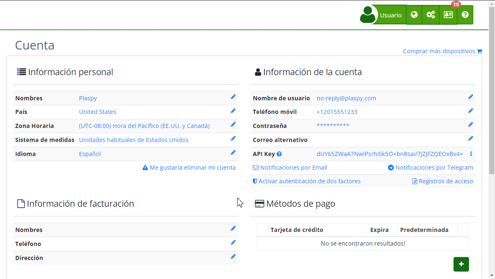

# Activar autenticación de dos factores (2FA)
La [Autenticación de Dos Factores](https://app.plaspy.com/UserSecurity/EnableOTP) \(2FA\) es una medida de seguridad adicional que ayuda a proteger tu cuenta de accesos no autorizados. Al activar 2FA, necesitarás un código de seguridad generado por una aplicación de autenticación, además de tu contraseña, para acceder a tu cuenta.

### Descripción de Campos

- **Correo Electrónico:** Muestra el correo electrónico asociado a la cuenta para la cual se está activando 2FA.
- **Aplicaciones de Autenticación:** Enlaces a aplicaciones recomendadas como [Google Authenticator](https://support.google.com/accounts/answer/1066447?hl=es), [Authy](https://authy.com/), y [Microsoft Authenticator](https://www.microsoft.com/es/security/mobile-authenticator-app).
- **Botón Activar 2FA:** Inicia el proceso de activación de la Autenticación de Dos Factores.
- **Botón Cancelar:** Cancela el proceso y regresa a la pantalla anterior.

### Instrucciones Paso a Paso

1. **Acceder a la Configuración de 2FA:**

 - Inicia sesión en tu cuenta.
 - Navega a la sección de "[Cuenta](https://app.plaspy.com/Account)" desde el menú principal.
 - Haz clic en "[Activar autenticación de dos factores](https://app.plaspy.com/UserSecurity/EnableOTP)".
2. **Iniciar el Proceso de Activación:**

 - En la pantalla de "Activar autenticación de dos factores", verás tu correo electrónico asociado y una breve descripción de 2FA.
 - Haz clic en el botón **Activar 2FA**.
3. **Configurar la Aplicación de Autenticación:**

 - Selecciona y descarga una aplicación de autenticación de tu preferencia \(por ejemplo, Google Authenticator, Authy o Microsoft Authenticator\).
 - Abre la aplicación y sigue las instrucciones para agregar una nueva cuenta.
4. **Escanear el Código QR:**

 - te mostrará un código QR que deberás escanear con la aplicación de autenticación.
 - Si tu aplicación no soporta escanear códigos QR, puedes ingresar manualmente el código proporcionado por.
5. **Ingresar el Código de Seguridad:**

 - Una vez escaneado el código QR o ingresado manualmente, la aplicación generará un código de seguridad.
 - Introduce este código en el campo correspondiente para completar el proceso de activación.
6. **Confirmación de Contraseña:**

 - Por razones de seguridad, se te pedirá que confirmes tu contraseña actual.
 - Introduce tu contraseña y haz clic en **Aceptar**.
7. **Finalizar:**

 - Una vez completado el proceso, 2FA estará activado para tu cuenta. Cada vez que inicies sesión, necesitarás proporcionar el código generado por la aplicación de autenticación, además de tu contraseña.

### Validaciones y Restricciones

- **Código de Seguridad:** El código de seguridad generado por la aplicación de autenticación es válido solo por un corto período de tiempo. Asegúrate de ingresarlo rápidamente.
- **Confirmación de Contraseña:** Debes ingresar correctamente tu contraseña actual para finalizar la configuración de 2FA.
- **Aplicaciones Compatibles:** Utiliza solo aplicaciones de autenticación compatibles y recomendadas para asegurar la correcta generación de códigos.

### Preguntas Frecuentes

- **¿Qué es la Autenticación de Dos Factores \(2FA\)?** 2FA es una medida de seguridad que requiere dos formas de verificación para acceder a tu cuenta: tu contraseña y un código de seguridad generado por una aplicación de autenticación.
- **¿Qué sucede si pierdo el acceso a mi aplicación de autenticación?** En caso de perder acceso a tu aplicación de autenticación, contacta al soporte para asistencia en la recuperación de tu cuenta.
- **¿Puedo desactivar 2FA una vez activada?** Sí, puedes desactivar 2FA desde la misma sección de configuración en tu cuenta. Sin embargo, no se recomienda desactivar esta capa adicional de seguridad.

Esta guía te ayudará a activar y configurar la Autenticación de Dos Factores en tu cuenta, mejorando la seguridad y protección de tu información.
