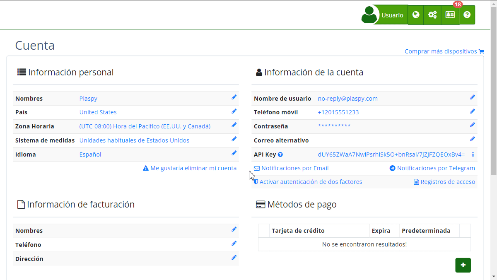

# Correo Electrónico Alternativo
El uso de un correo electrónico alternativo en Plaspy es una medida adicional de seguridad que te permite recuperar tu cuenta en caso de que no puedas acceder a tu correo principal. A continuación, se detalla cómo configurar y utilizar esta funcionalidad.

### Descripción de Campos

- **Correo Electrónico Alternativo:** Campo donde ingresas una dirección de correo electrónico adicional que será utilizada para asegurar tu cuenta.
- **Botón Confirmar:** Guarda la dirección de correo electrónico alternativo ingresada.
- **Enlace Ahora no:** Opción para omitir la configuración del correo electrónico alternativo en este momento.

### Instrucciones Paso a Paso

1. **Acceder a la Configuración del Correo Electrónico Alternativo:**

    - Inicia sesión en tu [cuenta](https://app.plaspy.com/Account) de Plaspy.
    - Si es la primera vez que accedes, es posible que se te solicite configurar un correo electrónico alternativo.
2. **Ingresar la Dirección de Correo Alternativo:**

    - En la pantalla "[Protege tu cuenta](https://app.plaspy.com/Account)", verás tu correo electrónico principal.
    - Debajo, en el campo **Correo electrónico alternativo**, ingresa una dirección de correo electrónico adicional.
3. **Confirmar el Correo Electrónico Alternativo:**

    - Una vez ingresada la dirección, haz clic en el botón **Confirmar**.
    - Es posible que se te pida confirmar tu contraseña para mayor seguridad. Ingresa tu contraseña actual y presiona **Aceptar**.
4. **Omitir Configuración:**

    - Si no deseas configurar el correo alternativo en este momento, puedes hacer clic en el enlace **Ahora no** para proceder sin guardar cambios.

### Validaciones y Restricciones

- **Dirección de Correo Válida:** Asegúrate de ingresar una dirección de correo electrónico válida. El sistema validará el formato del email antes de permitirte guardar.
- **Confirmación de Contraseña:** Por razones de seguridad, es posible que se te pida confirmar tu contraseña actual al momento de guardar el correo electrónico alternativo.

### Preguntas Frecuentes

- **¿Por qué necesito un correo electrónico alternativo?**
    - Un correo electrónico alternativo te ayuda a recuperar el acceso a tu cuenta en caso de que pierdas acceso a tu correo principal. Esto añade una capa adicional de seguridad a tu cuenta.
- **¿Puedo cambiar mi correo electrónico alternativo más tarde?**
    - Sí, puedes cambiar tu correo electrónico alternativo en cualquier momento accediendo a la configuración de tu cuenta en Plaspy.
- **¿Qué sucede si no configuro un correo electrónico alternativo?**
    - Aunque no es obligatorio, se recomienda configurar un correo electrónico alternativo para asegurar el acceso continuo a tu cuenta y mejorar la seguridad.

Esta guía te ayudará a configurar y gestionar tu correo electrónico alternativo en Plaspy, proporcionando una medida adicional de seguridad para proteger tu cuenta.
