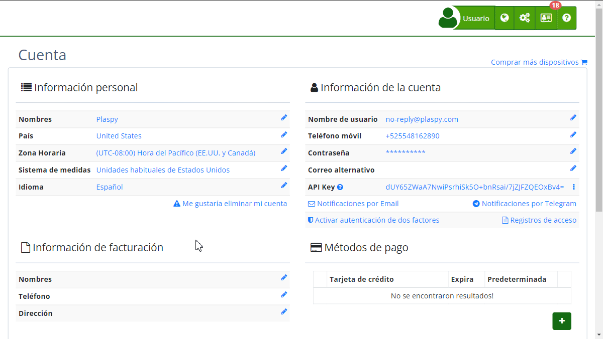

# Información de facturación
La sección de "[*fa-file-o* Información de Facturación](https://app.plaspy.com/Checkout/?from=/Account)" permite a los usuarios gestionar y actualizar los detalles necesarios para la facturación de los servicios contratados. Aquí, puedes registrar y mantener actualizada la información requerida para emitir facturas correctamente, lo cual es esencial para asegurar la continuidad de los servicios sin interrupciones.

#### Descripción de Campos

- **País:** Selecciona el país correspondiente a la dirección de facturación de una lista desplegable. Este campo es obligatorio y asegura que la información de facturación cumpla con las normativas locales.
- **Nombres:** Introduce tu nombre en el campo correspondiente. Este es un campo obligatorio y debe contener el nombre legal del responsable de la facturación.
- **Apellidos:** Completa este campo con tu apellido. Al igual que el campo de nombre, es obligatorio y debe coincidir con los datos legales.
- **Teléfono:** Proporciona un número de teléfono de contacto. Este campo es obligatorio y debe ser un número válido que permita contactar en caso de ser necesario.
- **Dirección:** Especifica la dirección física donde se recibirá la correspondencia de facturación. Este campo es esencial para la entrega de cualquier documento físico relacionado con la facturación.
- **Organización:** Si aplicable, incluye el nombre de la organización o empresa para la cual se está realizando la facturación.
- **Número de documento:** Selecciona el tipo de documento \(por ejemplo, NIF, TIN, NIT, CC, etc.\) y proporciona el número correspondiente. Este campo es crucial para validar la información fiscal y asegurar que las facturas se emitan correctamente.

#### Instrucciones Paso a Paso

1. **Acceso a la Sección:**

 - Inicia sesión en tu cuenta.
 - Navega a la sección de "[*fa-user* Cuenta](https://app.plaspy.com/Account)" desde el menú principal.
 - Haz clic en "[*fa-file-o* Información de Facturación](https://app.plaspy.com/Checkout/?from=/Account)".
2. **Actualizar Información:**

 - En el formulario de "[*fa-file-o* Información de Facturación](https://app.plaspy.com/Checkout/?from=/Account)", selecciona tu país desde la lista desplegable.
 - Introduce tu nombre y apellido en los campos correspondientes.
 - Proporciona un número de teléfono de contacto válido.
 - Completa la dirección física de facturación.
 - Si aplicable, añade el nombre de tu organización.
 - Selecciona el tipo de documento y proporciona el número de documento fiscal correspondiente.
 - Revisa que toda la información esté correcta y haz clic en "Continuar" para actualizar los datos.

#### Validaciones y Restricciones

- **Campos Obligatorios:** Todos los campos marcados con un asterisco \(\*\) son obligatorios. Asegúrate de completarlos para poder guardar la información.
- **Formato del Teléfono:** El número de teléfono debe ser válido y cumplir con el formato internacional, incluyendo el código de país.
- **Número de Documento:** Dependiendo del tipo de documento seleccionado, el número debe cumplir con el formato requerido por las autoridades fiscales.

#### Preguntas Frecuentes

- **¿Qué sucede si no actualizo mi información de facturación?**

 - Es crucial mantener la información de facturación actualizada para evitar interrupciones en el servicio y problemas con la emisión de facturas.
- **¿Cómo puedo corregir un error en mi información de facturación?**

 - Simplemente accede a la sección de "*fa-file-o* Información de Facturación", realiza los cambios necesarios y guarda la información actualizada.
- **¿Es necesario proporcionar una dirección física?**

 - Sí, una dirección física es necesaria para cualquier correspondencia relacionada con la facturación y cumplimiento fiscal.

Esta guía asegura que puedas mantener tu información de facturación precisa y actualizada, facilitando una gestión eficiente y sin inconvenientes de tus servicios.
