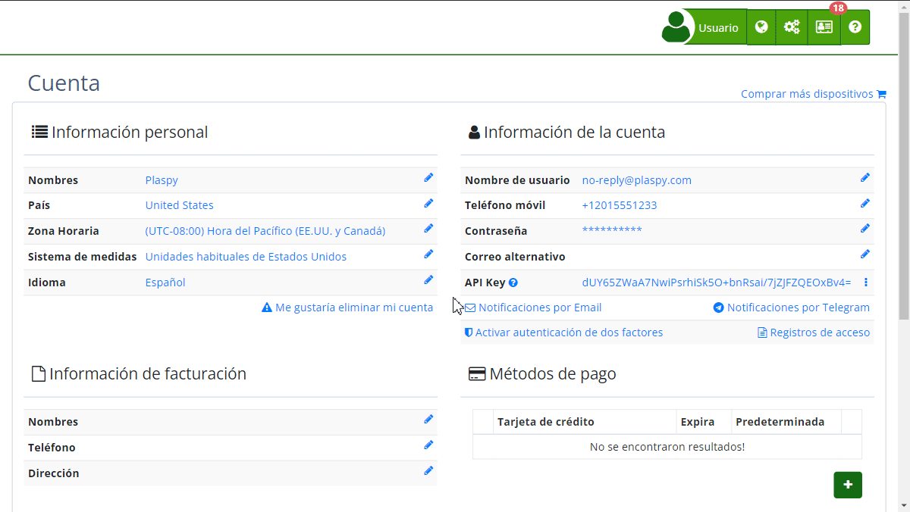

# Eliminar tu cuenta
Eliminar tu cuenta es una decisión importante y definitiva. Antes de proceder, asegúrate de haber cancelado cualquier suscripción activa para evitar pagos no deseados. Esta opción es irreversible, y una vez eliminada la cuenta, no podrás recuperar ningún dato asociado a ella.

## Instrucciones Paso a Paso

1. **Acceso a la Función de Eliminación de Cuenta:**
    - Inicia sesión en [tu cuenta](https://app.plaspy.com/Account).
    - Dirígete a la sección de configuración de la cuenta.
    - Selecciona la opción "[Eliminar tu cuenta](https://app.plaspy.com/UserSecurity/Delete?from=/Account)".
2. **Confirmación de Eliminación:**
    - Se mostrará una pantalla con el mensaje de advertencia sobre la eliminación de la cuenta.
    - Si estás seguro de proceder, haz clic en el botón rojo "Eliminar mi cuenta".
3. **Verificación de Contraseña:**
    - Por motivos de seguridad, se te pedirá que ingreses tu contraseña actual para confirmar la eliminación.
    - Ingresa tu contraseña y haz clic en "Aceptar".
4. **Confirmación Final:**
    - Después de verificar tu contraseña, la cuenta será eliminada definitivamente.
    - Recibirás una notificación confirmando la eliminación de tu cuenta.

## Validaciones y Restricciones

- **Suscripciones Activas:** Antes de eliminar tu cuenta, asegúrate de cancelar cualquier suscripción activa para evitar cargos adicionales.
- **Recuperación de Datos:** Una vez eliminada la cuenta, no se podrá recuperar ningún dato ni reactivar la cuenta.

## Preguntas Frecuentes

- **¿Qué sucede con mis datos una vez eliminada mi cuenta?** 
    - Todos los datos asociados a tu cuenta serán eliminados permanentemente y no podrán ser recuperados.
- **¿Puedo cancelar la eliminación de mi cuenta?** 
    - No, una vez que confirmes la eliminación de tu cuenta y se procese, no hay forma de revertir esta acción.
- **¿Qué debo hacer si tengo una suscripción activa?** 
    - Debes cancelar cualquier suscripción activa antes de proceder con la eliminación de tu cuenta para evitar pagos no deseados.

## Conclusión

Eliminar tu cuenta es un proceso simple pero irreversible. Asegúrate de estar completamente seguro antes de proceder y sigue cuidadosamente los pasos indicados para garantizar que la eliminación se realice de manera correcta y segura.
