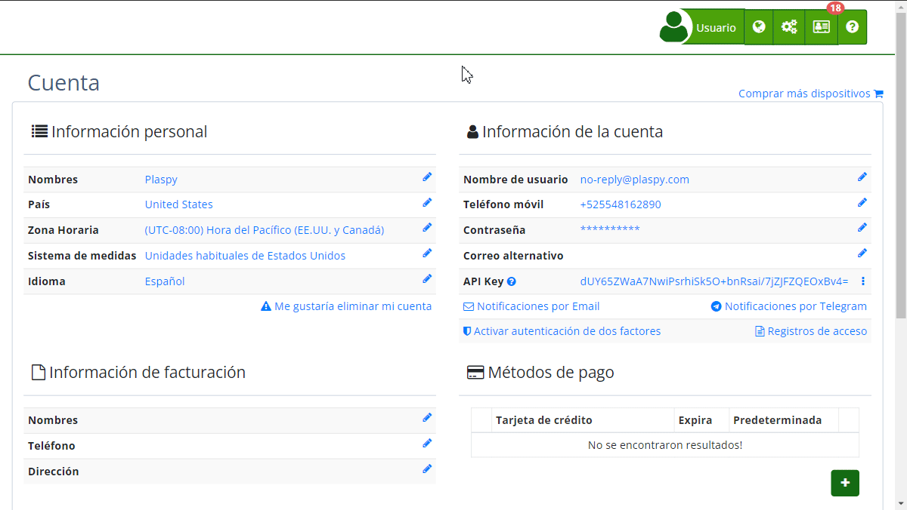

# Notificaciones por Email
Las notificaciones por email permiten a los usuarios mantenerse informados sobre las últimas actualizaciones, noticias y eventos relevantes. A través de esta funcionalidad, los usuarios pueden personalizar y seleccionar las categorías de notificaciones que desean recibir directamente en su correo electrónico.

### Descripción de Campos

- **Correo Electrónico:** Dirección de email del usuario donde se recibirán las notificaciones.
- **Categorías de Notificaciones:**
    - **Actualizaciones de producto:** Recibe actualizaciones sobre cambios en el sistema, mejoras y nuevas funcionalidades.
    - **Noticias:** Mantente informado con las últimas noticias, videos instructivos y demostraciones útiles.
    - **Alertas de Límite de Dispositivo:** Te avisa cuando un dispositivo excede el número de alertas diarias disponibles.
- **No deseo recibir ninguna notificación:** Opción para desactivar todas las notificaciones por email.
- **Botón Confirmar:** Guarda las preferencias seleccionadas.
- **Botón Cancelar:** Cancela el proceso y regresa a la página anterior.

### Instrucciones Paso a Paso

1. **Acceder a la Configuración de Notificaciones:**
    - Inicia sesión en tu cuenta.
    - Navega a la sección de "[*fa-user* Cuenta](https://app.plaspy.com/Account)" desde el menú principal.
    - Haz clic en "[*fa-envelope-o* Notificaciones por Email](https://app.plaspy.com/UserSecurity/MailNotifications)".
2. **Seleccionar Categorías:**
    - En la pantalla de configuración, verás tu correo electrónico y una descripción de las notificaciones disponibles.
    - Marca las casillas de las categorías de notificaciones que deseas recibir: **Actualizaciones**, **Noticias** y/o **Alertas de límite de dispositivos**.
3. **Desactivar Notificaciones:**
    - Si no deseas recibir ninguna notificación, marca la casilla **No deseo recibir ninguna notificación**. Esta acción desmarcará automáticamente todas las categorías.
4. **Confirmar Preferencias:**
    - Una vez seleccionadas tus preferencias, haz clic en el botón **Confirmar** para guardar los cambios.
5. **Cancelar Configuración:**
    - Si decides no realizar ningún cambio, haz clic en el botón **Cancelar** para volver a la página anterior sin guardar cambios.

### Validaciones y Restricciones

- **Categorías Seleccionadas:** Debes seleccionar al menos una categoría de notificación si no has marcado la opción de no recibir ninguna notificación.
- **Dirección de Email:** Asegúrate de que la dirección de email mostrada sea la correcta para recibir las notificaciones. Si necesitas actualizarla, puedes hacerlo desde la sección de información de la cuenta.

### Preguntas Frecuentes

- **¿Puedo cambiar mis preferencias de notificaciones más tarde?**
    - Sí, puedes cambiar tus preferencias de notificaciones en cualquier momento accediendo nuevamente a la sección de "*fa-envelope-o* Notificaciones por Email" en tu cuenta.
- **¿Qué sucede si no selecciono ninguna categoría y no marco la opción de desactivar notificaciones?**
    - Si no seleccionas ninguna categoría y tampoco marcas la opción de no recibir notificaciones, no se guardarán cambios y seguirás recibiendo las notificaciones según tu configuración anterior.
- **¿Cómo puedo asegurarme de que los emails no terminen en mi carpeta de spam?**
    - Añade la dirección de email a tu lista de contactos o lista de remitentes seguros en tu servicio de email para asegurar que los mensajes lleguen a tu bandeja de entrada.

Esta guía asegura que puedas configurar y personalizar tus notificaciones por email de manera eficiente, manteniéndote siempre informado sobre lo que más te importa.
