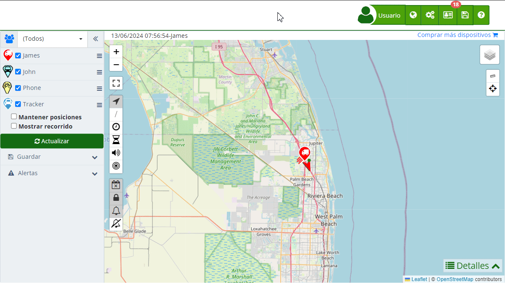

# Mi cuenta
En la sección "[*fa-user* Mi Cuenta](https://app.plaspy.com/Account)" de Plaspy, puedes gestionar toda la información relevante a tu perfil y configuración personal. Esta sección está diseñada para ofrecerte un acceso fácil y rápido a tus datos, permitiéndote actualizar y gestionar tu cuenta de manera eficiente.

### *fa-list* Información Personal

- **Nombres:** Muestra el nombre o nombres de usuario registrados. Puedes editar esta información haciendo clic en el ícono de lápiz y luego guardando los cambios.
- **País:** Indica el país registrado en tu cuenta. Para cambiarlo, selecciona el ícono de lápiz, actualiza la información y guarda los cambios.
- **Zona Horaria:** Muestra la zona horaria seleccionada al momento del registro. Si deseas modificarla, haz clic en el ícono de lápiz, selecciona la nueva zona horaria y guarda los cambios.
- **Sistema de Medidas:** Permite elegir entre diferentes sistemas de medidas para personalizar cómo se muestran los datos en la plataforma. Los sistemas de medidas disponibles son:

1. 1. **Sistema Métrico Internacional \(SI\):**Utiliza el metro, litro y kilogramo como unidades básicas para medir distancia, volumen y peso, respectivamente. Kilómetros para la distancia, litros para el volumen de combustible y kilogramos para el peso. Por ejemplo un recorrido de 100 kilómetros, un tanque de 50 litros de combustible.
    2. **Unidades Habituales de Estados Unidos \(US Customary Units\):**Utiliza el pie, galón y libra como unidades básicas para medir distancia, volumen y peso, respectivamente. Millas para la distancia, galones para el volumen de combustible y libras para el peso. Por ejemplo un recorrido de 62 millas, un tanque de 13.2 galones de combustible.
    3. **Sistema Métrico con Galones:**Combina el uso del sistema métrico para distancia y peso con el galón estadounidense para medir volumen de combustible. Kilómetros para la distancia, galones para el volumen de combustible y kilogramos para el peso. Por ejemplo un recorrido de 100 kilómetros, un tanque de 13.2 galones de combustible.

- **Idioma:** Indica el idioma de la plataforma. Puedes cambiar el idioma haciendo clic en el ícono de lápiz, seleccionando el nuevo idioma y guardando los cambios.
- *fa-exclamation-triangle* **Me gustaría eliminar mi cuenta:** Permite borrar tu cuenta de forma permanente. **Antes de hacerlo**, asegúrate de cancelar cualquier suscripción activa para evitar cobros.

### *fa-user* Información de la Cuenta

- **Nombre de Usuario:** Es el correo electrónico con el cual te registraste en Plaspy y donde recibes todas las notificaciones. Puedes cambiarlo desde esta sección.
- **Teléfono Móvil:** Muestra el número de teléfono asociado a tu cuenta. Para actualizarlo, haz clic en el ícono de lápiz y sigue las instrucciones para guardar los cambios.
- **Contraseña:** Aquí puedes cambiar tu contraseña actual. Solo debes seleccionar el ícono de lápiz y seguir las instrucciones para establecer una nueva contraseña segura.
- **Correo Alternativo:** Indica un correo electrónico alternativo para recuperación de cuenta. Puedes actualizarlo desde esta sección.
- **API Key:** Muestra tu clave de API, que puedes utilizar para integraciones y desarrollos. Puedes copiar, generar una nueva o eliminar la API Key desde esta sección.
- **Notificaciones y Seguridad:**  

    - ***fa-envelope-o* Notificaciones por Email:** Configura las notificaciones que deseas recibir por correo electrónico. Puedes añadir varios correos electrónicos separados por comas o puntos y comas. También puedes seleccionar las categorías de notificaciones que deseas recibir, como cambios en la plataforma o noticias importantes.
    - ***fa-telegram* Notificaciones por Telegram:** Permite recibir notificaciones a través de Telegram configurando esta opción desde tu cuenta.
    - ***fa-shield* Autenticación de Dos Factores:** Activa o desactiva la autenticación de dos factores para aumentar la seguridad de tu cuenta.
    - ***fa-file-text-o* Registros de Acceso:** Consulta los registros de acceso a tu cuenta para monitorear cualquier actividad sospechosa.

### *fa-file-o* Información de Facturación

- **Nombres:** Muestra el nombre registrado para fines de facturación. Puedes editarlo desde esta sección.
- **Organización:** Indica el nombre de la organización asociada a la cuenta. Puedes actualizar esta información según sea necesario.
- **Teléfono:** Muestra el número de teléfono registrado para facturación. Actualiza esta información si es necesario.
- **Dirección:** Muestra la dirección registrada para facturación. Puedes cambiarla según sea necesario.
- **ID Fiscal:** Muestra el ID fiscal registrado. Puedes actualizar esta información desde esta sección.

### *fa-credit-card* Métodos de Pago

- **Tarjetas de Crédito:** Muestra las tarjetas de crédito asociadas a tu cuenta. Puedes añadir nuevas tarjetas, eliminar las existentes y establecer la tarjeta predeterminada para pagos.

### *fa-history* Suscripciones Activas

- **Cantidad, Valor y Producto:** Muestra un resumen de todas tus suscripciones activas, incluyendo la cantidad, el valor y el producto asociado.

### *fa-file-text-o* Recibos y Facturas

- **Fecha, Cantidad, Vence, Valor y Producto:** Muestra un historial de tus recibos y facturas, incluyendo detalles como la fecha de emisión, la cantidad, la fecha de vencimiento, el valor y el producto asociado.
