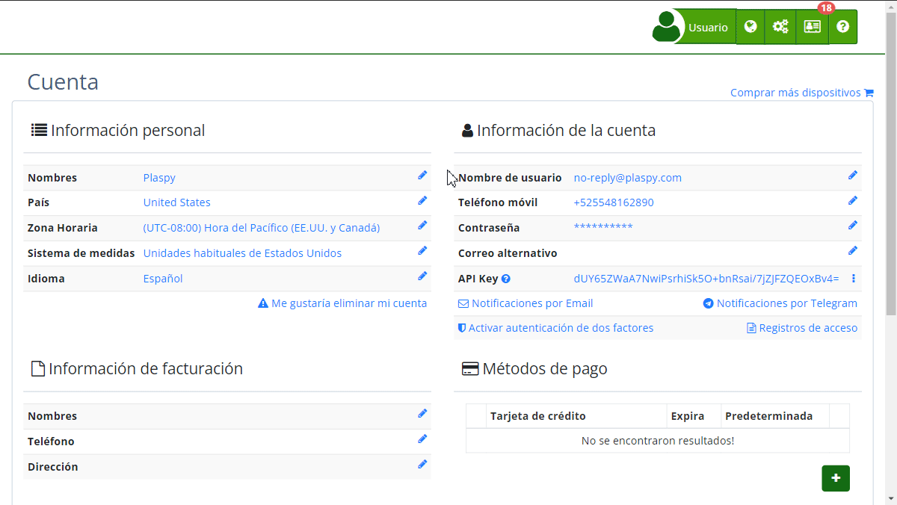

# Cambio de Contraseña
Para mantener la seguridad de tu cuenta, es importante cambiar regularmente tu contraseña. te permite actualizar tu contraseña directamente desde tu perfil de usuario. Asegúrate de seguir las políticas de seguridad al crear una nueva contraseña.

Puedes acceder a la opción de cambio de contraseña desde la sección "[Cuenta](https://app.plaspy.com/Account)" en el menú de usuario. Una vez ahí, selecciona tu [contraseña actual](https://app.plaspy.com/UserSecurity/Password?from=/Account) o el ícono de edición \([*fa-pencil*](https://app.plaspy.com/UserSecurity/Password?from=/Account)\).

### Requisitos de la Nueva Contraseña

- **1 letra minúscula**: Debe incluir al menos una letra en minúscula \(a-z\).
- **1 letra mayúscula**: Debe incluir al menos una letra en mayúscula \(A-Z\).
- **1 número**: Debe contener al menos un número \(0-9\).
- **8 caracteres**: La longitud mínima de la contraseña debe ser de 8 caracteres.

### Campos

- **Nueva contraseña**: Ingresa tu nueva contraseña asegurándote de cumplir con los requisitos mencionados.
- **Confirme la nueva contraseña**: Vuelve a ingresar la nueva contraseña para confirmarla.

### Instrucciones Paso a Paso

1. **Accede a la sección "*fa-user* Cuenta"**: En el menú de usuario, selecciona "[Cuenta](https://app.plaspy.com/Account)".
2. **Selecciona Cambiar contraseña**: Dentro de la información de tu cuenta, busca y selecciona la opción para cambiar la [contraseña](https://app.plaspy.com/UserSecurity/Password?from=/Account) \(*fa-pencil*\).
3. **Introduce la nueva contraseña**: Asegúrate de que la nueva contraseña cumple con todos los requisitos de seguridad.
4. **Confirma la nueva contraseña**: Vuelve a ingresar la nueva contraseña en el campo de confirmación.
5. **Guardar cambios**: Haz clic en el botón "Cambiar" para guardar tu nueva contraseña.

### Validaciones y Restricciones

- La nueva contraseña debe cumplir con todos los requisitos de seguridad mencionados.
- Ambas contraseñas \(la nueva y su confirmación\) deben coincidir.
- Si alguna validación falla, se mostrará un mensaje de error indicándote qué requisitos no se han cumplido.

### Preguntas Frecuentes

- **¿Por qué es importante cambiar mi contraseña regularmente?**
 - Cambiar tu contraseña regularmente ayuda a proteger tu cuenta contra accesos no autorizados y posibles violaciones de seguridad.
- **¿Qué hago si olvido mi nueva contraseña?**
 - Si olvidas tu nueva contraseña, puedes restablecerla utilizando la opción de recuperación de contraseña en la página de inicio de sesión.
- **¿Puedo usar una contraseña que ya he utilizado antes?**
 - Es recomendable no reutilizar contraseñas antiguas para garantizar una mejor seguridad.
