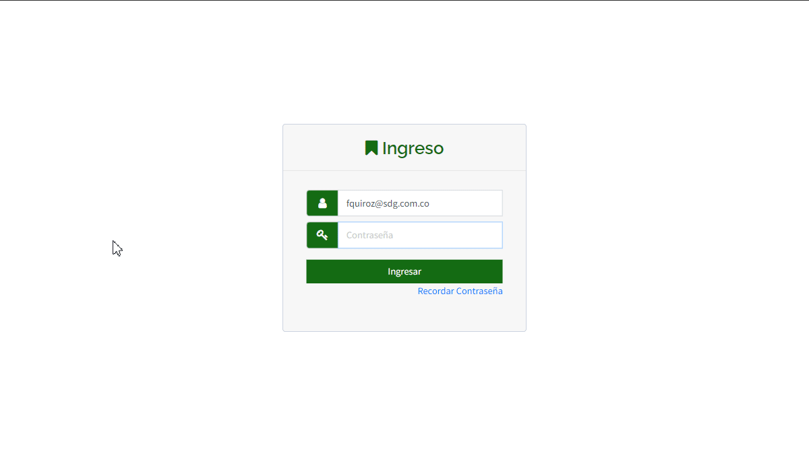

# Recordar Contraseña
, la funcionalidad de "[Recordar Contraseña](https://app.plaspy.com/Forgot/Password)" permite a los usuarios restablecer su contraseña en caso de olvido. Esta guía te llevará a través de los pasos necesarios para recuperar el acceso a tu cuenta de manera segura y eficiente.

#### Introducción

Para acceder a la opción de recordar contraseña, sigue estos pasos:

1. Abre tu navegador web y dirígete a la página principal.
2. Haz clic en el enlace "[¿Olvidó su contraseña?](https://app.plaspy.com/Forgot/Password)" que se encuentra debajo del campo de inicio de sesión.
3. Serás redirigido a la página de recordar contraseña.

#### Descripción de Campos

- **Email para inicio de sesión**: Ingresa la dirección de correo electrónico asociada con tu cuenta.
- **No soy un robot**: Marca la casilla para completar el reCAPTCHA, confirmando que no eres un robot.

#### Instrucciones Paso a Paso

1. **Ingresar Email**: En el campo "Email para inicio de sesión", introduce la dirección de correo electrónico que utilizaste para registrar tu cuenta.
2. **Completar reCAPTCHA**: Marca la casilla "No soy un robot". Esto puede requerir que completes un breve desafío visual para verificar tu identidad.
3. **Hacer clic en Recordar**: Una vez que hayas ingresado tu correo electrónico y completado el reCAPTCHA, haz clic en el botón "Recordar".
4. **Verificación de Correo**: enviará un correo electrónico a la dirección proporcionada. Revisa tu bandeja de entrada \(y la carpeta de spam, si es necesario\) para encontrar el correo de restablecimiento de contraseña. Este correo contendrá un código de verificación de 6 dígitos.
5. **Ingresar Código de Verificación**: Una vez que recibas el correo electrónico, abre el mensaje y localiza el código de verificación de 6 dígitos. Introduce este código en la página donde se solicita para continuar con el proceso de restablecimiento de contraseña.
6. **Restablecer Contraseña**: Después de ingresar el código de verificación, serás redirigido a una página donde podrás ingresar una nueva contraseña.
7. **Ingresar Nueva Contraseña**: Introduce una nueva contraseña en los campos provistos y confirma la contraseña ingresándola nuevamente. Asegúrate de que tu nueva contraseña sea segura y fácil de recordar.
8. **Confirmar Cambios**: Haz clic en el botón para confirmar los cambios. Ahora podrás iniciar sesión en tu cuenta utilizando tu nueva contraseña.

#### Validaciones y Restricciones

- **Correo Electrónico Registrado**: Asegúrate de ingresar la dirección de correo electrónico que está registrada en tu cuenta. De lo contrario, no recibirás el correo de restablecimiento.
- **Código de Verificación**: El código de 6 dígitos es válido solo por un tiempo limitado. Asegúrate de ingresarlo lo antes posible para continuar con el proceso de restablecimiento.
- **Seguridad de la Contraseña**: La nueva contraseña debe cumplir con los requisitos de seguridad establecidos por, como tener una longitud mínima y combinar letras, números y caracteres especiales.
- **Tiempo de Respuesta**: El enlace de restablecimiento de contraseña en el correo electrónico puede tener un tiempo de validez limitado. Asegúrate de usarlo lo antes posible.

#### Preguntas Frecuentes

- **¿Qué hago si no recibo el correo de restablecimiento de contraseña?**
    - Revisa tu carpeta de spam o correo no deseado.
    - Asegúrate de que la dirección de correo electrónico ingresada esté correctamente registrada en tu cuenta.
    - Si aún no recibes el correo, intenta repetir el proceso o contacta al soporte técnico.
- **¿Cómo puedo asegurarme de que mi nueva contraseña sea segura?**
    - Usa una combinación de letras mayúsculas y minúsculas, números y caracteres especiales.
    - Evita usar contraseñas comunes o información personal fácil de adivinar.
    - Considera utilizar una frase larga y única que solo tú conozcas.

Al seguir estos pasos, podrás restablecer tu contraseña de manera segura y rápida, asegurando que tu cuenta permanezca accesible y protegida.
