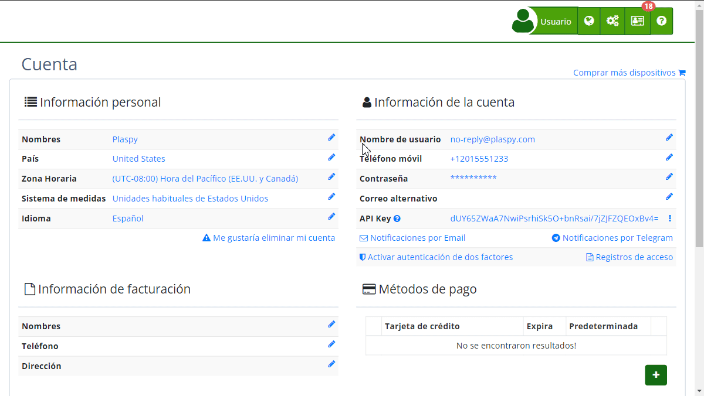

# Correo Electrónico Principal
En Plaspy, el correo electrónico principal es fundamental para la seguridad y la gestión de la cuenta. Este correo se utiliza para todas las notificaciones importantes y la verificación de la identidad del usuario. A continuación, se detalla cómo configurar y cambiar el correo electrónico principal de tu cuenta.

### Descripción de Campos

- **Correo electrónico principal:** Dirección de correo utilizada para iniciar sesión y recibir notificaciones importantes.

### Instrucciones Paso a Paso

1. **Acceder a la Configuración de la Cuenta:**

    - Inicia sesión en tu cuenta de Plaspy.
    - Dirígete a la sección "[Cuenta](https://app.plaspy.com/Account)" en el menú de navegación.
2. **Modificar el Correo Electrónico Principal:**

    - En la sección " Información de la cuenta", haz clic en el ícono de edición junto a la dirección de correo electrónico actual.
    - Se abrirá una ventana emergente titulada "[Protege tu cuenta](https://app.plaspy.com/UserSecurity/Email?from=/Account)".
3. **Ingresar Nuevo Correo Electrónico:**

    - En el campo "Email para inicio de sesión", introduce la nueva dirección de correo electrónico.
    - Lee el mensaje que indica que cambiar el correo electrónico cerrará automáticamente tu sesión y requerirá verificación.
4. **Confirmar el Cambio:**

    - Haz clic en "Confirmar".
    - Recibirás un correo electrónico en la nueva dirección para verificar el cambio.
5. **Verificar Nueva Dirección de Correo Electrónico:**

    - Abre el correo de verificación enviado a tu nueva dirección.
    - Sigue las instrucciones del correo para completar la verificación.

### Validaciones y Restricciones

- **Dirección de correo válida:** Asegúrate de ingresar una dirección de correo electrónico válida y accesible.
- **Verificación necesaria:** No podrás utilizar la nueva dirección de correo hasta que completes la verificación.
- **Seguridad adicional:** Por razones de seguridad, se te pedirá que ingreses tu contraseña actual para confirmar el cambio.

### Preguntas Frecuentes

- **¿Qué sucede si no verifico mi nueva dirección de correo?**
    - Si no verificas la nueva dirección de correo electrónico, no podrás utilizarla para iniciar sesión y las notificaciones seguirán enviándose al correo antiguo.
- **¿Puedo usar la misma dirección de correo en múltiples cuentas?**
    - No, cada dirección de correo electrónico debe ser única y no puede estar asociada a más de una cuenta de Plaspy.
- **¿Cómo recupero el acceso si no puedo verificar el nuevo correo?**
    - Si tienes problemas para verificar tu nueva dirección de correo, contacta al soporte de Plaspy para asistencia adicional.

Esta guía te ayudará a gestionar de manera efectiva tu correo electrónico principal en Plaspy, garantizando la seguridad y la accesibilidad de tu cuenta.
