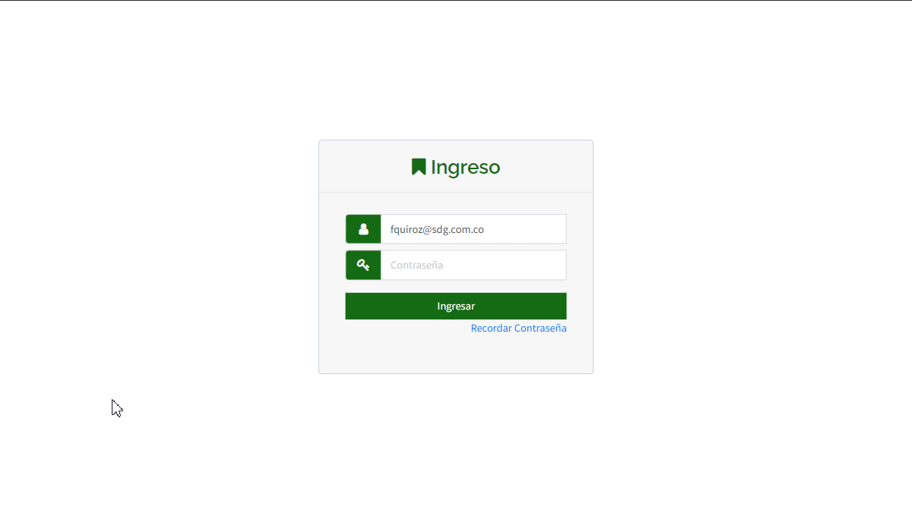

# Recordar Usuario
, la funcionalidad de "[Recordar Usuario](https://app.plaspy.com/Forgot/User)" permite a los usuarios recuperar su nombre de usuario en caso de haberlo olvidado. Esta guía te llevará a través de los pasos necesarios para recordar tu usuario de manera segura y eficiente.

### Introducción

Para acceder a la opción de recordar usuario, sigue estos pasos:

1. Abre tu navegador web y dirígete a la página principal.
2. Haz clic en el enlace "[Olvide el usuario registrado](https://app.plaspy.com/Forgot/User)" que se encuentra debajo del campo de inicio de sesión.
3. Serás redirigido a la página de recordar usuario.

### Descripción de Campos

- **Identificador o IMEI del dispositivo**: Ingresa el identificador, IMEI o serial de cualquier dispositivo registrado en tu cuenta.
- **Número de teléfono móvil**: Ingresa el número de teléfono móvil que está registrado en tu cuenta.
- **No soy un robot**: Marca la casilla para completar el reCAPTCHA, confirmando que no eres un robot.

### Instrucciones Paso a Paso

1. **Seleccionar Método de Recuperación**: En la página de recordar usuario, elige el método que prefieres para recuperar tu usuario: "Identificador o IMEI del dispositivo" o "Número de teléfono móvil".
2. **Ingresar Información**:

 - Si seleccionaste "Identificador o IMEI del dispositivo", ingresa el identificador, IMEI o serial de cualquier dispositivo registrado en tu cuenta en el campo correspondiente.
 - Si seleccionaste "Número de teléfono móvil", ingresa tu número de teléfono móvil registrado en el campo correspondiente.
3. **Completar reCAPTCHA**: Marca la casilla "No soy un robot". Esto puede requerir que completes un breve desafío visual para verificar tu identidad.
4. **Hacer clic en Recordar**: Una vez que hayas ingresado la información requerida y completado el reCAPTCHA, haz clic en el botón "Recordar".
5. **Mostrar Usuario en Pantalla**: El correo electrónico registrado se mostrará en la pantalla una vez que se complete la información.
6. **Verificación de Correo**: Además, enviará un correo electrónico a la dirección registrada con tu usuario y el correo registrado. Revisa tu bandeja de entrada \(y la carpeta de spam, si es necesario\) para encontrar el correo con tu nombre de usuario y la dirección de correo registrada.
7. **Recuperar Usuario**: Ahora podrás ver tu usuario en pantalla y también en el correo electrónico enviado. Utiliza este nombre de usuario para iniciar sesión en tu cuenta.

### Validaciones y Restricciones

- **Información Registrada**: Asegúrate de ingresar correctamente el identificador, IMEI, serial del dispositivo o el número de teléfono móvil registrado en tu cuenta. De lo contrario, no se mostrará la información ni recibirás el correo de recuperación.
- **Seguridad del Proceso**: El reCAPTCHA asegura que el proceso es completado por un humano y no por un bot.
- **Verificación de Correo**: El correo de recuperación puede tener un tiempo de validez limitado. Asegúrate de usar la información proporcionada lo antes posible.

## Preguntas Frecuentes

- **¿Qué hago si no veo mi usuario en la pantalla o no recibo el correo de recuperación de usuario?**
 - Revisa tu carpeta de spam o correo no deseado.
 - Asegúrate de que la información ingresada esté correctamente registrada en tu cuenta.
 - Si aún no recibes el correo, intenta repetir el proceso o contacta al soporte técnico.
- **¿Cómo puedo asegurarme de que mi información de contacto esté actualizada ?**
 - Accede a tu cuenta y verifica que tu información de contacto \(correo electrónico y número de teléfono móvil\) esté correcta y actualizada.
 - Si es necesario, actualiza tu información para evitar problemas futuros al recuperar tu usuario o restablecer tu contraseña.

Siguiendo estos pasos, podrás recuperar tu nombre de usuario de manera segura y rápida, asegurando que tu cuenta permanezca accesible.
