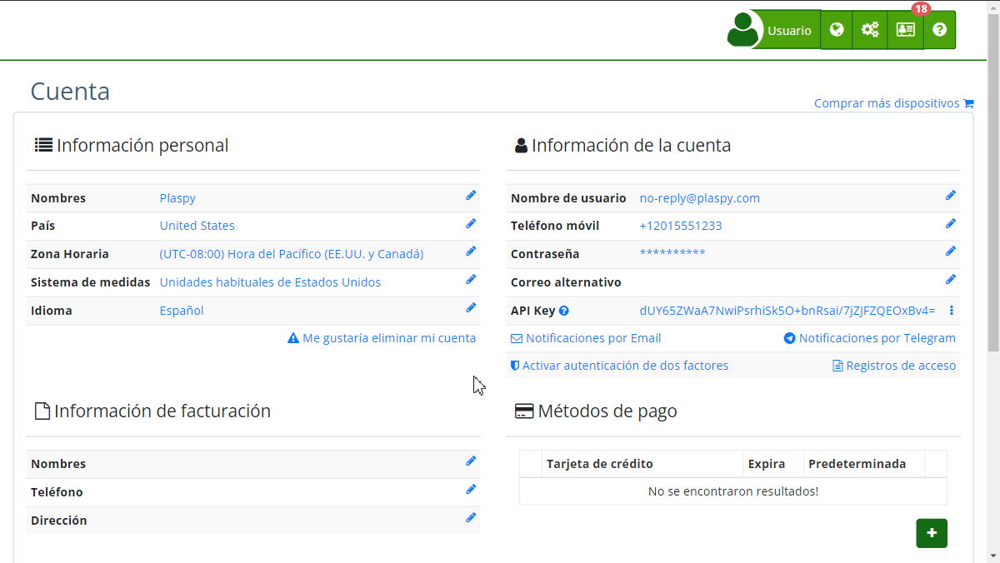

# Registro de Acceso
El **Registro de Acceso** en Plaspy permite a los usuarios monitorear y revisar todas las actividades de inicio de sesión realizadas en su cuenta. Esta herramienta es fundamental para mantener la seguridad de la cuenta, ya que proporciona un registro detallado de cada vez que alguien accede a la cuenta, incluyendo información sobre la fecha, el evento, el navegador utilizado y el país desde el cual se realizó el acceso.

Para acceder al Registro de Acceso, sigue estos pasos:

1. Inicia sesión en tu cuenta de Plaspy.
2. Dirígete a la sección de https://app.plaspy.com/Account**[*fa-user* Mi cuenta](https://app.plaspy.com/Account)**.
3. En la parte inferior de la pantalla, encontrarás el panel de **Registro de acceso**.

## Campos del Registro de Acceso

- **Fecha**: Muestra la fecha y hora exacta del acceso.
- **Evento**: Describe el tipo de evento registrado.
- **Navegador**: Detalla el navegador y sistema operativo desde el cual se realizó el acceso.
- **País**: Indica el país desde el cual se accedió, basándose en la dirección IP.

## Instrucciones Paso a Paso

1. **Visualizar el Registro**: Una vez en la sección de "*fa-user* **Mi cuenta**", el registro de acceso se mostrará automáticamente. Puedes revisar los eventos de acceso recientes y detallados.
2. **Cargar Más Registros**: Si deseas ver más registros de acceso, haz clic en el botón **Cargar más** que se encuentra al final de la tabla. Esto te permitirá cargar eventos adicionales y revisar más entradas.

## Validaciones y Restricciones

- **Accesos Recientes**: Los registros muestran los accesos más recientes en la parte superior de la lista.
- **Detalles del Navegador**: Es importante notar que el detalle del navegador incluye el sistema operativo, lo que puede ser útil para identificar accesos sospechosos.
- **País y Dirección IP**: La bandera del país y la dirección IP ayudan a identificar ubicaciones de acceso inusuales que podrían indicar una posible brecha de seguridad.

## Preguntas Frecuentes

- **¿Cómo puedo saber si alguien accedió a mi cuenta sin mi permiso?**  

    - Revisa los registros de acceso para identificar cualquier evento que no reconozcas, especialmente los que provienen de ubicaciones o dispositivos desconocidos.
- **¿Qué debo hacer si detecto un acceso sospechoso?**  

    - Si encuentras algún acceso sospechoso, te recomendamos [cambiar tu contraseña](password_change) de inmediato y   
[habilitar la autenticación de dos factores](enable_twofactor_authentication_2fa) para mejorar la seguridad de tu cuenta.
- **¿El registro de acceso muestra intentos fallidos de inicio de sesión?**  

    - Actualmente, el registro de acceso en Plaspy solo muestra los eventos de ingreso exitosos. Para más detalles sobre intentos fallidos, contacta al soporte técnico de Plaspy.
- **¿Puedo exportar mi registro de acceso?**  

    - Por ahora, Plaspy no ofrece una opción para exportar el registro de acceso. Sin embargo, puedes tomar capturas de pantalla si necesitas guardar esta información.

Utilizar el Registro de Acceso te ayudará a mantener la seguridad de tu cuenta, permitiéndote estar al tanto de todas las actividades de inicio de sesión y detectar cualquier comportamiento sospechoso rápidamente.
