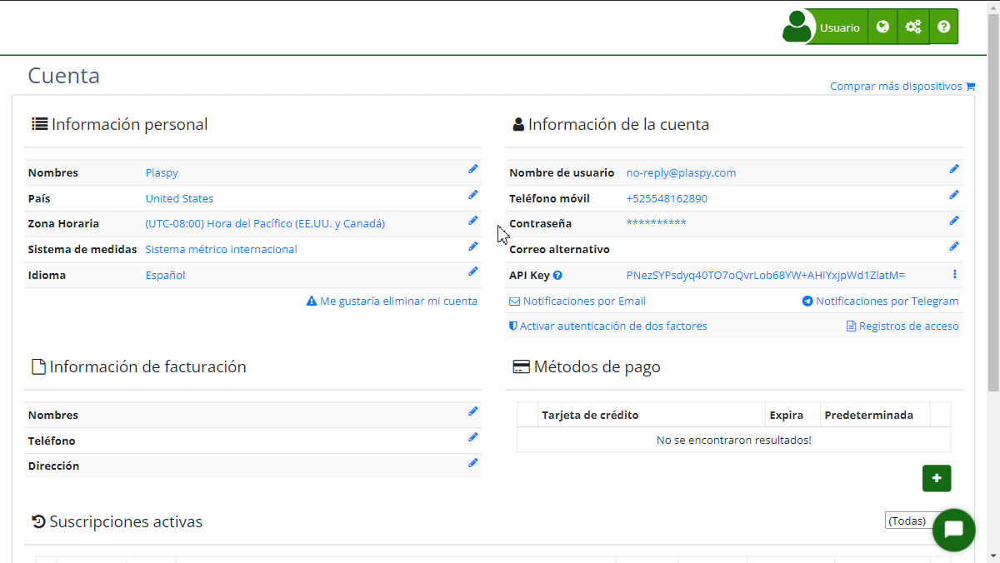
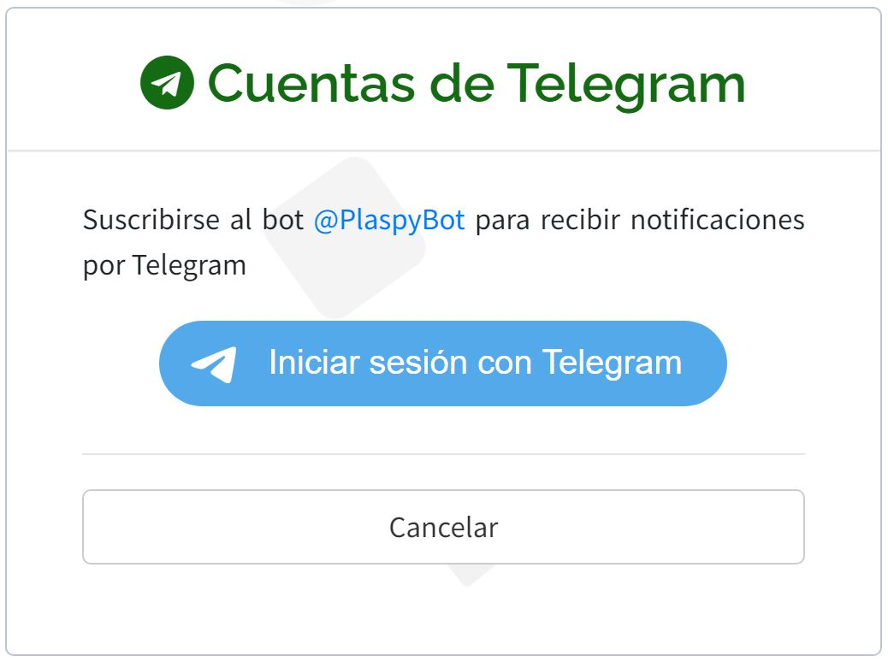
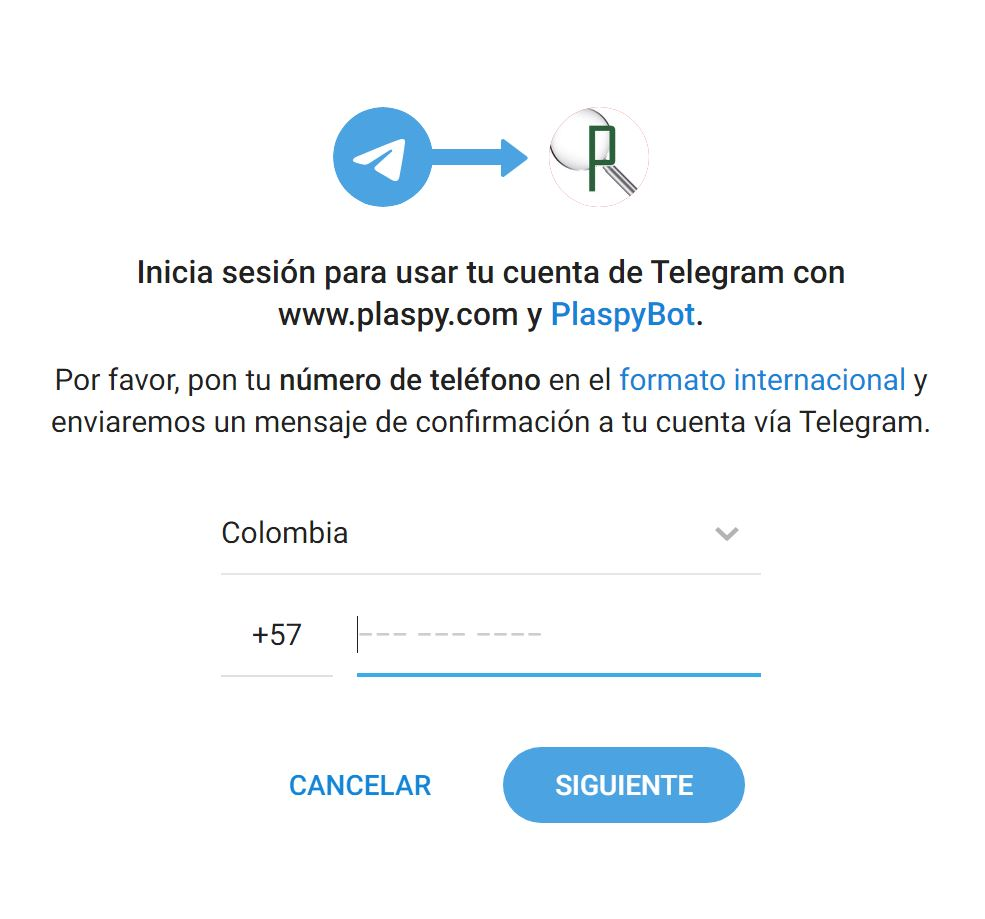
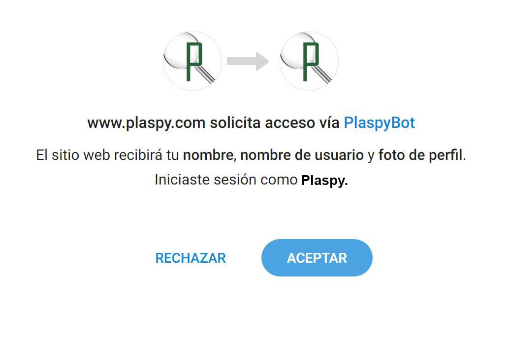

# Cuentas de Telegram
La plataforma permite a los usuarios recibir notificaciones a través de [Telegram](https://app.plaspy.com/Telegram?from=/Account), lo que facilita estar al tanto de las actualizaciones y eventos importantes en tiempo real. A continuación se detallan los pasos para configurar esta opción:

### Descripción de Campos

- **Bot de Telegram:** @PlaspyBot es el bot que te permitirá recibir notificaciones en tu cuenta de Telegram.
- **Iniciar sesión con Telegram:** Botón que redirige a la autenticación de Telegram para vincular tu cuenta.
- **Cancelar:** Botón que cancela el proceso de configuración de notificaciones por Telegram y te regresa a la página anterior.

### Instrucciones Paso a Paso

1. **Acceder a la Configuración de Notificaciones por Telegram:**

 - Inicia sesión en tu cuenta.
 - Navega a la sección de "[*fa-user* Cuenta](https://app.plaspy.com/Account)" desde el menú principal.
 - Haz clic en la opción [***fa-telegram* Notificaciones por Telegram**](https://app.plaspy.com/Telegram?from=/Account). 

2. **Suscribirse al Bot de Telegram:**

 - En la pantalla de "Cuentas de Telegram", haz clic en el enlace del bot de Telegram @PlaspyBot o en el botón "Iniciar sesión con Telegram".
 - Serás redirigido a la página de autenticación de Telegram. Ingresa tus credenciales de Telegram si es necesario. 

3. **Autenticación y Permisos:**

 - Completa el proceso de autenticación en Telegram para permitir que envíe notificaciones a tu cuenta.
 - Una vez autenticado, regresarás automáticamente a y verás una confirmación de que tu cuenta está vinculada con Telegram. 

4. **Configuración Adicional:**

 - Si en algún momento deseas cancelar la suscripción, puedes hacerlo desde la misma sección de "[Notificaciones por Telegram](https://app.plaspy.com/Telegram?from=/Account)".

### Validaciones y Restricciones

- **Autenticación:** Debes tener una cuenta de Telegram activa para poder vincularla y recibir notificaciones.
- **Permisos:** Asegúrate de otorgar los permisos necesarios durante la autenticación para que las notificaciones puedan ser enviadas correctamente.

### Preguntas Frecuentes

- **¿Qué tipo de notificaciones recibiré por Telegram?**
 - Recibirás notificaciones relacionadas con eventos importantes, alertas de dispositivos, cambios en tu cuenta y otras actualizaciones relevantes.
- **¿Puedo desactivar las notificaciones por Telegram en cualquier momento?**
 - Sí, puedes desactivar las notificaciones en cualquier momento accediendo nuevamente a la sección de "Notificaciones por Telegram" y seleccionando la opción de cancelar suscripción.
- **¿Es seguro vincular mi cuenta de Telegram ?**
 - Sí, el proceso de vinculación utiliza los métodos de autenticación seguros de Telegram para proteger tu información y asegurar que solo tú puedas recibir las notificaciones.

Esta guía te ayudará a configurar y gestionar las notificaciones por Telegram de manera eficiente, asegurando que estés siempre informado de los eventos y actualizaciones importantes.
