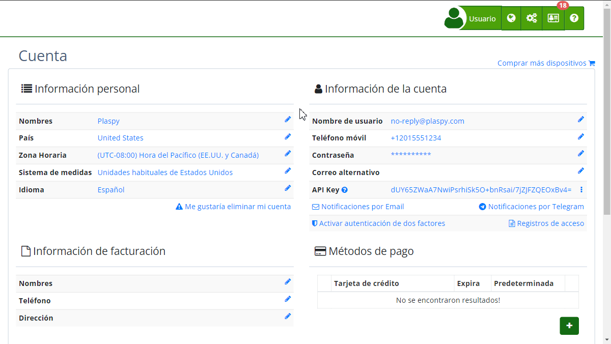

# Modificar Teléfono Móvil
La función de "[Modificar Teléfono Móvil](https://app.plaspy.com/UserSecurity/Phone?from=/Account)" en Plaspy permite a los usuarios actualizar su número de teléfono de recuperación. Esta característica es crucial para la seguridad de la cuenta, ya que el número de teléfono puede utilizarse en caso de que la cuenta se bloquee o si se detecta alguna actividad sospechosa. A continuación, se detallan los pasos y consideraciones para modificar el número de teléfono móvil en la plataforma.

#### Acceso

Para acceder a la opción de modificar el número de teléfono móvil:

1. Inicia sesión en tu cuenta de Plaspy.
2. Ve a la sección "[*fa-user* Mi Cuenta](https://app.plaspy.com/Account)".
3. Selecciona "[Modificar teléfono móvil](https://app.plaspy.com/UserSecurity/Phone?from=/Account)".

#### Descripción de Campos

- **Número de teléfono de recuperación**: Este campo debe contener el número de teléfono con el formato internacional \(por ejemplo, +155512345678\). Este número se usará para recuperar la cuenta en caso de olvido de contraseña o detección de actividad sospechosa.

#### Instrucciones Paso a Paso

1. **Acceso a la Página**: Dirígete a la sección de "[*fa-user* Mi Cuenta](https://app.plaspy.com/Account)" y selecciona la opción de modificar el [teléfono móvil](https://app.plaspy.com/UserSecurity/Phone?from=/Account).
2. **Ingreso de Número**: Introduce el número de teléfono de recuperación en el formato internacional.
3. **Confirmar Cambios**: Haz clic en el botón "Confirmar" para guardar el nuevo número. Si decides no realizar cambios, selecciona "Ahora no" para cancelar la operación.

#### Validaciones y Restricciones

- **Formato Internacional**: El número de teléfono debe estar en formato internacional. Es decir, debe incluir el código de país seguido del número de teléfono.
- **Número Válido**: El sistema valida que el número ingresado sea un número de teléfono válido. Si el número no cumple con los requisitos de formato, el sistema mostrará un mensaje de error solicitando un número válido.
- **Campo Obligatorio**: Es obligatorio ingresar un número de teléfono para poder guardar los cambios.

#### Preguntas Frecuentes

- **¿Por qué necesito un número de teléfono de recuperación?**
    - El número de teléfono de recuperación es necesario para asegurar tu cuenta y permitir la recuperación en caso de que olvides tu contraseña o si Plaspy detecta actividad sospechosa.
- **¿Puedo usar cualquier número de teléfono?**
    - Puedes usar cualquier número de teléfono que cumpla con el formato internacional y sea accesible para ti en caso de emergencias relacionadas con tu cuenta.
- **¿Qué pasa si no tengo un número de teléfono en formato internacional?**
    - Es necesario que el número esté en formato internacional. Si no tienes uno, considera adquirir un número que pueda utilizarse para este propósito.
- **¿Cómo sé si mi número fue actualizado correctamente?**
    - Después de ingresar el número y confirmar, recibirás una notificación en la plataforma indicando que los cambios se han guardado exitosamente.

Esta funcionalidad asegura que tu cuenta esté protegida y que siempre puedas recuperar el acceso en caso de problemas de seguridad. Asegúrate de mantener tu número de recuperación actualizado y de que esté correctamente ingresado en el formato requerido.
