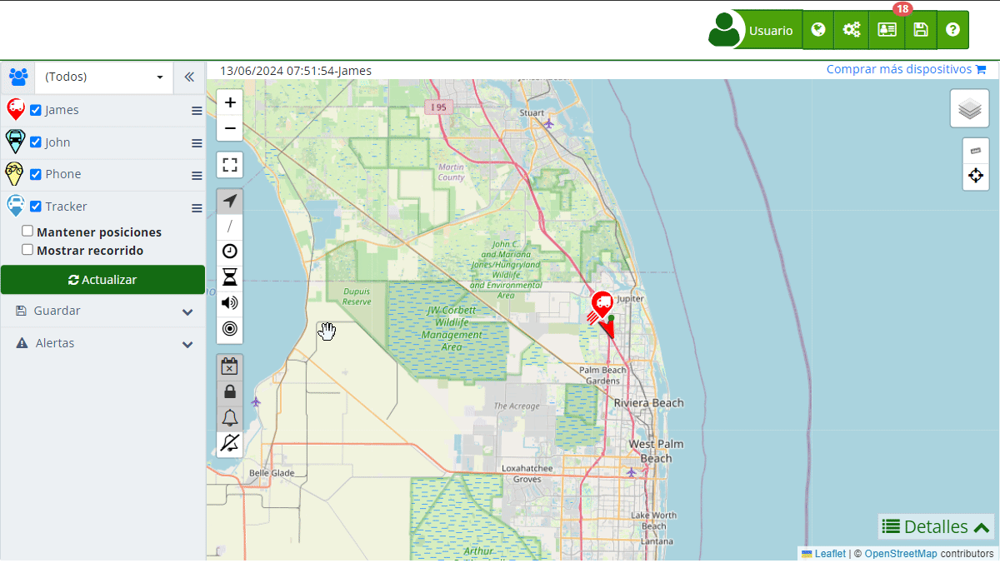

# Reportes
La sección de [reportes](https://app.plaspy.com/Reports) en Plaspy ofrece a los usuarios la capacidad de generar informes detallados sobre los datos recogidos por sus dispositivos de seguimiento satelital. Esta funcionalidad es esencial para monitorear la actividad, la ubicación y el rendimiento de los vehículos, y otros activos. Los reportes pueden personalizarse según las necesidades del usuario, permitiendo una gestión eficaz y una toma de decisiones informada.

Para acceder a la sección de reportes, inicie sesión en Plaspy, diríjase al menú principal y seleccione la opción "[Reportes](https://app.plaspy.com/Reports)". Una vez allí, podrá configurar los parámetros de su consulta y aplicar diversos filtros para obtener la información específica que necesita.

### Descripción de Campos

- **Consulta**: Permite seleccionar el tipo de informe que se desea generar, como "Detalle mapa", "Informe de Actividad", "Informe Detallado", "Resumen de Actividades", y otros. Los usuarios pueden crear, editar, duplicar y eliminar reportes según sus necesidades.
- **Fecha**: Este campo especifica el rango de fechas para la consulta. Puede seleccionarse mediante un calendario interactivo o mediante opciones predefinidas como "Hoy", "Última semana", "Último mes", entre otros.
- **Grupo**: Permite seleccionar un grupo específico de dispositivos si se han organizado en grupos. Esto facilita la consulta de datos para un subconjunto de dispositivos en particular.
- **Dispositivos**: Este campo permite seleccionar uno o varios dispositivos específicos para la consulta. Se puede utilizar una lista desplegable con una función de búsqueda para una selección rápida.
- **Filtros**: La sección de filtros permite refinar la consulta añadiendo criterios adicionales, como velocidad mínima y máxima, nivel de batería, zonas geográficas, entre otros. Los usuarios pueden agregar, editar o eliminar filtros según sus necesidades específicas.

### Instrucciones Paso a Paso

1. **Acceder a la sección de Reportes**: Inicie sesión en Plaspy y seleccione "[Reportes](https://app.plaspy.com/Reports)" desde el menú principal.
2. **Seleccionar el tipo de informe**: En el campo "Consulta", elija el tipo de informe que desea generar, como "Detalle mapa" o "Informe Detallado".
3. **Definir el rango de fechas**: Utilice el campo "Fecha" para seleccionar el rango de fechas de interés. Puede hacerlo directamente desde el selector de fechas o elegir un rango predefinido.
4. **Elegir el grupo de dispositivos**: Si tiene dispositivos organizados en grupos, seleccione el grupo correspondiente en el campo "Grupo". De lo contrario, deje la opción en "\(Todos\)".
5. **Seleccionar dispositivos**: En el campo "Dispositivos", elija uno o varios dispositivos de la lista desplegable. Utilice la función de búsqueda si tiene muchos dispositivos.
6. **Aplicar filtros adicionales**: Si es necesario, agregue filtros específicos para refinar aún más los resultados del informe.
7. **Generar el informe**: Haga clic en "Actualizar" para generar el informe con los parámetros seleccionados. Puede descargar el informe en formato Excel si es necesario, utilizando el botón "Descargar".

### Validaciones y Restricciones

- **Campos obligatorios**: Los campos "Consulta", "Fecha" y "Dispositivos" son obligatorios para generar un informe. Si no se completan, el sistema no permitirá la generación del informe.
- **Selección de dispositivos**: Asegúrese de seleccionar al menos un dispositivo para el informe. El sistema no generará un informe si no se han seleccionado dispositivos.

### Filtros en los Reportes

La sección de filtros es fundamental para obtener datos específicos y relevantes en los reportes. Los filtros permiten incluir o excluir datos según criterios definidos por el usuario. Por ejemplo, se pueden filtrar reportes por nivel de batería, velocidad, kilometraje, tiempo inactivo, entre otros. Para aplicar un filtro:

1. **Agregar un filtro**: Haga clic en el icono de filtro y seleccione el atributo que desea filtrar, como "Batería \(%\)" o "Velocidad \(Km/h\)".
2. **Seleccionar la condición**: Elija la condición del filtro, como "Igual \(=\)", "Mayor que \(&gt;\)" o "Menor que \(&lt;\)".
3. **Introducir el valor**: Ingrese el valor específico para el filtro, como "50" para filtrar dispositivos con una batería del 50%.
4. **Aplicar el filtro**: Haga clic en "Actualizar" para aplicar el filtro y generar el reporte.

### Preguntas Frecuentes

- **¿Qué tipos de informes puedo generar en Plaspy?**
    - En Plaspy, puede generar varios tipos de informes, incluyendo "Detalle mapa", "Informe de Actividad", "Informe Detallado", y "Resumen de Actividades". Cada tipo de informe ofrece diferentes perspectivas y detalles según las necesidades del usuario.
- **¿Cómo puedo filtrar los datos en los informes?**
    - Puede agregar filtros adicionales en la sección de filtros al generar un informe. Estos filtros permiten especificar criterios como rangos de velocidad, niveles de batería, zonas geográficas, y más, para refinar los resultados del informe.
- **¿Puedo descargar los informes en formato Excel?**
    - Sí, después de generar un informe, puede descargarlo en formato Microsoft Excel utilizando el botón "Descargar" disponible en la sección de reportes. Esto facilita la manipulación y análisis adicional de los datos en programas de hojas de cálculo.
