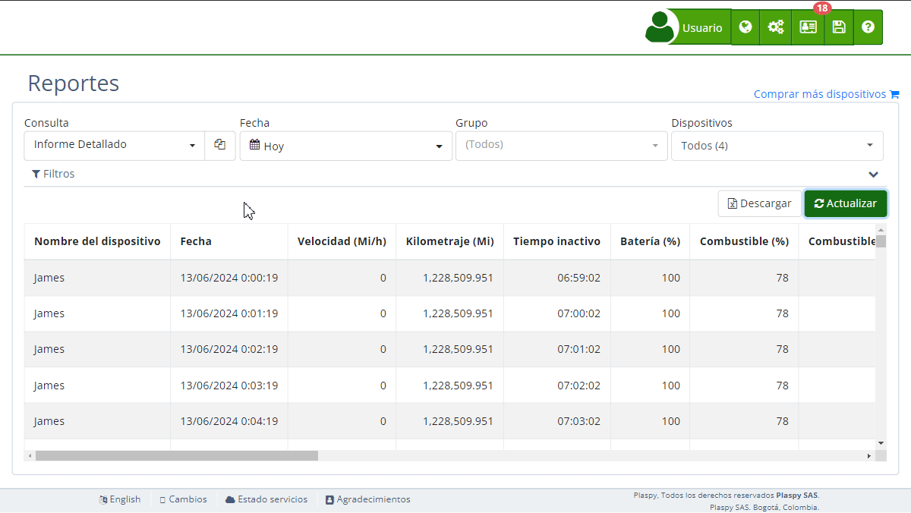

# Nuevo Reporte
La creación de un nuevo [reporte](https://app.plaspy.com/Reports) en Plaspy permite a los usuarios personalizar la manera en que visualizan y analizan los datos de seguimiento de sus dispositivos. Esta funcionalidad es esencial para adaptar los informes a necesidades específicas, proporcionando una flexibilidad considerable en la gestión de datos. Los usuarios pueden crear un reporte nuevo desde cero, duplicar uno existente para usarlo como base, o editar un reporte actual.

### Tipos de Reportes

Al crear un nuevo reporte, existen dos tipos principales de reportes que se pueden generar:

- **Estándar**: Este tipo de reporte se utiliza comúnmente en el [mapa](https://app.plaspy.com/Map) para los detalles del mapa o para aplicar los filtros de la consulta del mapa cuando se consulta un recorrido. Proporciona una visión detallada y precisa del comportamiento y ubicación de la flota en tiempo real. Cada registro representa una ubicación específica de un activo, ofreciendo datos como la velocidad instantánea, coordenadas geográficas y la hora exacta del registro. Es ideal para usuarios que necesitan un seguimiento exhaustivo y un registro minucioso de las actividades de cada vehículo o activo en su operación diaria.
- **Resumen de Actividades**: Este tipo de reporte es utilizado para descargar [resúmenes de actividades](https://app.plaspy.com/Summary). Consolida la información de los activos, proporcionando un informe simplificado que facilita la visión general del rendimiento diario. En lugar de ubicaciones específicas, este reporte se centra en estadísticas agregadas, como la velocidad máxima o promedio alcanzada por día y otros indicadores de resumen que permiten una rápida evaluación del desempeño y eficiencia de toda la flota. Es ideal para una visión estratégica y la toma de decisiones a nivel gerencial.

### Crear un Nuevo Reporte

Para crear un nuevo reporte, siga estos pasos:

1. **Acceder a la Sección de Reportes**: Entre a su cuenta de Plaspy, en el menú de la parte superior derecha, haga clic en el ícono de \(*fa-globe*\) y busque la opción de “*fa-tasks* **Reportes”**.
2. **Seleccionar 'Nuevo Reporte'**: En el campo de consulta, seleccione "\(Nueva consulta\)" y haga click en "*fa-plus*" para comenzar desde cero. Si prefiere duplicar un reporte existente, seleccione el reporte y haga clic en el botón de copiar.
3. **Nombrar el Reporte**: Ingrese un nombre descriptivo para el nuevo reporte en el campo "Nombre del reporte".
4. **Seleccionar Tipo de Reporte**: Elija entre "Estándar" y "Resumen de Actividades" según el tipo de análisis que necesita.
5. **Configurar Parámetros**: Establezca los parámetros de fecha, grupo y dispositivos que desee incluir en el reporte.
6. **Añadir Columnas y Filtros**: Use la sección de variables para agregar las columnas que desee incluir y configure los filtros necesarios.
7. **Guardar el Reporte**: Haga clic en "Guardar" para almacenar el nuevo reporte en el sistema.

### Editar un Reporte Existente

Para editar un reporte existente:

1. **Seleccionar el Reporte**: Elija el [reporte](https://app.plaspy.com/Reports) que desea editar del menú desplegable de consultas.
2. **Abrir el modo Edición:** Haz clic en el ícono de lápiz \(*fa-pencil-square-o*\) que aparece junto al nombre del reporte para poder modificarlo.
3. **Modificar Parámetros**: Cambie los parámetros de fecha, grupo y dispositivos según sea necesario.
4. **Reordenar o Eliminar Columnas**: Las columnas del reporte se pueden reordenar, eliminar o renombrar directamente en el editor.
5. **Actualizar el Reporte**: Haga clic en "*fa-refresh* Actualizar" para aplicar los cambios.

### Duplicar un Reporte

Para duplicar un reporte y usarlo como base para uno nuevo:

1. **Seleccionar el Reporte**: Elija el [reporte](https://app.plaspy.com/Reports) que desea duplicar del menú desplegable.
2. **Hacer una Copia**: Haga clic en el icono de copiar \(*fa-files-o*\) para duplicar el reporte seleccionado, junto al nombre del reporte.
3. **Modificar la Copia**: Renombre y ajuste los parámetros de la copia según sus necesidades.
4. **Guardar el Nuevo Reporte**: Haga clic en "Guardar" para almacenar la copia como un nuevo reporte.

### Sección de Historial

La pestaña "Historial" permite a los usuarios ver todas las modificaciones realizadas a un reporte. Cada cambio se registra con una marca de tiempo y una breve descripción, facilitando el seguimiento de las alteraciones hechas. Los usuarios pueden volver a una versión anterior del informe con todos los cambios realizados hasta ese punto, lo cual ofrece una manera eficiente de revertir cambios no deseados. Además, los usuarios pueden usar la integración con OpenAI para solicitar modificaciones al reporte usando lenguaje natural, simplificando considerablemente la personalización de los reportes.

### Sección de Variables

En la pestaña "Variables", los usuarios pueden agregar columnas manualmente a sus reportes. Esta sección incluye una lista de todas las variables disponibles que pueden ser incluidas, tales como:

- **Nombre del dispositivo**: El nombre o identificador único del dispositivo de rastreo.
- **Fecha**: La fecha y hora en que se recogió el último dato de ubicación del dispositivo de rastreo.
- **Velocidad \(Km/h\)**: La velocidad actual a la que se mueve el dispositivo de rastreo.
- **Batería \(%\)**: El porcentaje de carga de batería que queda en el dispositivo de rastreo.

Para agregar una variable:

1. **Buscar la Variable**: Use la barra de búsqueda para encontrar la variable deseada.
2. **Agregar la Variable**: Haga clic en el ícono de "*fa-plus-square*" junto a la variable para agregarla al reporte.

### Propiedades del Reporte

La pestaña "Propiedades" permite a los usuarios modificar las propiedades del reporte. Por defecto, solo el usuario actual puede consultar el reporte, pero esta configuración puede cambiarse para permitir que todos los sub-usuarios de la cuenta también puedan consultarlo.

Al finalizar los ajustes, haga clic en "Guardar" para aplicar los cambios y actualizar el reporte.
