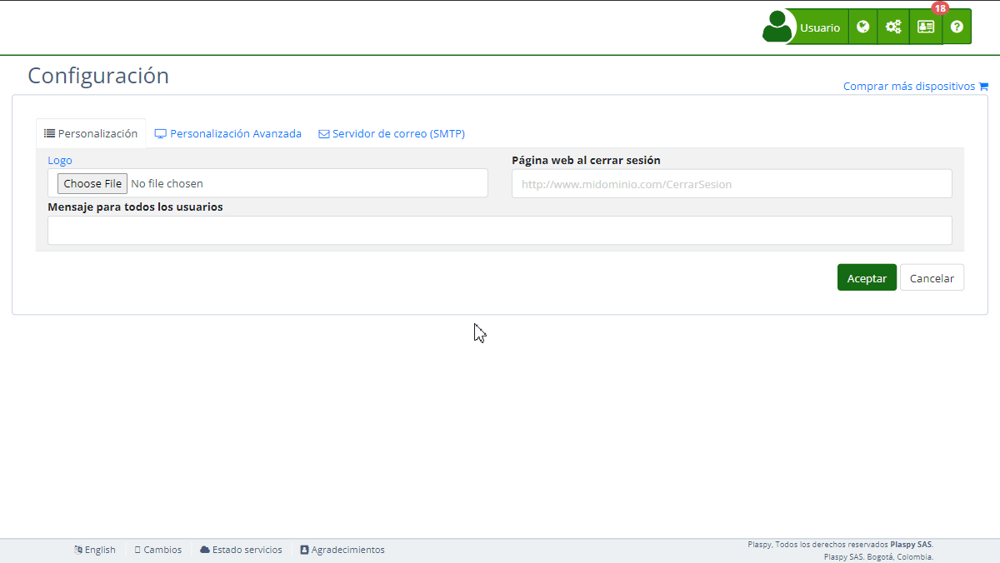

# Contacto
La sección "[*fa-envelope* Contacto](https://app.plaspy.com/Settings)" en la configuración de Plaspy permite a los administradores proporcionar información de contacto y configurar servicios de chat para la asistencia al usuario. Esta sección es fundamental para asegurar que los usuarios puedan comunicarse fácilmente con el soporte técnico o el servicio al cliente. En esta guía, se detallan todos los campos disponibles y los pasos para configurarlos adecuadamente.

### Descripción de Campos

- **Smartsupp Chat Key:** Clave de API para integrar el servicio de chat de Smartsupp.
- **tawk.to Chat Key:** Clave de API para integrar el servicio de chat de tawk.to.
- **Email contáctenos:** Dirección de correo electrónico donde se recibirán las peticiones enviadas por los usuarios a través del formulario de contacto. Por defecto, esta dirección es la del usuario que administra la cuenta.
- **Información de contacto:** Campo de texto enriquecido para agregar información adicional de contacto.

### Instrucciones Paso a Paso

1. **Acceder a la Sección:**

    - Inicia sesión en Plaspy y dirígete al menú principal en la parte superior derecha.
    - Selecciona "[*fa-list* Configuración](https://app.plaspy.com/Settings)" y luego "*fa-envelope* Contacto".
2. **Configurar Smartsupp Chat Key:**

    - Obtén la clave de API de Smartsupp desde tu cuenta de Smartsupp.
    - Introduce la clave en el campo "Smartsupp Chat Key".
    - Enlace de ayuda: [Smartsupp Chat Code](https://smartsupp.helpjuice.com/es_ES/preguntas-frecuentes)
3. **Configurar tawk.to Chat Key:**

    - Obtén la clave de API de tawk.to desde tu cuenta de tawk.to.
    - Introduce la clave en el campo "tawk.to Chat Key".
    - Enlace de ayuda: [tawk.to Chat Code](https://www.tawk.to/)
4. **Configurar el Correo de Contacto:**

    - Ingresa la dirección de correo electrónico que los usuarios pueden utilizar para contactar al soporte a través del formulario de contacto.
    - Asegúrate de que la dirección sea válida y esté monitoreada regularmente. Por defecto, esta dirección es la del usuario que administra la cuenta.
5. **Añadir Información de Contacto Adicional:**

    - Utiliza el editor de texto enriquecido en el campo "Información de contacto" para proporcionar detalles adicionales como números de teléfono, horarios de atención, y otros medios de contacto.
    - Puedes formatear el texto, agregar enlaces y más utilizando las herramientas disponibles en el editor.
6. **Guardar los Cambios:**

    - Revisa todos los campos para asegurar que la información sea correcta.
    - Haz clic en "Aceptar" para guardar todos los cambios realizados.

### Validaciones y Restricciones

- **Smartsupp Chat Key y tawk.to Chat Key:** Deben ser claves de API válidas obtenidas de las respectivas plataformas.
- **Email contáctenos:** Debe ser una dirección de correo electrónico válida donde se recibirán las peticiones enviadas por los usuarios a través del formulario de contacto.
- **Información de contacto:** No hay restricciones específicas, pero se recomienda mantener la información clara y organizada para facilitar el contacto.

### Preguntas Frecuentes

- **¿Cómo obtengo mi clave de Smartsupp Chat?**
    - Puedes obtener tu clave de API de Smartsupp desde el panel de administración de tu cuenta de Smartsupp. Sigue las instrucciones en [Smartsupp Chat Code](https://smartsupp.helpjuice.com/es_ES/preguntas-frecuentes).
- **¿Qué hago si no tengo una clave de tawk.to?**
    - Si aún no tienes una clave de API de tawk.to, debes crear una cuenta en tawk.to y seguir los pasos para obtener tu clave. Más información en [tawk.to Chat Code](https://www.tawk.to/).
- **¿Qué tipo de información debo incluir en el campo de "Información de contacto"?**
    - Debes incluir cualquier información que ayude a los usuarios a ponerse en contacto con el soporte, como números de teléfono, direcciones de correo electrónico adicionales, horarios de atención, y enlaces a páginas de contacto o formularios.
- **¿Cómo sé si mi dirección de correo electrónico es válida?**
    - Asegúrate de que la dirección de correo electrónico siga el formato estándar \(por ejemplo, nombre@dominio.com\) y prueba enviando un correo a esa dirección para verificar que esté recibiendo correos correctamente.
- **¿Puedo personalizar el diseño del texto en la "Información de contacto"?**
    - Sí, puedes usar el editor de texto enriquecido para dar formato al texto, agregar enlaces, listas, y más, asegurándote de que la información sea clara y fácil de leer.
- **¿Qué sucede si no configuro una dirección de correo en "Email contáctenos"?**
    - Si no configuras una dirección de correo electrónico específica, las peticiones enviadas a través del formulario de contacto se enviarán por defecto a la dirección de correo del usuario que administra la cuenta.

Con estas instrucciones, podrás configurar la sección de "*fa-envelope* Contacto" de manera efectiva y asegurar que los usuarios tengan múltiples formas de comunicarse con el soporte técnico o el servicio al cliente de Plaspy.
