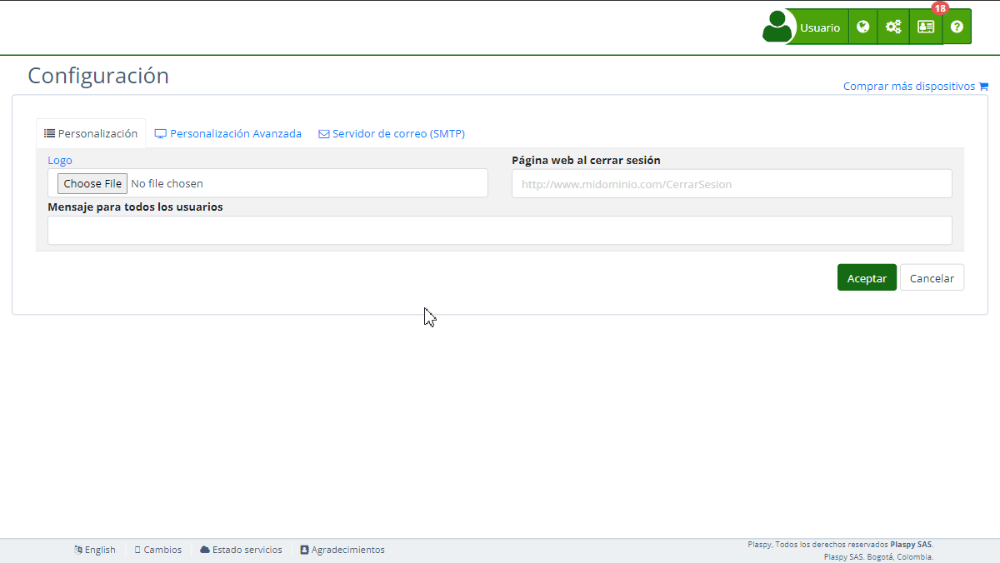

# Plantillas de correo electrónico
La sección "*fa-envelope-o* Plantillas de Email" en la [*fa-list* configuración](https://app.plaspy.com/Settings) permite a los administradores personalizar el contenido y el formato de varias notificaciones por correo electrónico enviadas por la plataforma. Esta función es esencial para garantizar que las comunicaciones con los usuarios sean coherentes con la imagen y el mensaje de tu organización. Esta guía detalla los campos disponibles y los pasos para configurarlos correctamente.

### Descripción de Campos

- **Tipo:** Menú desplegable para seleccionar el tipo de plantilla de correo electrónico a personalizar \(por ejemplo, Alertas del dispositivo, Cambio de información del usuario, Certificado del dispositivo, Código de verificación cambio de contraseña, Código de verificación cambio email, Creación de acceso temporal, Recordar nombre de usuario\).
- **Idioma:** Menú desplegable para seleccionar el idioma de la plantilla de correo electrónico \(por ejemplo, Inglés, Español\).
- **Título:** La línea de asunto del correo electrónico.
- **Contenido:** El cuerpo del correo electrónico, que se puede personalizar utilizando un editor de texto enriquecido.

### Instrucciones Paso a Paso

1. **Acceder a la Sección:**

 - Inicia sesión y navega al menú principal.
 - Selecciona "[*fa-list* Configuración](https://app.plaspy.com/Settings)" y luego "*fa-envelope-o* Plantillas de Email."
2. **Seleccionar el Tipo de Plantilla de Correo Electrónico:**

 - Utiliza el menú desplegable "Tipo" para seleccionar el tipo de plantilla de correo electrónico que deseas personalizar \(por ejemplo, Alertas del dispositivo\).
 - Dependiendo del tipo seleccionado, diferentes marcadores y variables estarán disponibles para usar en el contenido del correo electrónico.
3. **Elegir el Idioma:**

 - Utiliza el menú desplegable "Idioma" para seleccionar el idioma de la plantilla de correo electrónico. Esto asegura que el contenido del correo electrónico sea apropiado para el idioma preferido de tu audiencia.
4. **Configurar el Título del Correo Electrónico:**

 - Introduce la línea de asunto del correo electrónico en el campo "Título". Este es el primer texto que verán los destinatarios, por lo que debe ser claro y relevante.
5. **Personalizar el Contenido del Correo Electrónico:**

 - Utiliza el editor de texto enriquecido en el campo "Contenido" para personalizar el cuerpo del correo electrónico. Puedes dar formato al texto, insertar imágenes, agregar enlaces y usar variables para personalizar el contenido del correo electrónico.
 - Las variables disponibles dependen del tipo de plantilla seleccionado. Puedes encontrar y seleccionar estas variables en el menú llamado "Variables".
6. **Guardar o Probar la Plantilla:**

 - Haz clic en "Guardar" para aplicar los cambios a la plantilla de correo electrónico.
 - Opcionalmente, puedes hacer clic en "Probar" para enviar un correo de prueba y verificar que el contenido aparezca como se espera.
7. **Restaurar o Eliminar una Plantilla:**

 - Si es necesario, puedes restaurar una versión anterior de la plantilla haciendo clic en "Restaurar."
 - Para eliminar la plantilla actual, haz clic en "Eliminar."

### Validaciones y Restricciones

- **Título:** Debe ser una cadena de texto válida y relevante para el tipo de correo electrónico que se está enviando.
- **Contenido:** Debe estar correctamente formateado e incluir las variables necesarias para personalizar el correo electrónico. Asegúrate de que el contenido sea claro y esté libre de errores.

### Preguntas Frecuentes

- **¿Qué tipos de plantillas de correo electrónico puedo personalizar?**
 - Puedes personalizar varios tipos de plantillas de correo electrónico, incluyendo Alertas del dispositivo, Cambio de información del usuario, Certificado del dispositivo, Código de verificación cambio de contraseña, Código de verificación cambio email, Creación de acceso temporal, y Recordar nombre de usuario.
- **¿Cómo inserto variables en el contenido del correo electrónico?**
 - Utiliza el menú "Variables" en el editor de texto enriquecido para insertar marcadores dinámicos como \{\{DeviceName\}\}, \{\{AlertText\}\} y \{\{AlertDate\}\}. Estas variables serán reemplazadas con datos reales cuando se envíe el correo electrónico. Las variables disponibles dependen del tipo de plantilla seleccionado.
- **¿Puedo personalizar plantillas de correo electrónico en varios idiomas?**
 - Sí, puedes seleccionar el idioma deseado desde el menú desplegable "Idioma" y personalizar la plantilla en consecuencia.
- **¿Cómo puedo probar la plantilla de correo electrónico para asegurarme de que se vea correcta?**
 - Después de personalizar la plantilla, haz clic en el botón "Probar" para enviar un correo de prueba. Esto te permite verificar que el contenido aparezca como se espera antes de guardar los cambios.
- **¿Qué debo hacer si elimino una plantilla accidentalmente?**
 - Si eliminas una plantilla, es posible que necesites recrearla desde cero. Se recomienda guardar tus cambios regularmente y hacer uso de la opción "Restaurar" si está disponible.

Con estas instrucciones, podrás personalizar la sección de "*fa-envelope-o* Plantillas de Email" de manera efectiva y asegurarte de que tus comunicaciones por correo electrónico sean coherentes con la imagen y el mensaje de tu organización en la plataforma.
