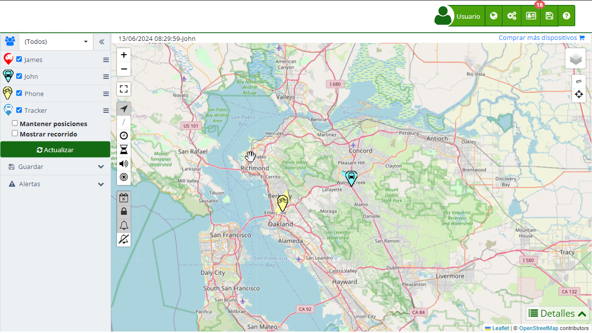

# Configuración
La sección de [Configuración](https://app.plaspy.com/Settings) en Plaspy te permite personalizar la apariencia y funcionalidad de tu cuenta, adaptándola a las necesidades específicas de tu organización. Desde la personalización de logotipos y colores hasta la configuración de servidores de correo y notificaciones, esta sección te brinda un control total sobre cómo se presenta y opera Plaspy para tu equipo y clientes.

Para acceder a la configuración, haz clic en el ícono de engranaje \(\) situado en la esquina superior derecha del panel principal y selecciona "[Configuración](https://app.plaspy.com/Settings)". Se abrirá una nueva pestaña donde podrás gestionar todas las opciones disponibles.

## Descripción de Campos

###  Personalización

- **Logo**: Permite cargar una imagen que se mostrará al iniciar sesión en tu cuenta. Puedes seleccionar un archivo desde tu dispositivo y subirlo para personalizar tu plataforma.
- **Página web al cerrar sesión**: Configura la URL que deseas que los usuarios vean al cerrar sesión en la plataforma.
- **Mensaje para todos los usuarios**: Campo donde puedes ingresar un mensaje global que será visible para todos los usuarios.

###  Personalización Avanzada

La Personalización Avanzada ofrece opciones adicionales para adaptar la apariencia de Plaspy a la identidad corporativa de tu empresa. Esta funcionalidad está disponible exclusivamente para cuentas con más de 100 dispositivos activos. Las opciones incluyen varias secciones, cada una de ellas enfocada en un aspecto específico de la personalización:

- **Organización**: En esta pestaña, puedes cambiar el nombre de la organización y el ícono de la plataforma. Esto permite que la interfaz de Plaspy refleje mejor la identidad de tu empresa.
- **Ingreso**: Aquí puedes personalizar la apariencia de la página de inicio de sesión de Plaspy. Puedes modificar el HTML de la página, agregar estilos CSS personalizados y configurar la imagen de fondo y el logo de la página de inicio de sesión.
- **Contacto**: Esta sección permite configurar la información de contacto que se mostrará a los usuarios. Puedes añadir direcciones de correo electrónico, números de teléfono y otras formas de contacto para mejorar la comunicación con los usuarios.
- **Estilos**: Esta pestaña permite personalizar el esquema de colores de la plataforma, incluyendo colores de fondo, texto, botones y enlaces. De esta forma, puedes adaptar la interfaz a los colores corporativos de tu organización.
- **Mapas**: Configura las opciones de visualización de los mapas en Plaspy. Puedes elegir entre diferentes proveedores de mapas y establecer las preferencias de visualización como el tipo de mapa predeterminado y las capas de información a mostrar.
- **Plantillas email**: Permite personalizar las plantillas de correo electrónico utilizadas por Plaspy. Puedes modificar el contenido y el diseño de los correos electrónicos que se envían desde la plataforma, asegurando que se alineen con la imagen corporativa de tu empresa.
- **Notificaciones móviles Push**: Configura las notificaciones push que se enviarán a los dispositivos móviles de los usuarios. Esta opción permite personalizar el contenido y la apariencia de las notificaciones para asegurar una comunicación efectiva.
- **Notificaciones Telegram**: En esta sección puedes configurar y personalizar las notificaciones que se envían a través de Telegram. Esto incluye la integración con el bot de Telegram de Plaspy y la configuración de mensajes automáticos.
- **Notificaciones WhatsApp**: Permite configurar las notificaciones que se enviarán a los usuarios a través de WhatsApp. Puedes personalizar el contenido de los mensajes y asegurar que se envíen de manera efectiva a través de esta plataforma.
- **Crear aplicación móvil:** En esta pestaña puedes generar una app móvil personalizada de Plaspy para Android y iOS. Solo debes completar un pequeño formulario y, al guardar, Plaspy prepara el código de la aplicación con tu personalización para que puedas usarla como tu propia app.

###  Servidor de correo \(SMTP\)

El Servidor SMTP \(Simple Mail Transfer Protocol\) es una herramienta esencial en Plaspy que permite la configuración de tu propio servidor de correo para el envío de notificaciones y alertas. Al configurar un servidor SMTP, puedes asegurarte de que todos los correos enviados desde Plaspy aparezcan como provenientes de tu dominio, lo que mejora la fiabilidad y profesionalismo de las comunicaciones.

- **Servidor SMTP**: La dirección del servidor SMTP que utilizarás para enviar correos.
- **Puerto**: El número de puerto que el servidor SMTP utilizará. Los puertos comunes incluyen 25, 465, y 587, con soporte para protocolos de seguridad como TLS/STARTTLS.
- **De**: La dirección de correo electrónico que aparecerá como remitente en los correos enviados desde Plaspy.
- **Autenticación**: Muchos servidores SMTP requieren autenticación. Deberás ingresar el nombre de usuario y la contraseña de la cuenta de correo que estás utilizando.

#### ¿Para qué sirve el servidor SMTP?

El servidor SMTP se utiliza para enviar correos electrónicos desde una aplicación a través de tu propio dominio. Esto es especialmente útil para mantener la consistencia en la comunicación con los usuarios y para evitar problemas de entrega de correos que pueden surgir al usar servidores de correo compartidos.

#### ¿Cómo funciona el servidor SMTP?

El servidor SMTP actúa como un intermediario entre tu aplicación y el servidor de correo del destinatario. Cuando envías un correo electrónico desde Plaspy, el servidor SMTP recibe la solicitud, verifica las credenciales de autenticación y luego entrega el correo al servidor del destinatario. Este proceso asegura que los correos sean entregados de manera segura y eficiente.

### Historial

La opción de Historial en la configuración permite a los usuarios revisar y restaurar configuraciones anteriores de la plataforma. Esta funcionalidad es crucial para mantener un registro de los cambios y revertir cualquier configuración que pueda haber causado problemas o no haya resultado como se esperaba.

- **Consultar historial**: Permite visualizar las configuraciones anteriores y los cambios realizados en la plataforma.
- **Restaurar configuración**: Opción para restaurar la configuración a un estado anterior, seleccionando una fecha específica en la que la configuración estaba en las condiciones deseadas.

## Instrucciones Paso a Paso

1. **Acceder a la Configuración**:

    - En el panel principal, haz clic en el ícono de engranaje \(\) en la esquina superior derecha.
    - Selecciona "[Configuración](https://app.plaspy.com/Settings)" del menú desplegable.
2. **Personalización**:

    - Ve a la pestaña " Personalización".
    - Para cambiar el logo, haz clic en "Elegir archivo" y selecciona una imagen desde tu dispositivo.
    - Ingresa la URL de redirección al cerrar sesión en el campo "Página web al cerrar sesión".
    - Añade un mensaje global en el campo "Mensaje para todos los usuarios".
3. **Personalización Avanzada**:

    - Dirígete a la pestaña " Personalización Avanzada".
    - En "[Organización](organization)", cambia el nombre de la organización y el ícono de la plataforma según sea necesario.
    - En "[Ingreso](log_in)", personaliza la apariencia de la página de inicio de sesión.
    - En "[Contacto](contact)", añade información de contacto relevante para los usuarios.
    - En "[Estilos](styles)", selecciona los colores que representen mejor tu marca.
    - En "[Mapas](maps)", configura las opciones de visualización de los mapas.
    - En "[Plantillas email](email_templates)", modifica el contenido y diseño de los correos electrónicos.
    - En "[Notificaciones móviles Push](push_notifications)", personaliza las notificaciones push.
    - En "[Notificaciones Telegram](telegram_notifications)", configura las notificaciones a través de Telegram.
    - En "[Notificaciones WhatsApp](whatsapp_notifications)", configura las notificaciones a través de WhatsApp.
    - En "[Crear aplicación móvil](https://app.plaspy.com/Settings/MobileApp)", genera tu propia app fácil y rápido llenando un pequeño formulario.
4. **Servidor de correo \(SMTP\)**:

    - Navega a la pestaña " Servidor de correo \(SMTP\)".
    - Ingresa los detalles de tu servidor SMTP, incluyendo la dirección del servidor, el puerto, y la dirección de correo del remitente.
    - Si es necesario, ingresa las credenciales de autenticación.
5. **Historial**:

    - Selecciona en la parte inferior izquierda el botón " Historial"
    - Consulta las configuraciones anteriores utilizando el selector de fechas.
    - Para restaurar una configuración, selecciona la fecha deseada y confirma la acción de restauración. Esto revertirá cualquier cambio realizado desde esa fecha.

## Validaciones y Restricciones

- La opción de Personalización Avanzada solo está disponible para cuentas con más de 100 dispositivos activos.
- Asegúrate de ingresar URLs válidas en los campos correspondientes a la página de cierre de sesión y hojas de estilos CSS.
- Verifica que las claves de API para proveedores de mapas y servicios de SMS sean correctas para evitar errores en la integración.
- La configuración del servidor SMTP requiere información precisa y válida para asegurar la correcta entrega de correos electrónicos.

## Preguntas Frecuentes

- **¿Por qué no puedo acceder a la Personalización Avanzada?**  

    - La Personalización Avanzada está disponible únicamente para cuentas que tienen más de 100 dispositivos activos en Plaspy.
- **¿Cómo puedo cambiar el logo de mi cuenta?**  

    - Puedes cambiar el logo accediendo a la sección de [Personalización](https://app.plaspy.com/Settings), seleccionando un archivo desde tu dispositivo y subiéndolo.
- **¿Qué debo hacer si tengo problemas con la configuración del servidor SMTP?**  

    - Asegúrate de que los detalles del servidor SMTP, incluyendo el puerto y la dirección del servidor, estén correctos. Puedes contactar a tu proveedor de servicios de correo para obtener la información necesaria.
- **¿Cómo puedo restaurar una configuración anterior?**  

    - Accede a la sección de Historial, selecciona la fecha de la configuración que deseas restaurar y confirma la restauración. Esto revertirá cualquier cambio realizado desde esa fecha.

Para más información y tutoriales en video, visita los enlaces proporcionados en la sección de configuración en Plaspy.
