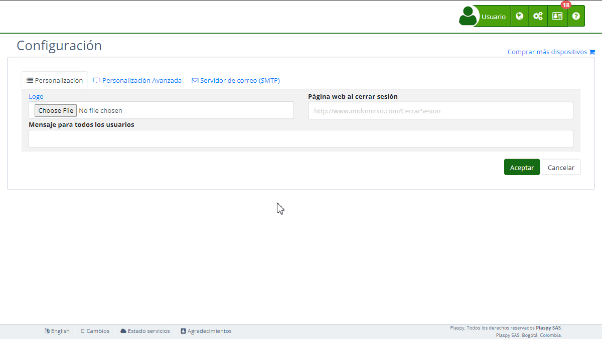

# Ingreso
La sección "Ingreso" dentro de la [configuración](https://app.plaspy.com/Settings) permite personalizar la página de inicio de sesión y mejorar la experiencia del usuario al acceder a la plataforma. Aquí puedes definir el aspecto visual y la funcionalidad de la página de ingreso, asegurando que los usuarios tengan una interfaz coherente y amigable. Esta guía te ayudará a configurar cada uno de los campos disponibles.

### Descripción de Campos

- **Título:** Título que se mostrará en la página de ingreso.
- **Texto de alerta:** Mensaje que se mostrará como alerta en la página de ingreso.
- **Texto Superior:** Mensaje que se mostrará en la parte superior de la página de ingreso.
- **Texto inferior:** Mensaje que se mostrará en la parte inferior de la página de ingreso.
- **Enlace a Play Store:** URL para redirigir a los usuarios a la descarga de la aplicación en Google Play Store.
- **Enlace a App Store:** URL para redirigir a los usuarios a la descarga de la aplicación en Apple App Store.
- **Imágenes de fondo:** Imágenes que se mostrarán como fondo en la página de ingreso.
- **HTML Ingreso:** Código HTML personalizado que define el contenido y diseño de la página de ingreso.

### Instrucciones Paso a Paso

1. **Acceder a la Sección:**
    - Inicia sesión y dirígete al menú principal.
    - Selecciona "[Configuración](https://app.plaspy.com/Settings)" y luego "Ingreso".
2. **Configurar el Título:**
    - Introduce el título deseado en el campo "Título". Este será visible en la página de ingreso.
3. **Añadir Texto de Alerta:**
    - Ingresa el mensaje que deseas mostrar como alerta en el campo "Texto de alerta".
4. **Configurar Mensajes Superior e Inferior:**
    - Completa los campos "Texto Superior" y "Texto inferior" con los mensajes que quieres que aparezcan en las respectivas posiciones de la página de ingreso.
5. **Añadir Enlaces a las Tiendas de Aplicaciones:**
    - Introduce la URL de la aplicación en Google Play Store en el campo "Enlace a Play Store".
    - Introduce la URL de la aplicación en Apple App Store en el campo "Enlace a App Store".
6. **Subir Imágenes de Fondo:**
    - Haz clic en "Examinar" y selecciona las imágenes que deseas usar como fondo en la página de ingreso.
7. **Personalizar HTML Ingreso:**
    - Utiliza el editor HTML para agregar o modificar el código HTML de la página de ingreso. Esto permite una personalización completa del contenido y el diseño.
8. **Guardar los Cambios:**
    - Revisa todos los campos para asegurar que la información sea correcta.
    - Haz clic en "Aceptar" para guardar todos los cambios realizados.

### Validaciones y Restricciones

- **Título:** Debe ser una cadena de texto válida.
- **Enlace a Play Store y App Store:** Deben ser URLs válidas que dirijan a las respectivas tiendas de aplicaciones.
- **Imágenes de fondo:** Deben ser archivos de imagen en formato aceptado \(e.g., JPG, PNG\).
- **HTML Ingreso:** El código HTML debe ser correcto y bien formado para evitar errores en la página de ingreso.

### Preguntas Frecuentes

**1. ¿Cómo puedo cambiar el fondo de la página de ingreso?**

- Accede a la sección de "Ingreso", selecciona las imágenes que deseas utilizar como fondo en el campo "Imágenes de fondo" y guarda los cambios.

**2. ¿Es obligatorio añadir un enlace a las tiendas de aplicaciones?**

- No es obligatorio, pero es recomendable para proporcionar a los usuarios un acceso directo a las aplicaciones móviles.

**3. ¿Qué tipo de mensajes puedo poner en los campos de texto?**

- Puedes poner cualquier mensaje informativo o de bienvenida que consideres útil para los usuarios en los campos de "Texto Superior" y "Texto inferior".

**4. ¿Cómo puedo personalizar completamente la página de ingreso?**

- Utiliza el campo "HTML Ingreso" para agregar o modificar el código HTML de la página de ingreso. Esto te permite personalizar completamente el contenido y diseño según tus necesidades.

**5. ¿Qué dimensiones deben tener las imágenes de fondo?**

- No hay restricciones específicas de dimensiones, pero se recomienda usar imágenes de alta calidad que se ajusten bien a diferentes tamaños de pantalla para una mejor apariencia visual.

Con estas instrucciones, podrás configurar la sección de "Ingreso" de manera efectiva y asegurar que la página de inicio de sesión sea atractiva y funcional para los usuarios.
