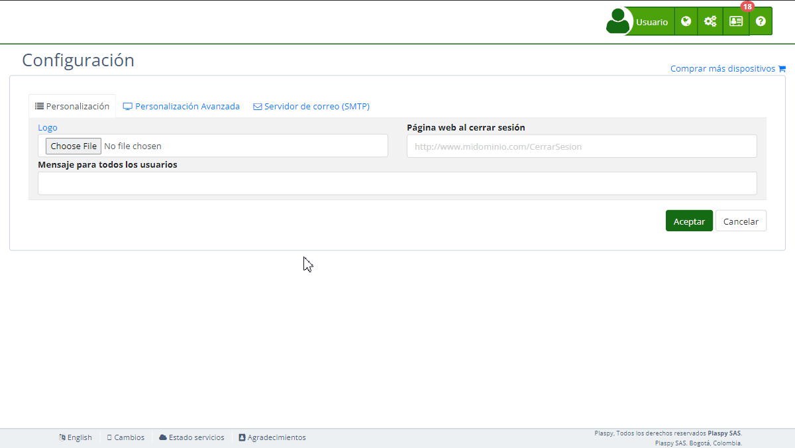

# Mapas
La sección "[Mapas](https://app.plaspy.com/Settings)" en la configuración de Plaspy permite a los administradores integrar diversas API de mapas para proporcionar servicios de geolocalización y visualización de mapas en la plataforma. Esta funcionalidad es esencial para aplicaciones que requieren la localización precisa de dispositivos y la visualización de rutas y ubicaciones en tiempo real. En esta guía se detallan los campos disponibles y los pasos para configurarlos adecuadamente.

### Descripción de Campos

- **Google Maps API key:** Clave de API para integrar los servicios de Google Maps.
- **Bing Maps API key:** Clave de API para integrar los servicios de Bing Maps.
- **MapBox API key:** Clave de API para integrar los servicios de MapBox.
- **Apple Maps Token:** Token de autenticación para integrar los servicios de Apple Maps.
- **Here Maps Id:** ID de aplicación para integrar los servicios de Here Maps.
- **Here Maps API key:** Clave de API para integrar los servicios de Here Maps.
- **Yandex Maps:** Casilla para habilitar o deshabilitar la integración con Yandex Maps.

### Instrucciones Paso a Paso

1. **Acceder a la Sección:**

    - Inicia sesión en Plaspy y dirígete al menú principal en la parte superior derecha.
    - Selecciona "[Configuración](https://app.plaspy.com/Settings)" y luego " Mapas".
2. **Configurar Google Maps API:**

    - Obtén la clave de API de Google Maps desde tu cuenta de Google Developers.
    - Introduce la clave en el campo "Google Maps API key".
    - Enlace de ayuda: [Google Maps API](https://developers.google.com/maps/documentation/javascript/get-api-key)
    - Términos de servicio: [Terms of Service](https://developers.google.com/maps/terms)
3. **Configurar Bing Maps API:**

    - Obtén la clave de API de Bing Maps desde tu cuenta de Microsoft.
    - Introduce la clave en el campo "Bing Maps API key".
    - Enlace de ayuda: [Bing Maps API](https://www.microsoft.com/en-us/maps/create-a-bing-maps-key)
    - Términos de uso: [Terms of Use](https://go.microsoft.com/fwlink/?LinkID=206977)
4. **Configurar MapBox API:**

    - Obtén la clave de API de MapBox desde tu cuenta de MapBox.
    - Introduce la clave en el campo "MapBox API key".
    - Enlace de ayuda: [MapBox Maps API](https://www.mapbox.com/maps/)
    - Términos de servicio: [Terms of service](https://www.mapbox.com/tos/)
5. **Configurar Apple Maps:**

    - Obtén el token de autenticación de Apple Maps desde tu cuenta de Apple Developer.
    - Introduce el token en el campo "Apple Maps Token".
    - Enlace de ayuda: [Apple MapKit JS](https://developer.apple.com/documentation/mapkitjs)
    - Términos y condiciones: [Terms and Conditions](https://developer.apple.com/terms/)
6. **Configurar Here Maps:**

    - Obtén el ID de aplicación y la clave de API de Here Maps desde tu cuenta de Here Developer.
    - Introduce el ID en el campo "Here Maps Id".
    - Introduce la clave de API en el campo "Here Maps API key".
    - Enlace de ayuda: [HERE Maps API](https://developer.here.com/)
    - Términos de servicio: [Service terms](https://legal.here.com/en-gb/terms)
7. **Habilitar Yandex Maps:**

    - Marca la casilla "Yandex Maps" para habilitar la integración con Yandex Maps.
    - Enlace de ayuda: [Yandex Maps API](https://tech.yandex.com/maps/)
    - Términos de uso: [Terms of Use](https://yandex.com/legal/maps_api/)
8. **Guardar los Cambios:**

    - Revisa todos los campos para asegurar que la información sea correcta.
    - Haz clic en "Aceptar" para guardar todos los cambios realizados.

### Validaciones y Restricciones

- **Google Maps API key, Bing Maps API key, MapBox API key, Apple Maps Token, Here Maps Id y Here Maps API key:** Deben ser claves y tokens válidos obtenidos de las respectivas plataformas.
- **Yandex Maps:** Debe marcarse la casilla para habilitar la integración.

### Preguntas Frecuentes

- **¿Cómo obtengo mi clave de API para Google Maps?**
    - Puedes obtener tu clave de API de Google Maps desde el panel de Google Developers. Sigue las instrucciones en [Google Maps API](https://developers.google.com/maps/documentation/javascript/get-api-key).
- **¿Qué hago si no tengo una clave de API para Bing Maps?**
    - Si aún no tienes una clave de API de Bing Maps, debes crear una cuenta en Microsoft y seguir los pasos para obtener tu clave. Más información en [Bing Maps API](https://www.microsoft.com/en-us/maps/create-a-bing-maps-key).
- **¿Qué sucede si mi clave de API no es válida?**
    - La clave de API debe ser válida y estar activa. Si la clave no es válida, no podrás guardar los cambios ni utilizar los servicios de mapas. Asegúrate de seguir las instrucciones de cada proveedor para generar y activar tu clave de API.
- **¿Puedo usar múltiples servicios de mapas al mismo tiempo?**
    - Sí, puedes configurar y utilizar múltiples servicios de mapas al mismo tiempo en Plaspy, dependiendo de tus necesidades y preferencias.
- **¿Cómo puedo verificar que mis claves de API se están aplicando correctamente?**
    - Después de guardar los cambios, verifica la funcionalidad de los mapas en la plataforma para asegurarte de que las claves de API están configuradas correctamente y los mapas se muestran según lo esperado.
- **¿Qué beneficios tiene habilitar la integración con Yandex Maps?**
    - Yandex Maps ofrece servicios de mapas adicionales que pueden ser útiles dependiendo de tu región y necesidades específicas. Habilitar Yandex Maps proporciona opciones adicionales de geolocalización y visualización.

Con estas instrucciones, podrás configurar la sección de "Mapas" de manera efectiva y asegurar que los servicios de mapas estén integrados y funcionando correctamente en la plataforma Plaspy.
