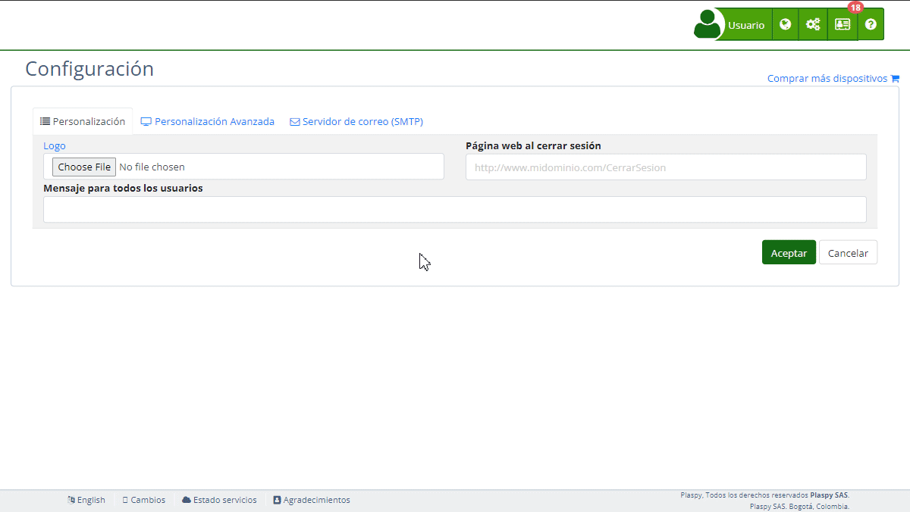

# Aplicación móvil
Esta sección permite a los usuarios generar el código fuente para sus [aplicaciones móviles personalizadas](https://app.plaspy.com/Settings/MobileApp) de Android e iOS de manera rápida y sencilla. Una vez completado el formulario con la información requerida, el sistema generará el código correspondiente para que los usuarios puedan crear su propia aplicación.

### Descripción de Campos

- **Tipo de aplicación móvil:** Selecciona el tipo de aplicación que deseas generar. Las opciones incluyen Básica, Google Maps, Notificaciones Push y Rastreo de teléfonos.
- **Nombre de la aplicación:** Introduce el nombre de tu aplicación. Este nombre aparecerá en la tienda de aplicaciones y en la propia aplicación.
- **App Id:** Especifica el identificador único de la aplicación. Debe ser un nombre de paquete único, como `com.tuempresa.tuapp`.
- **Color de fondo de los íconos:** Selecciona el color de fondo para los íconos de tu aplicación. Elige un color que combine con tu branding corporativo.

#### Google Maps API Keys

- **GoogleMaps Key SDK Android:** Introduce tu clave [API de Google Maps](https://developers.google.com/maps/documentation/android-sdk/get-api-key) para la versión Android de la aplicación.
- **GoogleMaps Key SDK iOS:** Introduce tu clave [API de Google Maps](https://developers.google.com/maps/documentation/ios-sdk/get-api-key) para la versión iOS de la aplicación.

#### Firebase Keys

- **Firebase Key Android \(google-services.json\):** Sube el archivo JSON con las credenciales de [Firebase](https://console.firebase.google.com/) para la versión Android.
- **Firebase Key iOS \(GoogleService-Info.plist\):** Sube el archivo PLIST con las credenciales de [Firebase](https://console.firebase.google.com/) para la versión iOS.

### Tipos de Aplicación

#### Básica

La aplicación básica es una aplicación híbrida escrita en Cordova que te permite personalizarla con tu logo y colores corporativos. Con esta aplicación, puedes iniciar sesión con tus credenciales de Plaspy y ver la ubicación de tus dispositivos de rastreo en tiempo real en un mapa. También puedes acceder a funciones adicionales como la generación de reportes, la gestión de dispositivos y la visualización de estadísticas. Es ideal para usuarios que necesitan una solución de rastreo simple y eficaz.

**Características principales:**

- Personalización con logo y colores corporativos.
- Inicio de sesión con credenciales de Plaspy.
- Visualización en tiempo real de la ubicación de dispositivos de rastreo.
- Generación de reportes y estadísticas.

#### Google Maps

Esta aplicación tiene todas las funcionalidades de la aplicación básica, pero con soporte para Google Maps. Utilizando el SDK de Google Maps para Android e iOS, podrás acceder a mapas más detallados y con mayor precisión en la ubicación. Esta aplicación es ideal para usuarios que requieren un alto nivel de detalle en la visualización de mapas y desean utilizar la tecnología de Google Maps en lugar de OpenStreetMap.

**Características principales:**

- Todas las funciones de la aplicación básica.
- Soporte para Google Maps SDK para Android e iOS.
- Acceso a mapas detallados y precisos.
- Sin costos adicionales por el uso de Google Maps.

#### Notificaciones Push

Además de las funciones de la aplicación básica, esta aplicación incluye soporte para notificaciones push a través de Firebase. Podrás recibir notificaciones instantáneas en tu dispositivo móvil sobre la ubicación de tus dispositivos de rastreo sin necesidad de abrir la aplicación. Esto permite una monitorización más efectiva y oportuna de tus dispositivos.

**Características principales:**

- Todas las funciones de la aplicación básica.
- Soporte para notificaciones push mediante Firebase.
- Recepción de notificaciones instantáneas sobre la ubicación de dispositivos.
- Mayor eficiencia en el monitoreo de dispositivos.

#### Rastreo de Teléfonos

Esta aplicación incluye todas las funciones de la aplicación básica, pero con capacidades adicionales de seguimiento telefónico. Además de rastrear tus dispositivos de rastreo, puedes optar por rastrear el teléfono en el cual está instalada la aplicación. Esto proporciona una capa adicional de seguridad y control, ideal para empresas que desean realizar un seguimiento detallado de sus dispositivos móviles.

**Características principales:**

- Todas las funciones de la aplicación básica.
- Capacidades de seguimiento telefónico.
- Posibilidad de enviar comandos SMS cuando la aplicación está sin conexión a Internet.
- Seguridad y control adicionales mediante el rastreo del teléfono.

### Instrucciones Paso a Paso

1. **Seleccionar el tipo de aplicación móvil:** En el menú desplegable, elige el tipo de aplicación que deseas crear. Las opciones incluyen funcionalidades como mapas, notificaciones push y rastreo de teléfonos.
2. **Ingresar el nombre de la aplicación:** Escribe el nombre que deseas para tu aplicación. Este será visible tanto en la tienda de aplicaciones como dentro de la propia aplicación.
3. **Especificar el App Id:** Introduce un identificador único para tu aplicación. Este es necesario para la publicación en las tiendas de aplicaciones.
4. **Seleccionar el color de fondo de los íconos:** Haz clic en el selector de color para elegir el color de fondo de los íconos de la aplicación.
5. **Configurar Google Maps API Keys \(si aplica\):** Si has seleccionado una aplicación con Google Maps, proporciona las claves API para las versiones de Android e iOS.
6. **Subir las claves de Firebase \(si aplica\):** Si has seleccionado una aplicación con notificaciones push, sube los archivos de configuración de Firebase para Android e iOS.
7. **Generar la aplicación:** Una vez completados todos los campos, haz clic en "Generar" para crear el código fuente de tu aplicación.

### Validaciones y Restricciones

- **Tipo de aplicación móvil:** Este campo es obligatorio. Debes seleccionar un tipo de aplicación.
- **Nombre de la aplicación:** Este campo es obligatorio. Debes proporcionar un nombre para la aplicación.
- **App Id:** Este campo es obligatorio. Debes proporcionar un identificador único.
- **Color de fondo de los íconos:** Debes seleccionar un color válido en formato RGB Hex.
- **Google Maps API Keys:** Si has seleccionado una aplicación con Google Maps, las claves API son obligatorias.
- **Firebase Keys:** Si has seleccionado una aplicación con notificaciones push, los archivos de configuración de Firebase son obligatorios.

### Preguntas Frecuentes

- **¿Qué tipo de aplicación se genera?**   

    - La aplicación generada es una aplicación híbrida escrita en Cordova. Puede incluir funcionalidades adicionales como soporte para Google Maps y notificaciones push, dependiendo del tipo de aplicación seleccionado.
- **¿Cómo subo mi aplicación a las tiendas de aplicaciones?**   

    - Necesitarás conocimientos en desarrollo de aplicaciones móviles y una cuenta en las tiendas de aplicaciones correspondientes \(Google Play Store y Apple App Store\) para subir tu aplicación.
- **¿Puedo personalizar la aplicación con mi logo y colores corporativos?**   

    - Sí, puedes personalizar la aplicación con tu logo y colores corporativos seleccionando el color de fondo de los íconos y subiendo tu logo.
- **¿Qué pasa si no tengo una clave API de Google Maps o Firebase?**   

    - Si la aplicación seleccionada requiere claves API de Google Maps o Firebase y no las proporcionas, no podrás generar una aplicación funcional con esas características. Debes obtener las claves API necesarias para completar el proceso.
