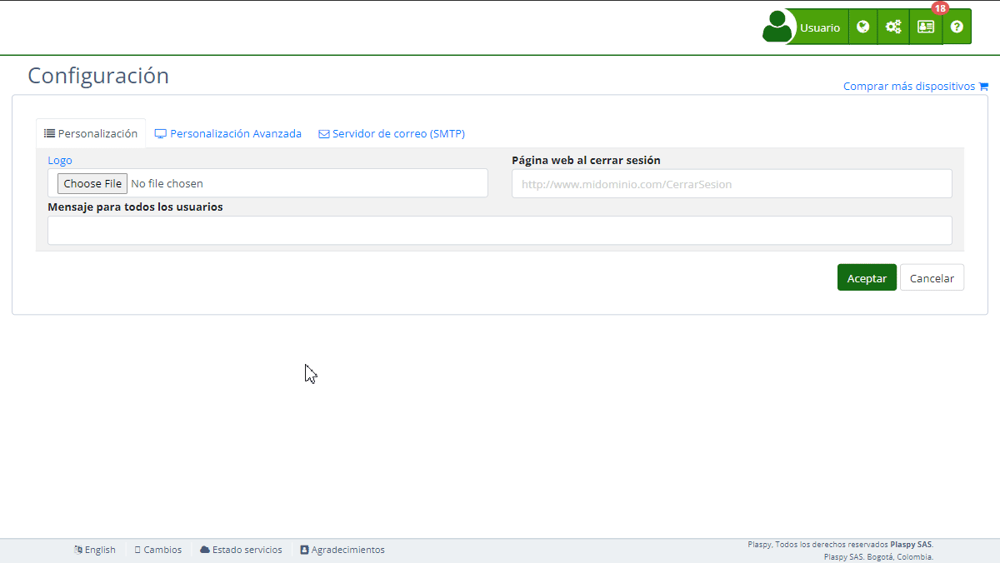

# Organización
La sección "[Organización](https://app.plaspy.com/Settings)" dentro de la configuración de Plaspy permite a los administradores personalizar y gestionar detalles clave de la organización, como el nombre, los colores de la interfaz, el ícono, el sub-dominio y la integración con herramientas de seguimiento y seguridad. Esta guía proporciona una descripción detallada de cada campo y los pasos necesarios para configurar esta sección de manera efectiva.

### Descripción de Campos

- **Nombre de la organización:** Campo para especificar el nombre oficial de la organización.
- **Color primario:** Selector para definir el color principal de la interfaz, utilizando un código RGB Hex.
- **Ícono:** Opción para cargar o restaurar el ícono de la organización. Este ícono se utilizará para las notificaciones de la página web y como el pequeño icono \(favicon\) de la página web. El ícono debe ser cuadrado y las dimensiones recomendadas son 32x32 píxeles.
- **Etiqueta del sitio para seguimiento:** Campo para introducir la etiqueta de seguimiento de Google Analytics, que se usará para recopilar datos de tráfico y comportamiento de los usuarios en la web.
- **Sub-dominio:** Campo para especificar y probar el sub-dominio de la plataforma, con opción para activar HTTPS mediante Let's Encrypt.

### Instrucciones Paso a Paso

1. **Acceder a la Sección:**

    - Inicia sesión en Plaspy y dirígete al menú principal en la parte superior derecha.
    - Selecciona "[Configuración](https://app.plaspy.com/Settings)" y luego " Organización".
2. **Actualizar el Nombre de la Organización:**

    - Ingresa el nombre oficial de tu organización en el campo "Nombre de la organización".
3. **Configurar el Color Primario:**

    - Selecciona un color utilizando el selector de colores y asegúrate de que el código Hex sea válido.
4. **Cargar o Restaurar el Ícono:**

    - Haz clic en "Choose File" para cargar un nuevo ícono.
    - Para restaurar el ícono original, haz clic en "Restaurar".
    - Recuerda que el ícono se utiliza para las notificaciones de la página web y como el pequeño ícono de la página web \(favicon\). Debe ser cuadrado y las dimensiones recomendadas son 32x32 píxeles.
5. **Añadir Etiqueta de Seguimiento de Google Analytics:**

    - Introduce la etiqueta de seguimiento en el campo correspondiente.
    - Puedes verificar la configuración en el sitio de Google Analytics.
    - Esta etiqueta se usa para recopilar datos sobre el tráfico y el comportamiento de los usuarios en tu sitio web, permitiéndote analizar y mejorar la experiencia del usuario.
6. **Configurar el Sub-dominio:**

    - Ingresa el sub-dominio deseado en el campo "Sub-dominio".
    - Activa HTTPS marcando la casilla y aceptando las condiciones de Let's Encrypt.
    - Haz clic en "Probar" para verificar la configuración del sub-dominio.
    - El sub-dominio es una dirección web que funciona como una extensión de tu dominio principal. Por ejemplo, en "plataforma.midominio.com", "plataforma" es el sub-dominio.
    - Debes configurar un registro CNAME que apunte a "h.trackservers.net". Un registro CNAME es un tipo de registro en DNS que alias un nombre de dominio a otro nombre de dominio. Para configurarlo, accede a la configuración de DNS de tu dominio y crea un registro CNAME con tu sub-dominio apuntando a "h.trackservers.net".
7. **Guardar los Cambios:**

    - Revisa todos los campos para asegurar que la información sea correcta.
    - Haz clic en "Aceptar" para guardar todos los cambios realizados.

### Validaciones y Restricciones

- **Nombre de la organización:** Debe ser una cadena de texto alfanumérica.
- **Color primario:** Debe ser un código RGB Hex válido.
- **Ícono:** Formato de archivo permitido \(e.g., PNG, JPG\).
- **Etiqueta de seguimiento:** Debe seguir el formato "UA-XXXXXXXX-X" de Google Analytics.
- **Sub-dominio:** Debe cumplir con el formato de sub-dominio y pasar la prueba de conexión.

### Preguntas Frecuentes

- **¿Cómo puedo cambiar el nombre de la organización?**
    - Accede a la sección de "Organización" y modifica el campo "Nombre de la organización". Guarda los cambios para que se apliquen.
- **¿Es obligatorio activar HTTPS?**
    - No es obligatorio, pero es altamente recomendable para asegurar las comunicaciones en tu sub-dominio. HTTPS es un protocolo de seguridad que encripta los datos transferidos entre el navegador del usuario y el servidor, protegiendo la información de posibles interceptaciones.
- **¿Qué sucede si no se carga el ícono correctamente?**
    - Asegúrate de que el archivo cumple con los formatos permitidos y que las dimensiones son cuadradas. Si persiste el problema, puedes restaurar el ícono original haciendo clic en "Restaurar".
- **¿Cómo puedo saber si mi sub-dominio está configurado correctamente?**
    - Después de ingresar el sub-dominio, haz clic en "Probar". El sistema verificará y te informará si la configuración es correcta. Además, asegúrate de configurar el registro CNAME en tu proveedor de DNS para que apunte a "h.trackservers.net".
- **¿Qué es y para qué sirve la etiqueta de Google Analytics?**
    - La etiqueta de Google Analytics se utiliza para recopilar y enviar datos sobre el tráfico y el comportamiento de los usuarios en tu sitio web a la plataforma de Google Analytics. Esto te permite obtener información detallada sobre cómo los usuarios interactúan con tu sitio, ayudándote a mejorar la experiencia del usuario y optimizar el rendimiento del sitio.
- **¿Cómo configuro un sub-dominio con un registro CNAME?**
    - Un sub-dominio es una dirección adicional que puedes crear para tu dominio principal, como "plataforma.midominio.com".
    - Para configurarlo, accede a la configuración de DNS de tu dominio y crea un registro CNAME. Este registro debe apuntar tu sub-dominio a "h.trackservers.net". Esto indica a los navegadores y servicios de Internet que el sub-dominio debe resolver al servidor especificado por el registro CNAME, facilitando la gestión y el acceso a tu plataforma en Plaspy.

Con estas instrucciones, podrás configurar la sección de "Organización" de manera efectiva y asegurar que todos los detalles de tu organización estén correctamente registrados en Plaspy.
