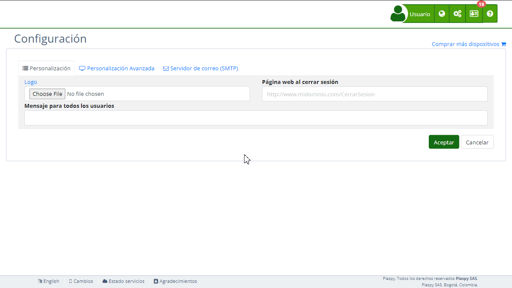

# Notificaciones Push
La sección "*fa-mobile* Notificaciones móviles Push" en la [*fa-list* configuración](https://app.plaspy.com/Settings) permite a los administradores configurar las notificaciones push para las aplicaciones móviles personalizadas creadas a través de [ Mobile App Settings](https://app.plaspy.com/Settings/MobileApp). Esta funcionalidad es crucial para enviar alertas y mensajes en tiempo real a los usuarios de las aplicaciones móviles. Esta guía detalla los campos disponibles y los pasos para configurarlos adecuadamente.

### Descripción de Campos

- **Firebase Account Key:** Archivo JSON con las credenciales privadas necesarias para usar Firebase Cloud Messaging \(FCM\).
- **Token de prueba:** Campo para introducir el token del dispositivo de prueba y probar el envío de notificaciones push.

### Instrucciones Paso a Paso

1. **Acceder a la Sección:**
    - Inicia sesión y navega al menú principal en la parte superior derecha.
    - Selecciona "[*fa-list* Configuración](https://app.plaspy.com/Settings)" y luego "*fa-mobile* Notificaciones móviles Push."
2. **Cargar Firebase Account Key:**
    - Obtén el archivo JSON con las credenciales privadas desde tu cuenta de Firebase. Este archivo contiene información crucial como el `project_id`, `private_key_id`, y `client_email`.
    - Haz clic en "Choose File" y selecciona el archivo JSON.
    - El contenido del archivo se cargará en el sistema, permitiendo a utilizar Firebase Cloud Messaging para enviar notificaciones push.
    - Enlace de ayuda: [Proveer credenciales manualmente](https://firebase.google.com/docs/cloud-messaging/auth-server#provide_credentials_manually)
3. **Configurar el Token de Prueba:**
    - Introduce el token del dispositivo de prueba en el campo "Token de prueba".
    - Puedes obtener el token del dispositivo de prueba siguiendo las guías para [Android](https://firebase.google.com/docs/cloud-messaging/android/client#recupera-el-token-de-registro-actual) y [iOS](https://firebase.google.com/docs/cloud-messaging/ios/client#c%C3%B3mo-recuperar-el-token-de-registro-actual).
    - Haz clic en "Probar" para enviar una notificación de prueba y asegurarte de que la configuración es correcta.
4. **Guardar los Cambios:**
    - Revisa todos los campos para asegurar que la información es correcta.
    - Haz clic en "Aceptar" para guardar todos los cambios realizados.

### Validaciones y Restricciones

- **Firebase Account Key:** Debe ser un archivo JSON válido con las credenciales necesarias para la autenticación de Firebase Cloud Messaging.
- **Token de prueba:** Debe ser un token válido del dispositivo de prueba para asegurar que las notificaciones push se envían correctamente.

### Preguntas Frecuentes

- **¿Qué es Firebase Cloud Messaging \(FCM\)?**
    - Firebase Cloud Messaging \(FCM\) es un servicio que permite enviar notificaciones y mensajes a los dispositivos de tus usuarios a través de aplicaciones móviles, navegadores y aplicaciones web.
- **¿Cómo obtengo el archivo JSON con las credenciales privadas de Firebase?**
    - Puedes obtener el archivo JSON desde la consola de Firebase, en la sección de configuración del proyecto, bajo "Cuentas de servicio".
- **¿Qué debo hacer si el archivo JSON no se carga correctamente?**
    - Asegúrate de que el archivo JSON es válido y contiene toda la información necesaria. Si el problema persiste, consulta la documentación de Firebase o ponte en contacto con el soporte.
- **¿Cómo puedo probar las notificaciones push en mi dispositivo?**
    - Introduce el token del dispositivo de prueba en el campo "Token de prueba" y haz clic en "Probar" para enviar una notificación de prueba. Sigue las guías de Firebase para obtener el token del dispositivo en [Android](https://firebase.google.com/docs/cloud-messaging/android/client#recupera-el-token-de-registro-actual) y [iOS](https://firebase.google.com/docs/cloud-messaging/ios/client#c%C3%B3mo-recuperar-el-token-de-registro-actual).
- **¿Puedo usar notificaciones push en aplicaciones que no fueron creadas a través Mobile App Settings?**
    - No, esta funcionalidad está habilitada solo para aplicaciones móviles personalizadas que fueron creadas a través de [ Mobile App Settings](https://app.plaspy.com/Settings/MobileApp).

Con estas instrucciones, podrás configurar la sección de "Notificaciones móviles Push" de manera efectiva y asegurar que las notificaciones push se envíen correctamente a los usuarios de tus aplicaciones móviles personalizadas en la plataforma.
