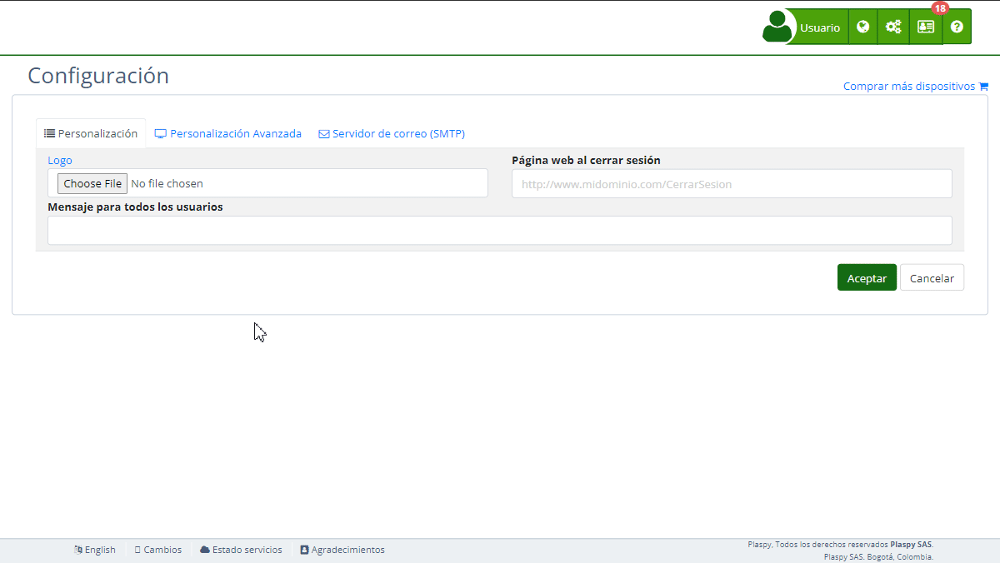

# Estilos
La sección "[*fa-desktop* Estilos](https://app.plaspy.com/Settings)" en la configuración permite a los administradores personalizar la apariencia de la plataforma mediante la carga de hojas de estilos CSS \(Cascading Style Sheets\). Esta funcionalidad es útil para adaptar la interfaz tanto en dispositivos de escritorio como móviles, asegurando una experiencia de usuario coherente y profesional. En esta guía se detallan los campos disponibles y los pasos para configurarlos adecuadamente.

### Descripción de Campos

- **Cargar estilos CSS predeterminados:** Opción para habilitar o deshabilitar el uso de los estilos CSS predeterminados. Al habilitar esta opción, el tema actual se adaptará automáticamente al color primario de la página web sin necesidad de incluir ningún esquema CSS adicional.
- **Hoja de estilos Escritorio:** URL de la hoja de estilos CSS que se aplicará a la versión de escritorio de la plataforma.
- **Hoja de estilos Móvil:** URL de la hoja de estilos CSS que se aplicará a la versión móvil de la plataforma.

### Instrucciones Paso a Paso

1. **Acceder a la Sección:**
    - Inicia sesión y dirígete al menú principal en la parte superior derecha.
    - Selecciona "[*fa-list* Configuración](https://app.plaspy.com/Settings)" y luego "*fa-desktop* Estilos".
2. **Habilitar o Deshabilitar Estilos CSS Predeterminados:**
    - Marca o desmarca la casilla "Cargar estilos CSS predeterminados" según tus necesidades. Si está marcada, utilizará sus estilos CSS predeterminados, adaptando automáticamente el tema al color primario de tu página web sin necesidad de esquemas CSS adicionales.
3. **Configurar Hoja de Estilos para Escritorio:**
    - Introduce la URL de la hoja de estilos CSS en el campo "Hoja de estilos Escritorio". Asegúrate de que la URL sea válida y accesible.
    - La URL debe comenzar con "http://" o "https://", y debe seguir el formato correcto para ser aceptada.
4. **Configurar Hoja de Estilos para Móvil:**
    - Introduce la URL de la hoja de estilos CSS en el campo "Hoja de estilos Móvil". Asegúrate de que la URL sea válida y accesible.
    - Al igual que con la hoja de estilos para escritorio, la URL debe ser válida y accesible para que los cambios se apliquen correctamente.
5. **Guardar los Cambios:**
    - Revisa todos los campos para asegurar que la información sea correcta.
    - Haz clic en "Aceptar" para guardar todos los cambios realizados.

### Validaciones y Restricciones

- **Cargar estilos CSS predeterminados:** Si esta opción está habilitada, aplicará sus estilos CSS predeterminados, ajustando el tema al color primario configurado en la plataforma.
- **Hoja de estilos Escritorio y Móvil:** Las URL deben ser válidas y accesibles. Deben seguir el formato correcto: "http\(s\)://\(dominio\)/\(ruta\)/\(archivo.css\)". Se validarán automáticamente para asegurar que cumplen con los requisitos de formato de URL.

### Preguntas Frecuentes

- **¿Qué es una hoja de estilos CSS y para qué sirve?**
    - Una hoja de estilos CSS es un archivo que define cómo se presentan los elementos HTML en una página web. Permite personalizar el diseño, colores, fuentes y disposición de la interfaz de usuario, proporcionando una experiencia visual coherente y profesional.
- **¿Puedo usar una hoja de estilos CSS personalizada en lugar de la predeterminada?**
    - Sí, puedes desmarcar la opción "Cargar estilos CSS predeterminados" y proporcionar las URLs de tus propias hojas de estilos CSS para escritorio y móvil.
- **¿Qué sucede si la URL de mi hoja de estilos CSS no es válida?**
    - La URL debe seguir el formato correcto para ser aceptada. Si la URL no es válida, no podrás guardar los cambios. Asegúrate de que la URL comience con "http://" o "https://" y sea accesible.
- **¿Cómo puedo verificar que mis hojas de estilos CSS se están aplicando correctamente?**
    - Después de guardar los cambios, visita la plataforma con tu url del subdominio en un navegador y verifica que los estilos se han aplicado correctamente tanto en la versión de escritorio como en la versión móvil.
- **¿Puedo cambiar la hoja de estilos CSS en cualquier momento?**
    - Sí, puedes actualizar las URLs de las hojas de estilos CSS en cualquier momento desde la sección "Estilos" en la configuración. Solo asegúrate de guardar los cambios después de hacer cualquier modificación.
- **¿Qué beneficios tiene habilitar los estilos CSS predeterminados?**
    - Al habilitar los estilos CSS predeterminados, el tema se adaptará automáticamente al color primario configurado en la plataforma, simplificando el proceso de personalización sin necesidad de esquemas CSS adicionales.

Con estas instrucciones, podrás configurar la sección de "Estilos" de manera efectiva y personalizar la apariencia de la plataforma según las necesidades de tu organización.
