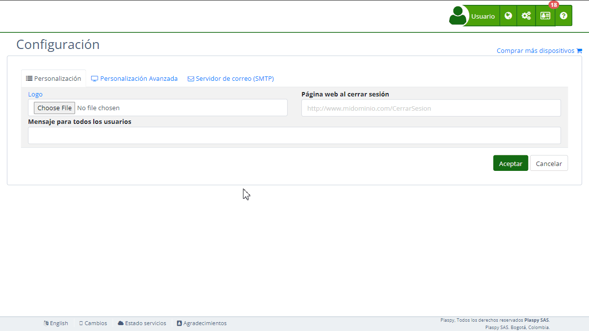

# Notificaciones Telegram
La sección " Notificaciones Telegram" en la [configuración](https://app.plaspy.com/Settings) de Plaspy permite a los administradores configurar notificaciones a través de Telegram utilizando un bot propio, diferente al bot de Plaspy \(@plaspybot\). Esta funcionalidad es útil para enviar alertas y mensajes directamente a los usuarios a través de Telegram. Es importante que el usuario ya haya creado su propio bot en Telegram siguiendo las instrucciones proporcionadas. Esta guía detalla los campos disponibles y los pasos para configurarlos adecuadamente.

###   
Descripción de Campos

- **Nombre Bot:** Nombre del bot de Telegram que has creado.
- **Token Bot:** Token del bot de Telegram proporcionado por @botfather.

### Instrucciones Paso a Paso

1. **Acceder a la Sección:**

    - Inicia sesión en Plaspy y navega al menú principal en la parte superior derecha.
    - Selecciona "[Configuración](https://app.plaspy.com/Settings)" y luego " Notificaciones Telegram."
2. **Crear un Bot en Telegram:**

    - Conéctate a [@botfather](https://t.me/botfather) en Telegram y envía el comando `/newbot` para crear un nuevo bot.
    - Sigue las instrucciones de @botfather para asignar un nombre y obtener el token del bot.
    - Para más información sobre la creación de bots, consulta [Cómo crear un bot](https://core.telegram.org/bots#how-do-i-create-a-bot).
3. **Configurar el Nombre del Bot:**

    - Introduce el nombre de tu bot de Telegram en el campo "Nombre Bot".
4. **Configurar el Token del Bot:**

    - Introduce el token del bot proporcionado por @botfather en el campo "Token Bot".
5. **Registrar el Bot en Plaspy:**

    - Haz clic en "Registrar" para registrar el bot en Plaspy.
    - Esto permitirá a Plaspy utilizar tu bot para enviar notificaciones a través de Telegram.
6. **Probar la Configuración:**

    - Después de registrar el bot, haz clic en "Probar" para verificar que las notificaciones se envían correctamente a través de tu bot de Telegram.
7. **Guardar los Cambios:**

    - Revisa todos los campos para asegurar que la información es correcta.
    - Haz clic en "Aceptar" para guardar todos los cambios realizados.

### Validaciones y Restricciones

- **Nombre Bot:** Debe ser un nombre válido y representativo de tu bot de Telegram.
- **Token Bot:** Debe ser un token válido proporcionado por @botfather. Asegúrate de que el token es correcto y activo.

### Preguntas Frecuentes

- **¿Cómo creo un bot en Telegram?**
    - Conéctate a [@botfather](https://t.me/botfather) en Telegram y sigue las instrucciones enviando el comando `/newbot`. Para más detalles, consulta [Cómo crear un bot](https://core.telegram.org/bots#how-do-i-create-a-bot).
- **¿Qué es un token de bot y cómo lo obtengo?**
    - Un token de bot es una cadena de caracteres única que identifica y autentica tu bot de Telegram. Lo obtienes de @botfather al crear tu bot.
- **¿Puedo usar cualquier bot de Telegram para notificaciones en Plaspy?**
    - Sí, puedes usar cualquier bot de Telegram que hayas creado siguiendo las instrucciones proporcionadas y registrándolo en Plaspy.
- **¿Qué debo hacer si el token del bot no funciona?**
    - Asegúrate de que el token es correcto y no ha expirado. Si el problema persiste, puedes generar un nuevo token desde @botfather enviando el comando `/token`.
- **¿Cómo pruebo que las notificaciones de Telegram funcionan correctamente?**
    - Después de registrar el bot, haz clic en "Probar" para enviar una notificación de prueba. Verifica en Telegram que la notificación se recibe correctamente.

Con estas instrucciones, podrás configurar la sección de " Notificaciones Telegram" de manera efectiva y asegurar que las notificaciones se envíen correctamente a través de tu bot de Telegram en la plataforma Plaspy.
