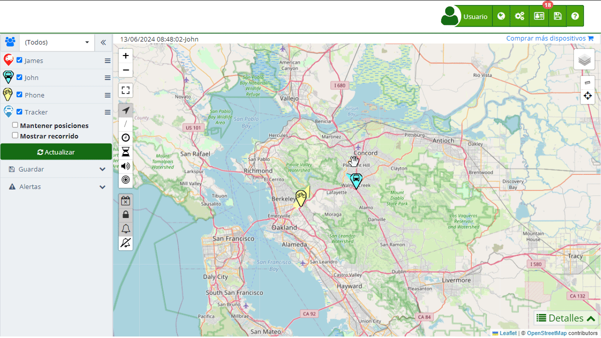

# Compartir Acceso
La funcionalidad de "[Compartir Acceso](https://app.plaspy.com/Users/Share)" en Plaspy permite a los usuarios crear accesos temporales para terceros mediante una URL sin necesidad de contraseña. Esta herramienta es ideal para proporcionar acceso limitado a la información de rastreo y estadísticas de dispositivos específicos por un período de tiempo determinado. Los usuarios invitados pueden consultar recorridos y estadísticas solo durante el rango de fechas habilitado y para los dispositivos que pertenezcan al grupo seleccionado.

Para acceder a la sección de acceso temporal, dirígete al menú superior derecho y selecciona , luego elige "[Compartir Acceso](https://app.plaspy.com/Users/Share)". Aquí podrás crear nuevos accesos temporales, editar los existentes y asignar dispositivos y grupos a cada acceso.

### Descripción de Campos

- **Nombre**: Campo para ingresar el nombre de la persona que tendrá el acceso temporal.
- **Email**: Campo opcional para ingresar el correo electrónico del usuario que recibirá el acceso temporal.
- **Zona horaria**: Selección de la zona horaria correspondiente al acceso temporal.
- **Grupo/Dispositivo**: Selección del [grupo](groups) de dispositivos o el dispositivo a los que se otorgará el acceso.
- **Descripción**: Campo para agregar una descripción detallada del acceso temporal, proporcionando información adicional sobre su propósito.
- **Acceso**: URL generada automáticamente para acceder a la información compartida.
- **Expira**: Selección del rango de fechas durante el cual el acceso temporal estará activo.

### Funcionalidades del Acceso Temporal

Los accesos temporales en Plaspy permiten realizar las siguientes acciones:

- **Proporcionar Acceso Temporal**: Permitir que terceros accedan a la información de rastreo y estadísticas de dispositivos específicos por un período limitado.
- **Control de Acceso**: Limitar el acceso a solo lectura y restringirlo a un rango de fechas específico.
- **Notificación por Correo Electrónico**: Enviar un enlace de acceso al correo electrónico del usuario invitado, facilitando el proceso de acceso.

### Instrucciones Paso a Paso

#### Crear un Nuevo Acceso Temporal

1. **Acceder a la Sección de Acceso Temporal**:

    - Haz clic en el ícono de "Configuración" \(\) en el menú superior y selecciona "[Compartir Acceso](https://app.plaspy.com/Users/Share)".
2. **Iniciar la Creación de un Acceso Temporal**:

    - Haz clic en el ícono "" en la esquina inferior derecha para abrir el formulario de creación de acceso temporal.
3. **Completar los Detalles del Acceso Temporal**:

    - **Nombre**: Introduce el nombre de la persona que tendrá el acceso.
    - **Email**: Ingresa el correo electrónico del usuario \(opcional\).
    - **Zona horaria**: Selecciona la zona horaria correspondiente.
    - **Grupo/Dispositivo**: Selecciona el grupo de dispositivos o el dispositivo que deseas compartir.
    - **Descripción**: Añade una descripción detallada del acceso temporal.
    - **Expira**: Selecciona el rango de fechas durante el cual el acceso estará activo.
4. **Guardar el Acceso Temporal**:

    - Haz clic en "Aceptar" para guardar el nuevo acceso temporal.
    - Si deseas cancelar, haz clic en "Cancelar".
5. **Generar y Copiar la URL de Acceso**:

    - La URL de acceso se generará automáticamente. Haz clic en el ícono de copiar para copiar la URL al portapapeles.

#### Editar un Acceso Temporal Existente

1. **Seleccionar el Acceso a Editar**:

    - En la lista de [accesos temporales](https://app.plaspy.com/Users/Share), haz clic en el ícono de editar \(\) junto al acceso que deseas modificar.
2. **Modificar los Detalles del Acceso**:

    - Realiza los cambios necesarios en el nombre, correo electrónico, zona horaria, grupo, dispositivo, descripción o rango de fechas del acceso.
3. **Guardar los Cambios**:

    - Haz clic en "Aceptar" para guardar los cambios realizados.

### Validaciones y Restricciones

- **Nombre del acceso**: Asegúrate de ingresar un nombre descriptivo y fácil de identificar.
- **Fecha de expiración**: Selecciona un rango de fechas válido durante el cual el acceso estará activo.
- **Dispositivo o Grupo**: Debes seleccionar al menos un dispositivo o grupo para que el acceso sea válido.

### Preguntas Frecuentes

- **¿Cómo puedo compartir un acceso temporal con un usuario?**
    - Crea un nuevo acceso temporal en la sección correspondiente, ingresa los detalles necesarios y proporciona la URL generada al usuario.
- **¿Puedo editar un acceso temporal después de haberlo creado?**
    - Sí, puedes editar los detalles de un acceso temporal existente seleccionándolo de la lista y haciendo los cambios necesarios.
- **¿Cómo puedo limitar el acceso a ciertos dispositivos?**
    - Selecciona el grupo o el dispositivo específico que deseas compartir durante la creación o edición del acceso temporal.
- **¿Qué sucede cuando el acceso temporal expira?**
    - El acceso temporal se desactiva automáticamente, y el usuario invitado ya no podrá acceder a la información compartida.
