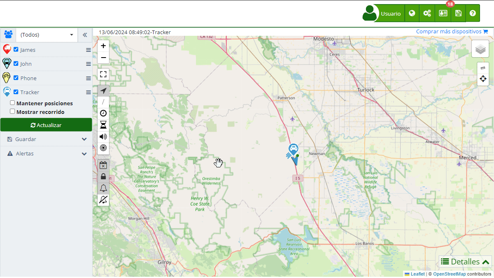

# SMS
La sección de "[SMS](https://app.plaspy.com/SMS)" en Plaspy permite a los usuarios gestionar y monitorear los mensajes de texto enviados por sus dispositivos. Esta funcionalidad es esencial para enviar alertas y comandos de forma eficiente y económica. Los usuarios pueden ver el historial de mensajes, agregar saldo a su cuenta y configurar límites de envío diario.

Para acceder a la sección de [SMS](https://app.plaspy.com/SMS), dirígete al menú superior derecho, haz click en "" y después selecciona " SMS". Desde allí, puedes revisar el historial de mensajes enviados y realizar configuraciones adicionales según tus necesidades.

### Descripción de Campos

- **Fecha**: Indica la fecha y hora en que se envió el mensaje de texto.
- **Número**: Muestra el número de teléfono al que se envió el mensaje.
- **Mensaje**: Contiene el contenido del mensaje de texto enviado.
- **Estado**: Indica el estado del mensaje, como "Exitoso" o "Fallido".
- **Precio USD**: Muestra el costo del mensaje en dólares estadounidenses.
- **Usuario**: Indica el usuario que envió el mensaje.
- **Dispositivo**: Muestra el dispositivo desde el cual se envió el mensaje.

### Envío de Mensajes de Texto

Para enviar un mensaje de texto desde Plaspy, sigue estos pasos:

1. **Abrir el Formulario de Envío**:

    - Haz clic en el ícono de "+" en la esquina inferior derecha de la pantalla de SMS.
2. **Completar los Detalles del Mensaje**:

    - **Número de teléfono**: Introduce el número de teléfono del destinatario.
    - **Mensaje**: Escribe el contenido del mensaje de texto.
3. **Enviar el Mensaje**:

    - Haz clic en "Enviar" para enviar el mensaje.
    - Si deseas cancelar el envío, haz clic en "Cancelar".

### Guardado de Historial de SMS

Plaspy permite guardar el historial de mensajes enviados en formato Excel para su análisis y almacenamiento posterior. Esta opción facilita la revisión y gestión de los mensajes enviados desde la plataforma.

#### Guardar Historial de Mensajes

1. **Acceder al Historial**:

    - En la sección de SMS, utiliza los filtros de búsqueda y las opciones de paginación para revisar el historial de mensajes enviados.
2. **Guardar en Excel**:

    - Haz clic en el ícono de guardar \(\) ubicado en la parte superior derecha después del icono del engranaje \(\).
    - El historial de mensajes se descargará en un archivo Excel que podrás abrir y revisar con cualquier software compatible.

### Configuración de Límite Diario de Mensajes

Puedes configurar el número máximo de mensajes de texto que se pueden enviar diariamente por dispositivo y por usuario. Esto es útil para controlar los costos y asegurarte de que no se excedan los límites presupuestarios.

#### Configuración de Límite Diario

1. **Acceder a la Configuración**:

    - Haz clic en el ícono de engranaje \(\) en la parte inferior izquierda de la pantalla de [SMS](https://app.plaspy.com/SMS).
2. **Definir Límites**:

    - En la ventana de configuración, verás dos campos:
        - **Dispositivo**: Especifica el número máximo de mensajes que un dispositivo puede enviar diariamente.
        - **Usuario**: Define el número máximo de mensajes que un usuario puede enviar diariamente.
    - Introduce los valores deseados en cada campo.
3. **Guardar Cambios**:

    - Haz clic en el botón "Aceptar" para guardar los cambios.
    - Si deseas cancelar los cambios, haz clic en "Cancelar".

### Consulta de Precios de Mensajes de Texto

Plaspy ofrece una página dedicada para consultar los precios de los mensajes de texto. Estos precios varían según el país y el operador. Para consultar los precios, visita [Plaspy SMS Pricing](https://app.plaspy.com/AdditionalServicesPricing). Aquí encontrarás una tabla detallada con los costos por país y operador, lo que te permitirá gestionar mejor tus gastos de mensajería.

### Instrucciones Paso a Paso

#### Acceso a la sección de SMS

1. **Abrir el menú de SMS**:

    - En el menú superior, haz clic en "" y después selecciona " SMS".
2. **Revisar el historial de mensajes**:

    - Utiliza los filtros de búsqueda y las opciones de paginación para revisar el historial de mensajes enviados.
3. **Enviar un nuevo mensaje**:

    - Haz clic en el ícono "" para abrir el formulario de envío de mensajes.
    - Completa los detalles del mensaje y haz clic en "Enviar".
4. **Configurar límite diario de mensajes**:

    - Haz clic en el ícono de engranaje \(\) en la parte inferior izquierda para abrir la configuración de límites diarios.
    - Define los límites y guarda los cambios.
5. **Guardar historial de mensajes**:

    - Haz clic en el ícono de guardar \(\) en el menu superior derecho para descargar el historial en un archivo de Excel
6. **Consultar precios de mensajes de texto**:

    - Visita [Plaspy SMS Pricing](https://app.plaspy.com/AdditionalServicesPricing) para revisar los precios por país y operador.

### Validaciones y Restricciones

- **Número de teléfono**: Asegúrate de ingresar un número de teléfono válido, incluyendo el código de país.
- **Contenido del mensaje**: El mensaje debe tener un contenido válido y no debe estar vacío.
- **Límites diarios**: No se pueden enviar más mensajes de los permitidos por los límites configurados.

### Preguntas Frecuentes

- **¿Cómo puedo agregar saldo para enviar mensajes de texto?**
    - Puedes [agregar saldo](https://app.plaspy.com/Subscription?sms=1) haciendo clic en el recuadro verde llamado "Saldo" en la parte superior de la pantalla de SMS.
- **¿Puedo enviar mensajes de texto a múltiples destinatarios a la vez?**
    - Actualmente, los mensajes se envían a un destinatario por vez. Puedes enviar múltiples mensajes a diferentes destinatarios individualmente.
- **¿Qué hago si un mensaje no se envía?**
    - Verifica el estado del mensaje en el historial. Si es "Fallido", revisa el número de teléfono y el saldo disponible. Si el problema persiste, contacta al soporte técnico.
- **¿Es posible programar el envío de mensajes de texto?**
    - Actualmente, los mensajes se envían de manera manual. No hay opción para programar el envío automático de mensajes.
- **¿Qué tipos de mensajes se pueden enviar?**
    - Puedes enviar cualquier tipo de mensaje de texto que cumpla con las restricciones de contenido y longitud estándar de SMS.
- **¿Dónde puedo consultar los precios de los mensajes de texto?**
    - Puedes consultar los precios de los mensajes de texto por país y operador en la página [Plaspy SMS Pricing](https://app.plaspy.com/AdditionalServicesPricing).
