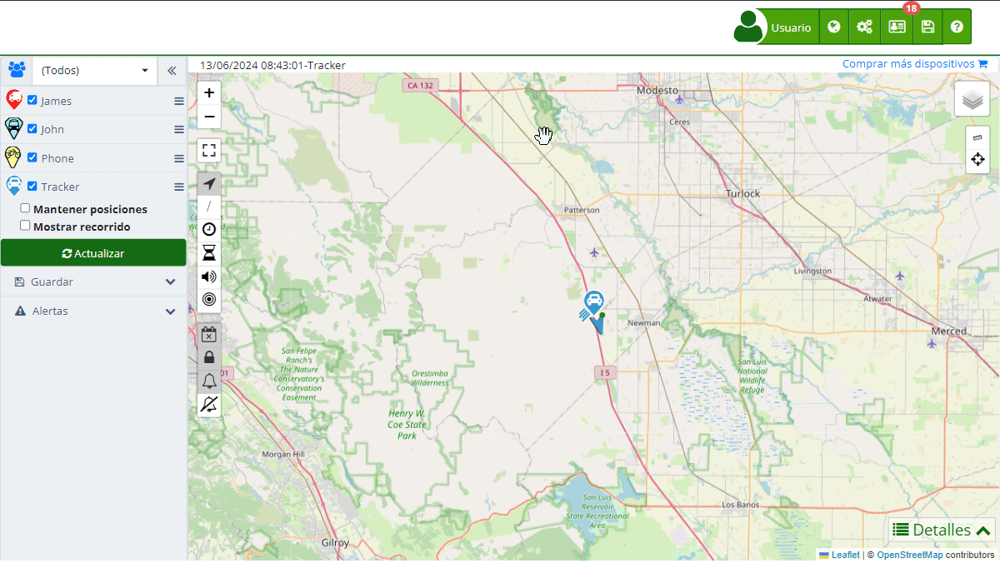

# Estadísticas
La sección de "[Estadísticas](https://app.plaspy.com/Statistics)" en Plaspy permite a los usuarios obtener informes detallados sobre el rendimiento y el uso de sus dispositivos a lo largo del tiempo. Esta herramienta es crucial para monitorear aspectos clave como el consumo de combustible, kilometraje, alertas generadas, y mucho más, proporcionando datos valiosos para la gestión eficiente de flotas y activos.

Para acceder a la sección de estadísticas, dirígete al menú superior y selecciona el ícono de estadísticas representado por un gráfico. Esto te llevará a la página donde puedes configurar y visualizar diversos tipos de informes según tus necesidades.

### Descripción de Campos

- **Fecha**: Permite seleccionar el rango de fechas para las estadísticas que deseas consultar. Puedes elegir entre opciones predefinidas como "Últimos 2 días", "Última semana", "Último mes", entre otras, o definir un rango personalizado.
- **Grupo**: Selecciona el grupo de dispositivos del cual deseas ver las estadísticas. Esta opción es útil para filtrar y obtener informes específicos de ciertos grupos de dispositivos.
- **Dispositivos**: Permite seleccionar uno o varios dispositivos específicos para generar las estadísticas. Puedes utilizar el campo de búsqueda para encontrar y seleccionar dispositivos fácilmente.
- **Tipo**: Define el tipo de estadística que deseas generar. Las opciones incluyen alertas generadas, consumo de combustible, kilometraje diario, nivel de combustible, tiempo en movimiento, velocidad, entre otros.
- **Actualizar**: Botón para aplicar los filtros seleccionados y generar la estadística correspondiente.
- **Chat de estadísticas con IA:** Permite consultar y analizar estadísticas desde un chat integrado. Puedes hacer preguntas en lenguaje natural y solicitar reportes específicos.
- **Guardar**: Permite guardar las estadísticas generadas en formato Excel para su análisis y almacenamiento posterior.

### Tipos de Estadísticas

- **Actividad de Funciones Específicas \(Sensor 2\)**: Proporciona información sobre la activación de funciones vehiculares específicas monitoreadas por el sensor 2, configurado según las necesidades del cliente. Este reporte es crucial para supervisar el funcionamiento de componentes adicionales del vehículo, tales como luces y sistemas de seguridad.
- **Actividad del Sensor de Encendido \(Sensor 1\)**: Detalla el tiempo durante el cual el vehículo ha estado encendido y apagado a lo largo del día, gracias a la conexión del sensor digital 1 al sistema de encendido del vehículo. Es esencial para monitorear el uso efectivo del vehículo.
- **Alertas de Monitoreo**: Resumen de todas las alertas generadas dentro de un período específico, incluyendo aquellas no notificadas por correo. Esto abarca desde alertas de movimiento hasta notificaciones de seguridad.
- **Análisis de Velocidad**: Proporciona un informe detallado sobre los patrones de velocidad, identificando posibles excesos y contribuyendo a la seguridad vial y al cumplimiento de las normativas de tráfico.
- **Conducción Agresiva**: Análisis detallado de eventos de conducción agresiva, incluyendo frenadas y aceleraciones bruscas. Este reporte identifica patrones de conducción riesgosa para promover prácticas de manejo más seguras y prevenir accidentes.
- **Consumo de Combustible Diario \(Galones\)**: Presenta el consumo de combustible diario de cada vehículo, medido en galones. Esta estadística permite un seguimiento eficiente del gasto de combustible, facilitando la planificación y la gestión del consumo energético.
- **Consumo de Combustible Diario \(Tanques\)**: Presenta el consumo de combustible diario de cada vehículo en la relación del consumo con la capacidad total del tanque, ofreciendo una perspectiva sobre la autonomía y eficiencia del vehículo.
- **Inactividad del Vehículo**: Muestra el tiempo total que el vehículo ha permanecido sin movimiento, ofreciendo perspectivas sobre la eficiencia operativa y la seguridad del vehículo.
- **Kilometraje Diario \(Kms\)**: Muestra los kilómetros recorridos por cada vehículo, día a día, proporcionando datos clave para el mantenimiento vehicular y la planificación logística.
- **Monitorización del Nivel de Combustible**: Reporte detallado del nivel de combustible en el tiempo, permitiendo identificar patrones de consumo y posibles fugas o anomalías en el sistema de combustible.
- **Registro de Paradas**: Documenta el número de paradas realizadas por el vehículo, ofreciendo insights sobre el uso del vehículo y posibles mejoras en la eficiencia de rutas.
- **Reporte de Temperatura**: Compila las variaciones de temperatura dentro del rango de fechas seleccionado, crucial para vehículos que transportan productos sensibles a la temperatura o para monitorear el estado del motor y sistemas asociados.
- **Tiempo de Actividad**: Detalla el tiempo total en movimiento del vehículo, proporcionando una visión clara sobre la utilización del mismo y ayudando en la optimización de rutas y tiempos de entrega.
- **Tiempo en Ralentí**: Expone el tiempo que el vehículo permanece encendido sin moverse, un factor importante para entender el consumo de combustible innecesario y el desgaste del motor.

### Interacción a través del Chat Incorporado con IA

En Plaspy, hemos integrado una función innovadora que permite a los usuarios interactuar con las estadísticas a través de un chat en línea potenciado por inteligencia artificial \(IA\). Esta herramienta proporciona una manera intuitiva y eficiente de obtener información y realizar consultas sobre los datos de tus dispositivos rastreados. A continuación, se describen las capacidades y ventajas de esta funcionalidad:

#### Funcionalidades del Chat Incorporado con IA

1. **Consultas en Tiempo Real:**

    - Puedes hacer preguntas directas sobre las estadísticas actuales de tus dispositivos, tales como "¿Cuántos kilómetros recorrieron los vehículos la semana pasada?" o "¿Cuál fue el consumo de combustible de los últimos 30 días?"
    - La IA responderá de inmediato con la información más reciente disponible en el sistema.
2. **Solicitar Nueva Información:**

    - Si necesitas generar un reporte específico o analizar un nuevo conjunto de datos, simplemente pide a la IA que lo haga por ti. Por ejemplo, "Genera un informe de alertas de los últimos 7 días" o "Muestra el análisis de velocidad para el vehículo A."
    - La IA procesará tu solicitud y te proporcionará el resultado deseado.
3. **Exploración Detallada de Datos:**

    - La IA puede desglosar la información contenida en las estadísticas y presentar datos específicos según tus necesidades. Puedes preguntar "¿Cuántas alertas de exceso de velocidad hubo ayer?" o "¿Cuál fue la velocidad máxima registrada hoy?"
    - Esto facilita una comprensión profunda y detallada de los datos sin necesidad de navegar manualmente por múltiples secciones.

#### Beneficios de Usar el Chat con IA

- La interacción directa con los datos a través del chat reduce el tiempo que normalmente tomaría buscar y analizar información.
- No se requieren conocimientos técnicos avanzados para usar esta herramienta. La IA está diseñada para entender y responder en lenguaje natural, facilitando su uso para todos los usuarios.
- Al estar integrada con el sistema de Plaspy, la IA proporciona datos actualizados en tiempo real, asegurando que siempre tengas la información más precisa a tu disposición.

### Opciones de Guardado

Plaspy ofrece varias opciones para guardar las estadísticas generadas en formato Excel, permitiendo una mayor flexibilidad en el análisis y gestión de datos. A continuación, se detallan las opciones disponibles:

- **Estadistica actual:** 
    - **Dispositivos Seleccionados**: Permite guardar la estadística del dispositivo actual que se está visualizando, de los dispositivos seleccionados en el filtro.
    - **Cada Dispositivo en una Hoja Diferente**: Guarda la estadística actual de los dispositivos seleccionados, cada uno en una hoja por separado dentro del mismo archivo Excel.
- **Todas las estadísticas:**
    - <i class="fa fa-floppy-o"></i>**Cada Estadística en Hojas Diferentes**: Guarda todas las estadísticas de los dispositivos seleccionados, cada estadística en hojas diferentes del mismo archivo Excel.
    - **<i class="fa fa-file-excel-o"></i> Cada Dispositivo en un Archivo Diferente**: Guarda todas las estadísticas de los dispositivos seleccionados en archivos Excel separados, cada dispositivo en un archivo diferente.

### Instrucciones Paso a Paso

#### Acceso a la sección de estadísticas

1. **Abrir el menú de estadísticas**:

    - En el menú superior derecho, haz clic en el ícono de [estadísticas](https://app.plaspy.com/Statistics) \(representado por \).
2. **Seleccionar los filtros deseados**:

    - **Fecha**: Selecciona el rango de fechas que deseas analizar.
    - **Grupo**: Elige el grupo de dispositivos \(opcional\).
    - **Dispositivos**: Selecciona uno o varios dispositivos específicos.
    - **Tipo**: Selecciona el tipo de estadística que deseas generar.
3. **Generar la estadística**:

    - Haz clic en el botón " Actualizar" para ver la estadística en la plataforma.
4. **Guardar la estadística**:

    - Haz clic en el botón " Guardar" para exportar la información a un archivo Excel.
    - Selecciona la opción de guardado que prefieras del menú desplegable \(\).

### Validaciones y Restricciones

- **Rango de fechas**: Asegúrate de seleccionar un rango de fechas válido. Las fechas deben estar en el formato correcto y no pueden estar vacías.
- **Selección de dispositivos**: Debes seleccionar al menos un dispositivo para generar una estadística.
- **Tipo de estadística**: Es obligatorio seleccionar un tipo de estadística para proceder con la generación del informe.

### Preguntas Frecuentes

- **¿Cómo puedo guardar las estadísticas generadas?**   

    - Puedes guardar las estadísticas generadas en formato Excel haciendo clic en el botón "Guardar" después de aplicar los filtros deseados. Luego, elige la opción de guardado adecuada para tus necesidades.
- **¿Puedo generar estadísticas para múltiples dispositivos a la vez?**   

    - Sí, puedes seleccionar múltiples dispositivos al configurar los filtros de las estadísticas.
- **¿Qué tipos de alertas se pueden incluir en las estadísticas?**   

    - Puedes incluir cualquier tipo de alerta que esté configurada en tus dispositivos, como alertas de velocidad, movimientos no autorizados, niveles de combustible, entre otros.
