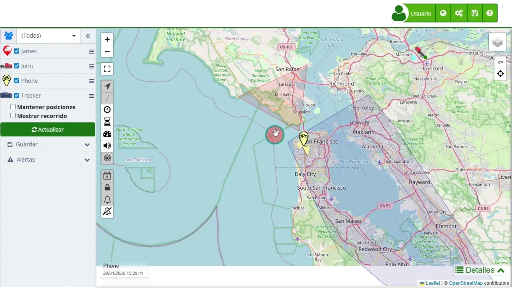

# Código de Activación
Para activar un [*fa-credit-card* código de activación](https://app.plaspy.com/Subscription?tp=1) en Plaspy, siga los pasos detallados a continuación. Es importante que disponga de un código válido, suministrado por un proveedor de Plaspy por medio de un correo electrónico.

El código de activación es esencial para habilitar sus servicios en Plaspy. Este código asegura que su suscripción esté acreditada y permite la activación de los dispositivos asociados. A continuación, se detallan los pasos necesarios para completar la activación utilizando este código.

## Acceso

Para activar el serial en Plaspy es necesario contar con una cuenta de usuario en [www.plaspy.com](https://app.plaspy.com/).

1. **Usuario Plaspy**: Si no tiene un usuario en Plaspy, en la página principal ingrese por la opción "[Regístrate](https://app.plaspy.com/Join)" en el menú superior, diligencie sus datos y cree la cuenta. Si ya tiene una cuenta de usuario en Plaspy, ingrese por la opción "[*fa-shopping-cart* Comprar más dispositivos](https://app.plaspy.com/Subscription?tp=1)" después de haber hecho click en su nombre de usuario en la parte superior derecha.

## Descripción de Campos

- **Código de activación**: Es el campo donde debe ingresar el código proporcionado por su proveedor de Plaspy. Este código se encuentra en un correo electrónico que haya recibido.

## Instrucciones Paso a Paso

1. **Ingresar a su cuenta Plaspy**:

    - Si no tiene una cuenta, [regístrese](https://app.plaspy.com/Join) en la página principal de Plaspy completando sus datos personales.
    - Si ya tiene una cuenta, [inicie sesión](https://app.plaspy.com/Subscription?tp=1) con sus credenciales.
2. **Acceder a la sección de activación**:

    - Una vez dentro, haga click en su nombre de usuario en la parte superior derecha y después diríjase a la opción "[*fa-shopping-cart* Comprar más dispositivos](https://app.plaspy.com/Subscription?tp=1)" ubicada en la parte superior derecha, justo debajo de su nombre de usuario.
3. **Seleccionar la opción de tarjeta prepago**:

    - En el menú de opciones, elija "[*fa-gift* Tengo una tarjeta prepagada](https://app.plaspy.com/Subscription?tp=1)", que se encuentra al final de la sección de descuentos.
4. **Ingresar el código de activación**:

    - En la sección de tarjeta prepago, ingrese el número de serial o código de activación en el campo correspondiente y presione "Validar".
5. **Revisar los datos del serial**:

    - Verifique los datos del serial que incluyen el número de dispositivos y el tipo de producto. Luego, presione "Activar".
6. **Confirmar la activación**:

    - Una vez validado, será redirigido a una página donde se hace efectivo el serial. Esta página mostrará información como la cantidad de dispositivos asociados a su cuenta y la fecha de expiración.
7. **Agregar un nuevo dispositivo**:

    - Para agregar un nuevo dispositivo, vaya al menú superior al lado de su nombre de usuario, en el menú con los engranajes, y seleccione "[*fa-cogs* Dispositivos](https://app.plaspy.com/Devices)".
    - Ingrese el nombre del dispositivo y el IMEI o Identificador \(normalmente el IMEI del rastreador\).
    - Presione "Nuevo" para crear el nuevo dispositivo.

## Validaciones y Restricciones

- **Campo Obligatorio**: El campo "Código de activación" es obligatorio. Si no se ingresa un código, no podrá proceder con la activación.
- **Formato del Código**: Asegúrese de ingresar el código exactamente como se lo proporcionaron, sin espacios adicionales ni caracteres incorrectos.

## Preguntas Frecuentes

- **¿Dónde puedo encontrar mi código de activación?**
    - El código de activación puede estar en un mail proporcionado por su proveedor o en un correo electrónico que haya recibido al adquirir una suscripción.
- **¿Qué hago si mi código de activación no funciona?**
    - Si su código no funciona, verifique que lo haya ingresado correctamente. Si el problema persiste, contacte al soporte técnico de Plaspy para asistencia.
- **¿Puedo activar más de un dispositivo con un solo código?**
    - Depende del tipo de suscripción y del número de dispositivos asociados al código de activación. Verifique los detalles proporcionados durante el proceso de activación.
