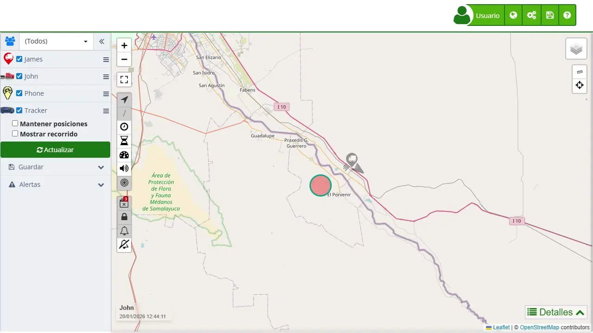

# Subscripción
Bienvenido a la sección de ayuda sobre suscripciones de Plaspy. Aquí encontrarás toda la información necesaria para gestionar y optimizar tu experiencia con nuestros servicios de seguimiento satelital. Nuestra plataforma está diseñada para ofrecer diversas opciones de suscripción que se adapten a tus necesidades específicas, ya sea que busques un plan estándar o uno más avanzado para una gestión integral.

En esta sección, aprenderás cómo registrarte fácilmente en Plaspy, activar tus códigos de suscripción, seleccionar y gestionar métodos de pago, renovar tus líneas y entender las diferencias entre nuestras versiones disponibles. Además, hemos incluido guías detalladas y preguntas frecuentes para resolver cualquier duda que puedas tener durante el proceso.

Te invitamos a explorar cada artículo para aprovechar al máximo las funcionalidades que Plaspy tiene para ofrecer, asegurando que tu experiencia sea lo más fluida y efectiva posible. Si en algún momento necesitas asistencia adicional, nuestro equipo de soporte está siempre disponible para ayudarte. ¡Gracias por confiar en Plaspy para tus necesidades de seguimiento satelital!

