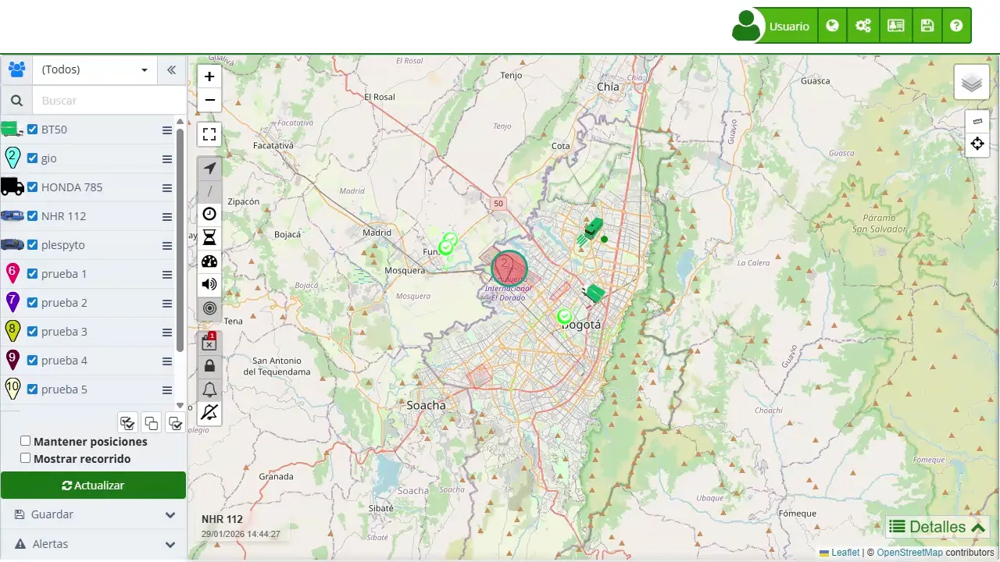

# Renovación de Líneas
La sección de "[Líneas](https://app.plaspy.com/SDG/Lines)" en Plaspy permite a los usuarios gestionar las líneas móviles asociadas a sus dispositivos de rastreo. Una funcionalidad clave de esta sección es la renovación de planes de datos, lo que asegura la continuidad del servicio de seguimiento satelital sin interrupciones. La renovación puede realizarse fácilmente desde la interfaz de usuario y permite extender la validez del plan de datos de una línea específica.

Para acceder a la sección de líneas, dirígete al menú superior y selecciona el ícono "" y luego elige "[Líneas](https://app.plaspy.com/SDG/Lines)". Aquí podrás ver el estado de tus líneas, renovarlas y actualizar sus descripciones.

### Descripción de Campos

- **Número**: Número de teléfono de la línea móvil asociada al dispositivo de rastreo.
- **Descripción**: Campo para agregar una descripción detallada de la línea, facilitando su identificación.
- **Dispositivo**: Dispositivo asociado a la línea móvil.
- **Estado**: Estado actual de la línea \(por ejemplo, Activa\).
- **Días restantes**: Número de días que restan antes de la expiración del plan de datos actual.
- **Fecha**: Fecha en la que se registró la línea.
- **Expira**: Fecha en la que expira el plan de datos actual.

### Funcionalidades de Renovación de Líneas

La renovación de líneas en Plaspy permite realizar las siguientes acciones:

- **Extensión del Servicio**: Extender la validez del plan de datos de la línea móvil, garantizando la continuidad del servicio de seguimiento satelital.
- **Acumulación de Días**: Los días restantes del plan actual se suman al nuevo período de suscripción, asegurando que no se pierdan días de servicio.
- **Gestión de Descripciones**: Actualizar la descripción de la línea para facilitar su identificación y gestión.

### Instrucciones Paso a Paso

#### Renovar un Plan de Datos

1. **Acceder a la Sección de Líneas**: Haz clic en "" en el menú superior y selecciona "[Líneas](https://app.plaspy.com/SDG/Lines)".
2. **Seleccionar la Línea a Renovar**: En la lista de líneas, identifica la línea que deseas renovar y haz clic en el ícono de renovación \(\).
3. **Revisar Detalles de Renovación**: Se abrirá una ventana modal con los detalles de la renovación, incluyendo el número de días restantes y el costo del nuevo plan.
4. **Confirmar y Realizar el Pago**:

    - Haz clic en " Renovar" para confirmar la renovación.
    - Sigue las instrucciones para realizar el pago y completar el proceso de renovación.
5. **Verificar la Renovación**: Una vez completado el pago, verifica que la nueva fecha de expiración se haya actualizado correctamente en la lista de líneas.

#### Editar la Descripción de una Línea

1. **Seleccionar la Línea a Editar**: En la lista de [líneas](https://app.plaspy.com/SDG/Lines), haz clic en el ícono de editar \(\) junto a la línea que deseas modificar.
2. **Actualizar la Descripción**: En la ventana modal, actualiza la descripción de la línea en el campo correspondiente.
3. **Guardar los Cambios**: Haz clic en "Aceptar" para guardar la nueva descripción.

### Validaciones y Restricciones

- **Fecha de expiración**: Asegúrate de renovar la línea antes de la fecha de expiración para evitar interrupciones en el servicio.
- **Información de pago**: Los pagos deben completarse exitosamente para que la renovación sea efectiva.

### Preguntas Frecuentes

- **¿Cómo puedo renovar mi plan de datos?**
    - Accede a la sección de [líneas](https://app.plaspy.com/SDG/Lines), selecciona la línea que deseas renovar, revisa los detalles y realiza el pago siguiendo las instrucciones proporcionadas.
- **¿Qué hago si no alcancé a renovar mi plan de datos?**
    - Si no alcanzaste a renovar a tiempo, todavía puedes hacerlo después de la fecha de vencimiento. Sin embargo, si pasan un par de días, tendrás que substituir la línea por una nueva para continuar con el servicio.
- **¿Puedo editar la descripción de una línea después de haberla registrado?**
    - Sí, puedes editar la descripción de una línea en cualquier momento accediendo a la sección de líneas y seleccionando la opción de editar \(\).
- **¿Cómo se calcula la nueva fecha de expiración al renovar una línea?**
    - La nueva fecha de expiración se calcula sumando el período del nuevo plan de datos a los días restantes del plan actual, garantizando que no se pierdan días de servicio.
