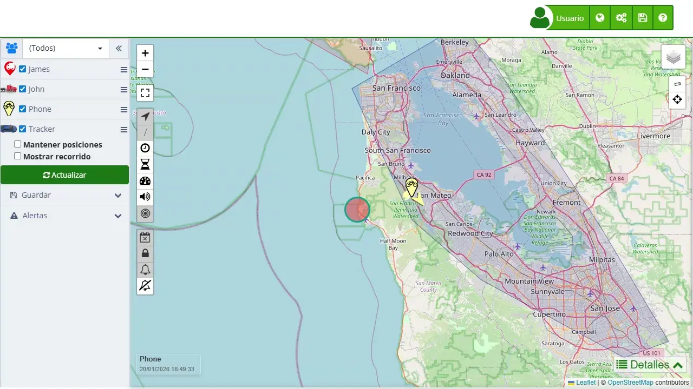

# Métodos de pago
Plaspy ofrece diversas opciones de [suscripción](https://app.plaspy.com/Subscription) y métodos de pago para adaptarse a las necesidades de todos sus usuarios. Entender estas opciones te permitirá elegir la mejor para tus requerimientos, optimizando así tus costos y asegurando un servicio continuo y eficiente.

### Períodos de Pago

Plaspy ofrece varios períodos de pago que permiten flexibilidad y ahorro según la opción seleccionada:

1. **Suscripción Mensual**: Paga el servicio mes a mes con una renovación automática cada mes. Sin contratos a largo plazo, sin costos de inscripción y sin compromisos. Puedes cancelar en cualquier momento. El costo mensual no incluye descuentos por pago anticipado.
2. **Suscripción Anual**: Paga por un año completo de servicio en un solo pago con una renovación automática cada año. Al pagar anualmente, obtienes un descuento significativo en comparación con el pago mensual. Requiere un pago inicial mayor.

### Descuentos

Plaspy aplica automáticamente los descuentos cuando se cumplen ciertas condiciones, permitiendo maximizar el ahorro:

1. **Descuentos por Pago Anual**: Al seleccionar un pago anual, se aplica automáticamente un descuento del 20% sobre el costo mensual regular.
2. **Descuentos por Cantidad de Dispositivos**: Plaspy ofrece descuentos adicionales basados en la cantidad de dispositivos adquiridos. Estos descuentos se aplican automáticamente cuando se alcanza la cantidad mínima requerida.

### Tabla de Descuentos Disponibles

| Cantidad de Dispositivos | Descuento Adicional \(%\) |
| --- | --- |
| Pago Anticipado Anual | 20% |
| Más de 51 dispositivos | 5% |
| Más de 101 dispositivos | 10% |
| Más de 201 dispositivos | 25% |
| Más de 501 dispositivos | 30% |

#### 

#### Notas:

- **Acumulación de Descuentos**: El descuento por pago anticipado anual se puede acumular con los descuentos por cantidad de dispositivos. Por ejemplo, si seleccionas un pago anual y adquieres más de 101 dispositivos, obtendrás un descuento total del 30% \(20% por pago anual + 10% por cantidad de dispositivos\).
- **Cálculo en Dólares**: Todos los pagos se calculan en dólares americanos \(USD\). La tasa de cambio utilizada dependerá del banco emisor de la tarjeta de crédito o débito utilizada para el pago. Esto significa que el monto en la moneda local puede variar dependiendo de la tasa de cambio actual de tu banco.

### Instrucciones Paso a Paso

1. **Seleccionar Tu País**: Utiliza el menú desplegable para seleccionar el país donde estás comprando los dispositivos. Esto establecerá la moneda para tu transacción.
2. **Mostrar Precios en USD**: Si prefieres ver los precios en dólares americanos \(USD\), marca la casilla "Mostrar precios en USD dólares".
3. **Ingresar el Número de Dispositivos**: Ingresa el número de dispositivos que deseas comprar en el campo " Número de dispositivos". El costo mensual se mostrará junto a él.
4. **Seleccionar el Período de Suscripción**: Elige tu período de suscripción deseado.

    - **Suscripción Mensual**: Pago recurrente mensual.
    - **Suscripción Anual**: Un solo pago anual con 20% descuento.
5. **Revisar el Resumen del Pedido**: El resumen del pedido se actualizará para reflejar tus selecciones, mostrando el costo total y cualquier descuento aplicado.
6. **Aplicar Descuentos**: Revisa la sección de "Descuentos" para ver si calificas para descuentos adicionales según la cantidad de dispositivos o el período de pago seleccionado.
7. **Proceder al Pago**: Haz clic en "Continuar" para proceder a la página de pago. Aquí podrás seleccionar tu método de pago preferido \(e.g., tarjeta de crédito, PayPal, ePayco\), digitar los datos de facturación y completar la transacción.

### Validaciones y Restricciones

- **Campo Obligatorio**: Asegúrate de ingresar un número de dispositivos mayor a cero.
- **Formato del Código**: La selección de suscripción afectará el costo total y los descuentos disponibles.
- **Cálculo en Dólares**: Los pagos se realizan en dólares americanos \(USD\) y la tasa de cambio utilizada dependerá de tu banco emisor.

### Preguntas Frecuentes

- **¿Puedo cambiar mi período de suscripción después de realizar una compra?** 
    - Sí, puedes cambiar tu período de suscripción en cualquier momento a través de la configuración de tu cuenta. Los cambios se aplicarán en el próximo ciclo de facturación.
- **¿Existen cargos adicionales por transacciones internacionales?** 
    - Dependiendo de tu banco, puede haber cargos adicionales por transacciones internacionales. Consulta con tu banco para obtener más detalles.
