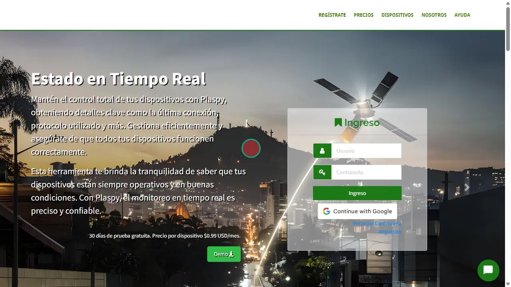

# Registro en Plaspy
El proceso de [registro](https://app.plaspy.com/SignUp) en Plaspy es sencillo y te permite comenzar a utilizar los servicios de seguimiento satelital de inmediato. Esta guía te explicará paso a paso cómo registrarte para iniciar tu mes gratis.

## Introducción

Para acceder a la página de registro de Plaspy, sigue estos pasos:

1. Abre tu navegador web y dirígete a la página principal de [Plaspy](https://www.plaspy.com).
2. Haz clic en el enlace "[Registrarse](https://app.plaspy.com/SignUp)" en la parte superior de la página principal.
3. Serás redirigido a la página de registro.

## Descripción de Campos

- **Nombres**: Ingresa tus nombres y apellidos completos.
- **País**: Selecciona tu país de la lista desplegable.
- **Email**: Proporciona una dirección de correo electrónico válida.
- **Confirmar email**: Vuelve a ingresar la misma dirección de correo electrónico para confirmar.
- **Contraseña**: Crea una contraseña segura.
- **Confirmar contraseña**: Vuelve a ingresar la contraseña para confirmarla.
- **He leído y acepto las condiciones de servicio**: Marca esta casilla para aceptar los términos y condiciones.
- **He leído y acepto las políticas de tratamiento de datos**: Marca esta casilla para aceptar las políticas de tratamiento de datos.
- **No soy un robot**: Marca la casilla para completar el reCAPTCHA, confirmando que no eres un robot.

## Instrucciones Paso a Paso

1. **Ingresar Nombres \(*fa-user*\)**: En el campo "Nombres", escribe tus nombres y apellidos completos.
2. **Seleccionar País \(*fa-globe*\)**: En el campo "País", selecciona tu país de la lista desplegable.
3. **Ingresar Email \(*fa-envelope-o*\)**: En el campo "Email", proporciona una dirección de correo electrónico válida. Luego, en el campo "Confirmar email", vuelve a ingresar la misma dirección de correo electrónico para confirmarla.
4. **Seleccionar Zona Horaria \(*fa-envelope-o*\)**: En el campo "Zona Horaria", selecciona tu zona horaria de la lista desplegable.
5. **Crear Contraseña \(*fa-unlock-alt*\)**: En el campo "Contraseña", crea una contraseña segura que puedas recordar. A continuación, en el campo "Confirmar contraseña", vuelve a ingresar la contraseña para confirmarla.
6. **Aceptar Términos y Políticas**: Marca las casillas correspondientes a "He leído y acepto las condiciones de servicio" y "He leído y acepto las políticas de tratamiento de datos" para proceder.
7. **Completar reCAPTCHA**: Marca la casilla "No soy un robot" y completa el reCAPTCHA para verificar que eres un humano.
8. **Hacer clic en Registrate**: Una vez que todos los campos estén completos y las casillas correspondientes marcadas, haz clic en el botón "Registrate".
9. **Verificación de Correo**: Plaspy enviará un correo electrónico de verificación a la dirección proporcionada. Revisa tu bandeja de entrada \(y la carpeta de spam, si es necesario\) y sigue las instrucciones para verificar tu cuenta.

## Validaciones y Restricciones

- **Dirección de Correo Electrónico**: Asegúrate de ingresar una dirección de correo electrónico válida y que coincida en ambos campos.
- **Contraseña Segura**: La contraseña debe cumplir con los requisitos de seguridad de Plaspy, como longitud mínima y combinación de letras, números y caracteres especiales.
- **Aceptación de Términos y Políticas**: Debes marcar las casillas de aceptación de términos y políticas para completar el registro.
- **Verificación de Correo Electrónico**: El correo de verificación debe ser confirmado para activar tu cuenta.

## Preguntas Frecuentes

- **¿Qué hago si no recibo el correo de verificación?**
    - Revisa tu carpeta de spam o correo no deseado.
    - Asegúrate de que la dirección de correo electrónico proporcionada esté correctamente escrita.
    - Si aún no recibes el correo, intenta repetir el proceso de registro o contacta al soporte técnico de Plaspy.
- **¿Cómo puedo asegurarme de que mi contraseña es segura?**
    - Usa una combinación de letras mayúsculas y minúsculas, números y caracteres especiales.
    - Evita usar contraseñas comunes o información personal fácil de adivinar.
    - Considera utilizar una frase larga y única que solo tú conozcas.

Siguiendo estos pasos, podrás registrarte en Plaspy de manera segura y rápida, asegurando que tu cuenta esté lista para comenzar a utilizar los servicios de seguimiento satelital.
